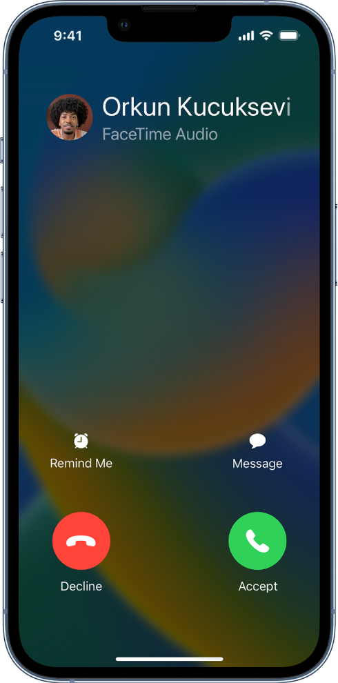
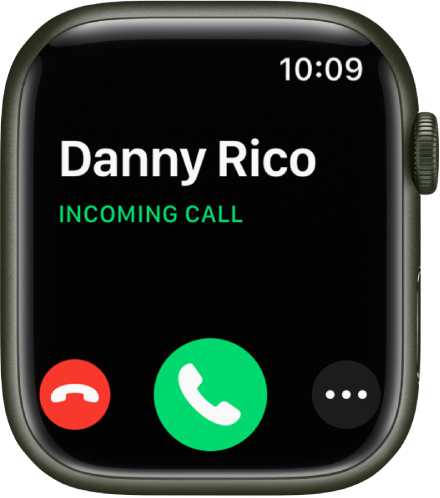
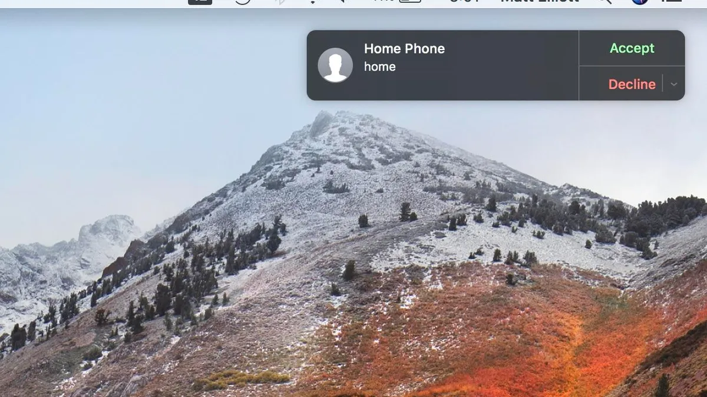
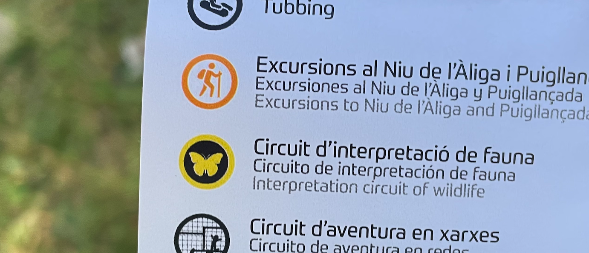
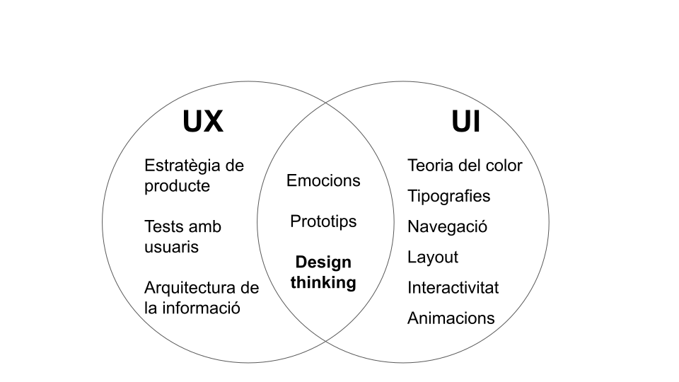

    

        
© Albert Palacios Jiménez, 2023

    

    

        
    

 

# Introducció UX/UI

## Disseny d'interfícies (de software)

És el procés de dissenyar visualment o metafòricament els aspectes funcionals d’un producte (programa).

Els dissenyadors d’interfícies s’han d’assegurar que la interacció amb els productes (programes), permet als usuaris aconseguir els seus objectius.

**Interfícies visuals**: programes amb els que s’interactua visualment a través de dispositius d’entrada (mouse, tàctil, …)

**Interfícies conversacionals**: programes amb els que s’interactua a través d’una conversa de text o veu (assistents IA)

## UX experiència d'usuari

**UX** (User eXperience) fa referència l’experiència que té un usuari o persona al fer servir un producte o software. En concret, la facilitat que té per aconseguir els objectius que es proposa. 

- Fàcil d’usar
- Útil
- Atractiu
- Intuïtiu
- Accessible (persones amb discapacitats)

L’experiència d’usuari implica sensacions, sentiments i emocions, una mala experiència pot crear frustració i enfadar a l’usuari.

Una bona experiència implica confiança i crea un vincle afectiu positiu entre l’usuari i el programa.

### Cicle de l'experiència d'usuari

L’experiència d’usuari ha de tenir en compte des que s’obté el producte fins després del seu ús.

- S’obté el producte
- El producte ofereix afegits (guia, atenció al client, figures …)
- Ús del producte
- Compatibilitat amb productes futurs

### Exemple de bona experiència

Poder contestar trucades del telèfon desde altres dispositius, quan els estàs fent servir, encara que no tinguin tarjeta SIM. A més, fent servir una interfície igual o similar entre dispositius.

    

        
    

    

        
    

    

        
    

    

        
    

 

### UX experiencia d’usuari, exemple de mala experiència

La publicitat del sender de ‘Fauna’ fa servir diferents noms, colors i icones que els cartells penjats al bosc. 

L’usuari pot pensar que no està al sender correcte.

    

        
    

    

        
    

 

### UX experiencia d’usuari, exemples de males experiències

- Botons que no funcionen
- Icones que no representen la funció adequada (un disquet per guardar)
- Esperes que no donen una idea del temps que falta per acabar una tasca
- Talls en la comunicació amb els servidors
- Missatges d’error que no s’entenen
- …

## UI (User Interface) disseny d’interfícies

El disseny d’interfícies és el procés de definir i programar interfícies de software, tenint en compte:

- L’aspecte visual o estil (segueix unes normes de fonts, colors, …)
- Organització (si els elements estan on l’usuari els espera)
- Navegació (relació entre les diferents pantalles/eines)
- Interacció (com els usuaris interactuen amb l’aplicació, teclat, mouse, veu, …)

## Relació entre UX i UI

El disseny d’interfícies UI està directament relacionat amb l’experiència d’usuari UX. L’usuari espera tenir una experiència agradable (positiva) al fer servir un programa:

- Aspecte visual conegut
- Organització dels elements senzilla
- Navegació entre pantalles entenedora
- Interactivitat i funcionament de l’aplicació

Una mala experiència farà que l’usuari busqui una altra aplicació.

# Design Thinking

**Pensament de disseny**, és un procés que intenta entendre els usuaris per tal de definir com ha de ser el software a desenvolupar.

Pensar en el disseny afecta l’experiència UX i el disseny d’interfícies UI. 

Com que és un procés iteratiu (que es repeteix) no intenta crear una aplicació complerta d’inici, sinó fer prototips senzills que van evolucionant amb el temps.

Pensament de disseny, afecta UX i UI. Normalment implica les següents etapes:

- Empatitzar amb les necessitats de l’usuari
- Definir què ha de fer l’aplicació
- Idear com ha de ser l’aplicació
- Crear un prototip
- Testejar el prototip
- Tornar al principi i evolucionar el prototip
