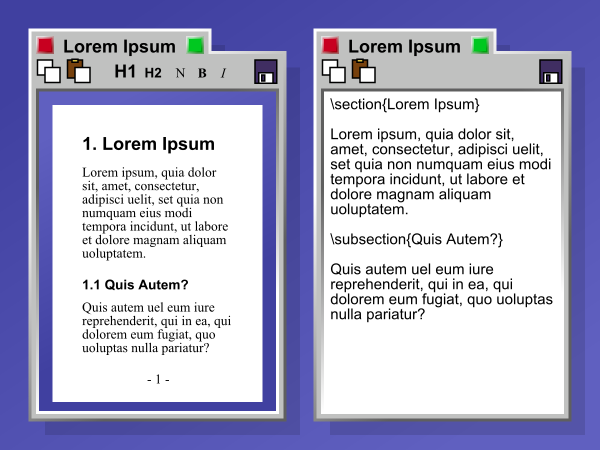
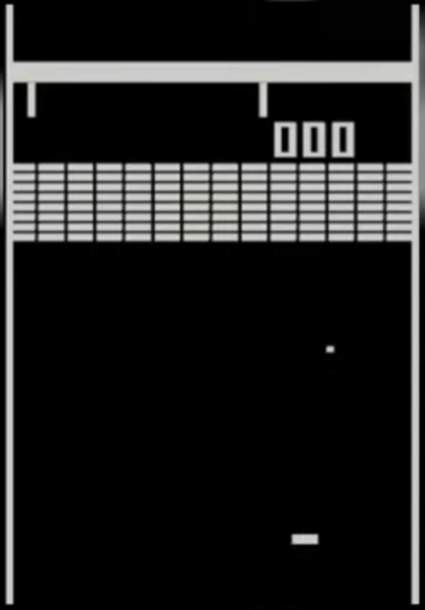
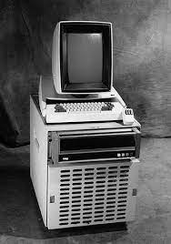
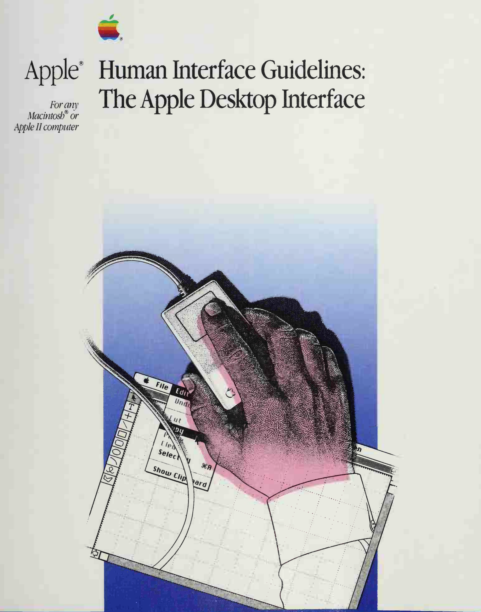

    

        
© Albert Palacios Jiménez, 2023

    

    

        
    

 

# Introducció UX/UI

## Primera GUI, naixement de WYSIWYG

La primera GUI va aparèixer el 1968 amb el sistema NLS, quan es va combinar una interfície de text amb gràfics.

Amb la primera GUI va aparèixer el concepte [WYSIWYG](https://es.wikipedia.org/wiki/WYSIWYG) (what you see is what you get), és a dir, mostrar documents de textos amb imatges que es formaten visualment i de igual manera bé sigui en paper o en altres equips i sistemes.

 

### GUIs de videojocs als anys 19**70**

Cal recordar que en paral·lel a la informàtica personal, els videojocs ja presentaven entorns interactius gràfics molt bàsics als anys 70.
L’evolució de les interfícies gràfiques, està molt unida als avenços tècnics aportats per la indústria del videojoc.

 
Atari Breakout, 1976

  

## The mother of all demos

*[“La mare de totes les demos”](https://en.wikipedia.org/wiki/The_Mother_of_All_Demos)* és el nom que s’ha donat a la presentació que es va fer dels sistemes NLS on es mostraven per primera vegada:

- Interfícies gràfiques amb textos i imatges
- Gràfics vectorials
- Dispositius ‘mouse’
- Aplicacions en finestres
- Videoconferència
- Enllaços entre diferents fonts de dades
- Control de versions (precusor de Git)

Tot i que la demo va ser el 1968, no va ser fins al 1973 quan Xerox va tenir un equip capaç d’executar tots els conceptes de la demo funcionals, el [Xerox Alto](https://es.wikipedia.org/wiki/Xerox_Alto).

 
Xerox Alto, 1973

  

### Steve Jobs a Xerox Park

El desembre de 1979 Steve Jobs junt amb altres enginyers d’Apple van visitar Xerox i van conèixer els conceptes exposats a “The mother of all demos”

En aquell moment hi va haver un **punt d’inflexió a la informàtica personal**, Apple va aconseguir fer un equip amb les tecnologies de “The mother of all demos” per al públic general, a un preu assequible. S’entén que a partir d’aquell moment es van “democratitzar” els ordinadors amb interfícies gràfiques.

**Curiositat**: en aquella presentació també se’ls van presentar demos de Xarxa molt similars al què més tard sería Internet, però estaven tan emocionats amb les interfícies gràfiques que no van donar importància a les xarxes.

### Apple Human Interface Guidelines

Junt amb el sistema operatiu GUI, Apple publica una guia que descriu com funciona un ordinador personal basat en gràfics enlloc de comandes de text.

La guia tenia com a propòsit explicar als desenvolupadors com dissenyar aplicacions coherents amb el disseny UX/UI dels ordinadors Apple Macintosh.

Indirectament, va introduir als programadors conceptes avançats de programació orientada a objectes, llibreries del sistema, interacció amb el mouse, model vista-controlador, …

 
 Human Interface Guidelines, 1987

  

### Human Interface Guidelines

El concepte de *“Human Interface Guidelines”* segueix viu, els sistemes que es volen considerar una mica “seriosos” publiquen les seves guies amb principis de disseny, per tal d’homogenitzar les aplicacions amb el sistema, i millorar l’experiència d’usuari:

- [Apple](https://developer.apple.com/design/human-interface-guidelines)
- Android [Material Design](https://m3.material.io/)
- [Elementary OS](https://docs.elementary.io/hig)
- [Gnome](https://developer.gnome.org/hig/)

Cal tenir en compte, que unes mateixes recomanacions de disseny han de tenir en compte diferents tipus de sistemes. Ordinadors, tablets, mòbils, …

## Conceptes bàsics del disseny GUI (1987)

- Els elements fan referència a **metàfores del món real** (arxius, carpetes, documents, colors, sons, …)
- Les aplicacions han d’estar preparades per rebre entrades de l’usuari en qualsevol moment, **els usuaris han de tenir el control**
- **See-and-point**, és a dir l’usuari escull entre les opcions que hi ha disponibles en pantalla (sense haver de recordar comandes textuals)
- **Les aplicacions han de ser consistens** amb el sistema i les altres aplicacions (obrir un arxiu s’ha de fer sempre amb el mateix quadre de diàleg)
- **WYSIWYG** la presentació dels documents no s’ha de veure diferent entre equips o impressions de paper
- **L’usuari ha d’estar informat** del què fa la màquina, amb el menor temps d’espera possible
- Els usuaris es poden equivocar, **hi ha d’haver eines per desfer els errors**
- **El sistema ha de ser estable** i entenedor, no pot canviar d’aspecte, temps de reacció o funcionament de manera aleatòria
- **Els usuaris han de poder configurar l’entorn de treball** per adaptar-lo a les seves necessitats
- **Consistència visual**, el sistema proveeix eines per tal que les accions més habituals (interaccionar amb arxius, canviar configuracions, …) siguin consistents entre les aplicacions
- **Simplicitat**, la pantalla no ha d’estar embrutada amb massa elements, botons o finestres. Els icones, menús i altres elements gràfics han de comunicar missatges simples
- **Claredat**, cal escollir bé la manera de mostrar els missatges a l’usuari, a vegades a través de imatges però altres a través de textos o alertes sonores

## Escala de temps UI

| Temps                 | Descripció                                               |
|-----------------------|----------------------------------------------------------|
| 0,1 segons            | Temps de reacció màxim d’elements a la pantalla           |
| 1-10 segons           | Sensació que l’equip està fent càlculs llargs             |
| 10 segons             | Sensació que l’equip va lent                              |
| 30-60 segons          | Temps màxim en completar tasques que fan esperar a l’usuari|
| 10 minuts             | Una visita llarga a una pàgina web o fent ús d’una aplicació|
| 1 hora                | Temps màxim que ha de durar un estudi d’usabilitat        |
| 1 dia                 | Temps màxim en respondre les preguntes dels clients       |
| 1 mes                 | Processos comercials habituals                            |
| 1 any                 | Temps en què es considera a un usuari ‘expert’ en ús d’una web/app |
| 10 anys               | Temps per desenvolupar experiències complexes com UNIX, programació, … |
