

    

        
© Albert Palacios Jiménez, 2023

    

    

        
    

 

# UI en equips de sobretaula

## L'escriptori

L’escriptori esdevé la metàfora de la interacció amb el sistema, es tracta d’una superfície a partir de la qual es poden llençar totes les activitats.

    

        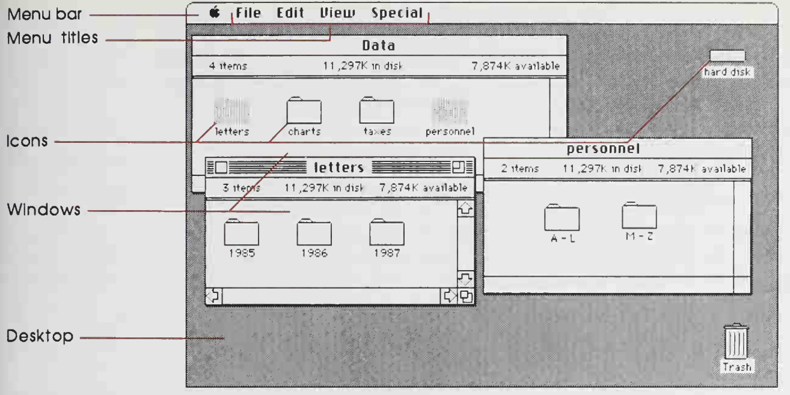
        
Apple Machintosh, 1984

    

    

        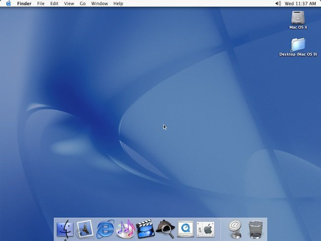
        
Apple OSX Cheetah, 2001

    

    

        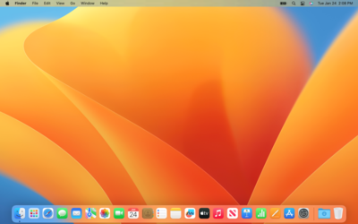
        
Apple OSX Ventura, 2023

    

 

**Observació:** Els sistemes Apple han mantingut un mateix llenguatge visual al llarg dels anys, que destaca pel menú de sistema compartit i el dock

## L'escriptori de Windows

    

        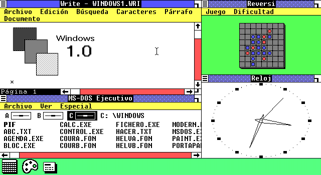
        
Windows 1.0, 1985

    

    

        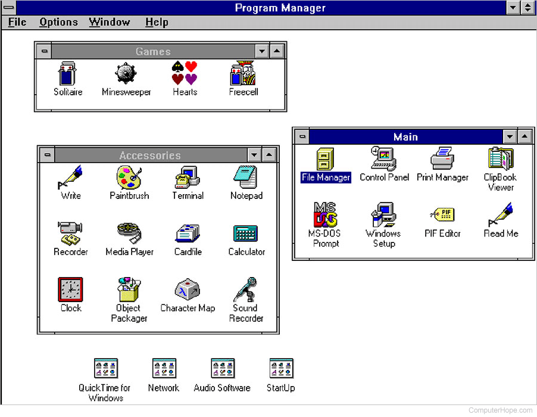
        
Windows 3.0, 1990

    

    

        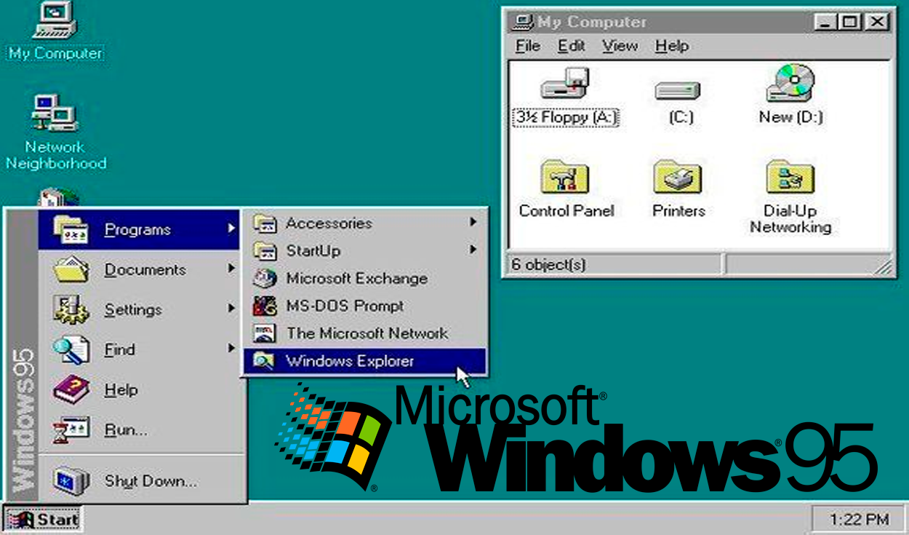
        
Windows 95, 1995

    

    

        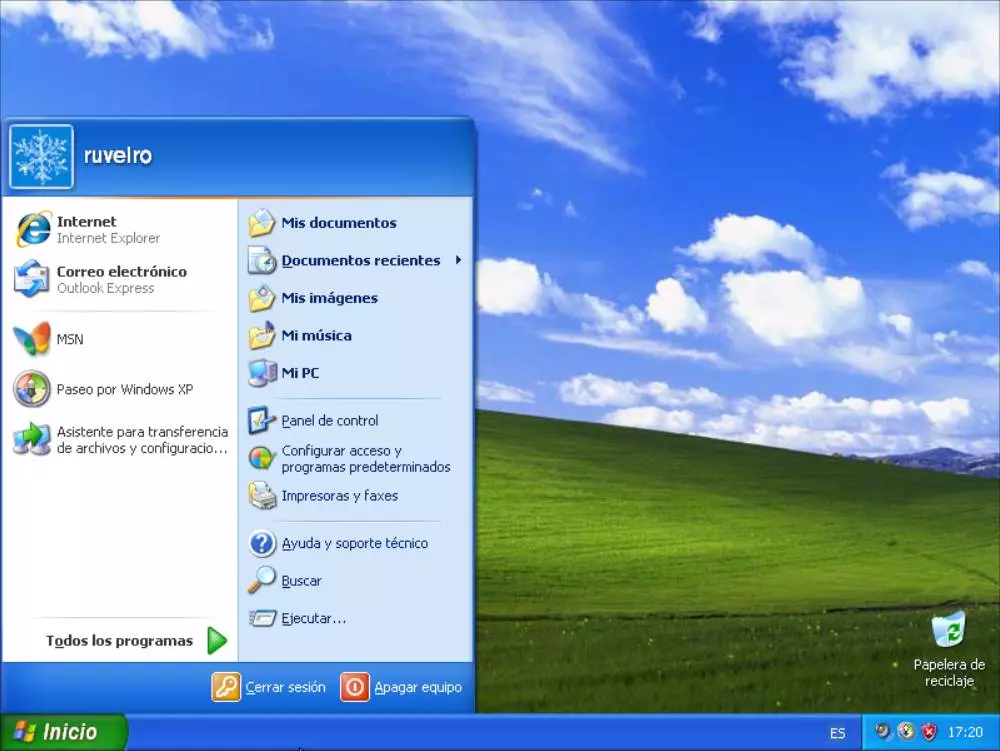
        
Windows XP, 2001

    

    

        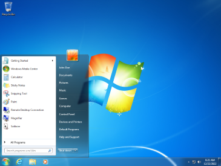
        
Windows 7, 2009

    

    

        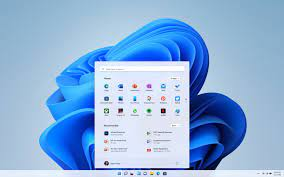
        
Windows 11, 2021

    

 

## L'escriptori en altres sistemes històrics

    

        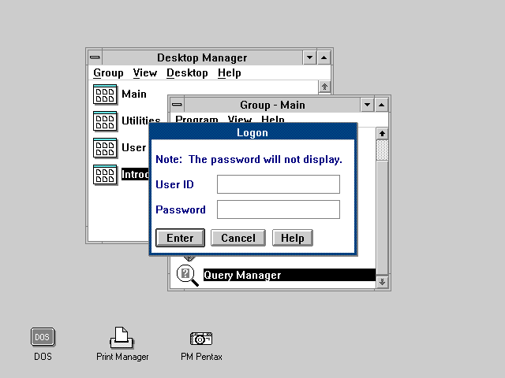
        
OS/2, 1987

    

    

        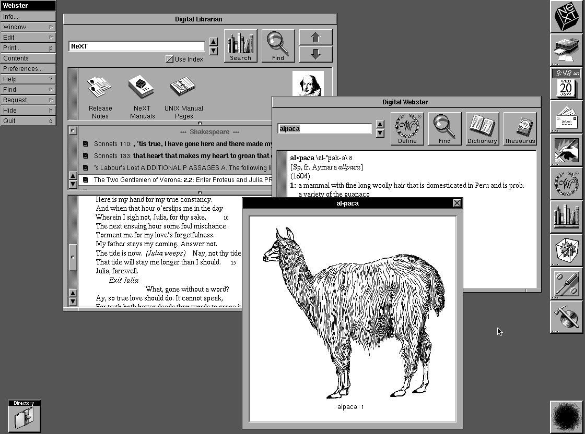
        
NeXTSTEP 1.0, 1989

    

    

        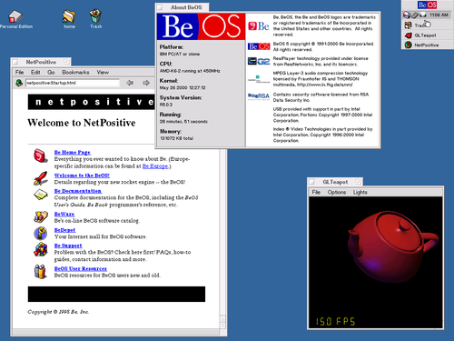
        
Be OS, 1995

    

    

        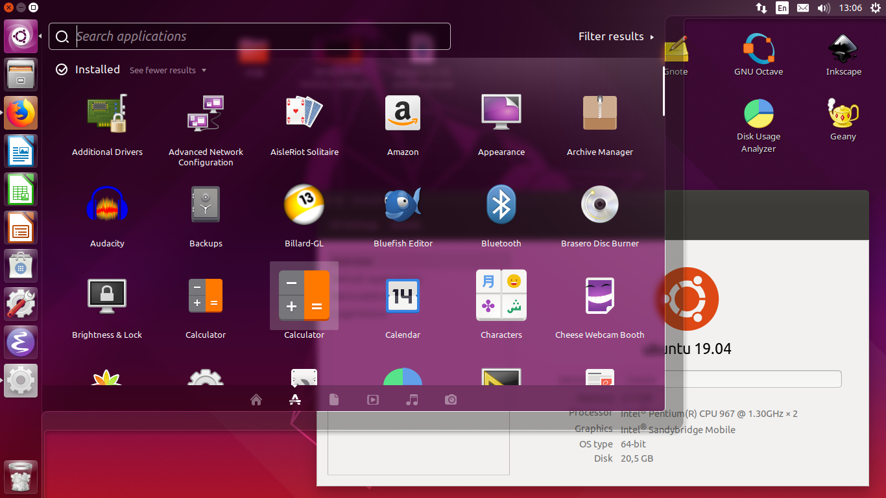
        
Ubuntu Unity, 2020

    

    

        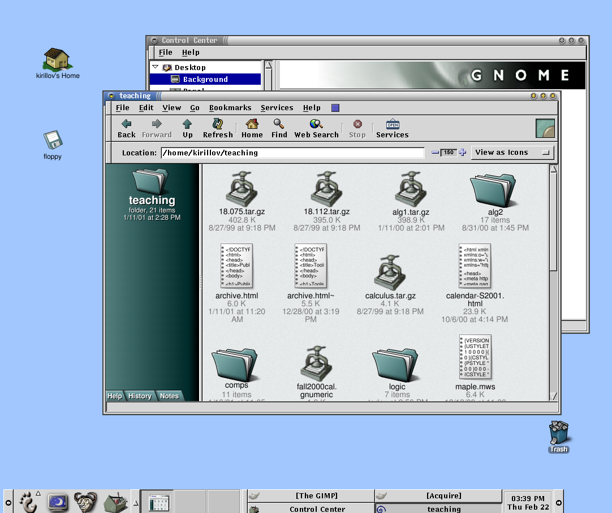
        
Gnome 1, 1999

    

    

        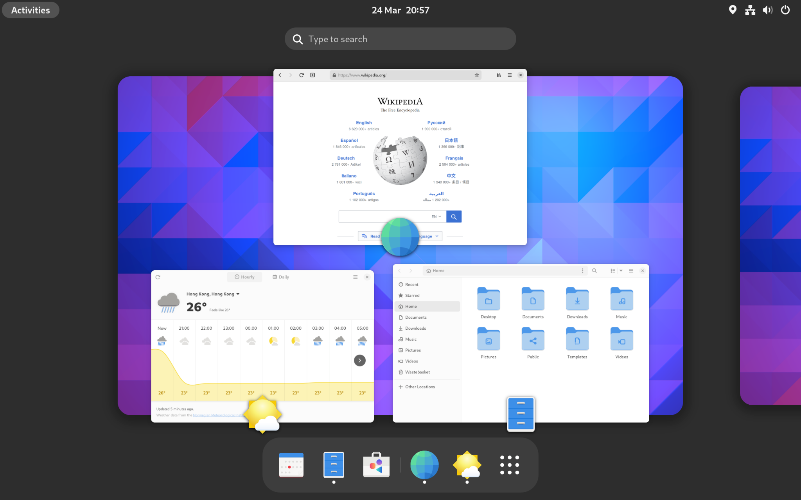
        
Gnome 4, 2021

    

 

## Resolució de pantalla al cap dels anys

Al llarg dels anys, la resolució de les pantalles ha augmentat el què ha provocat canvis en com es dissenyen les aplicacions.

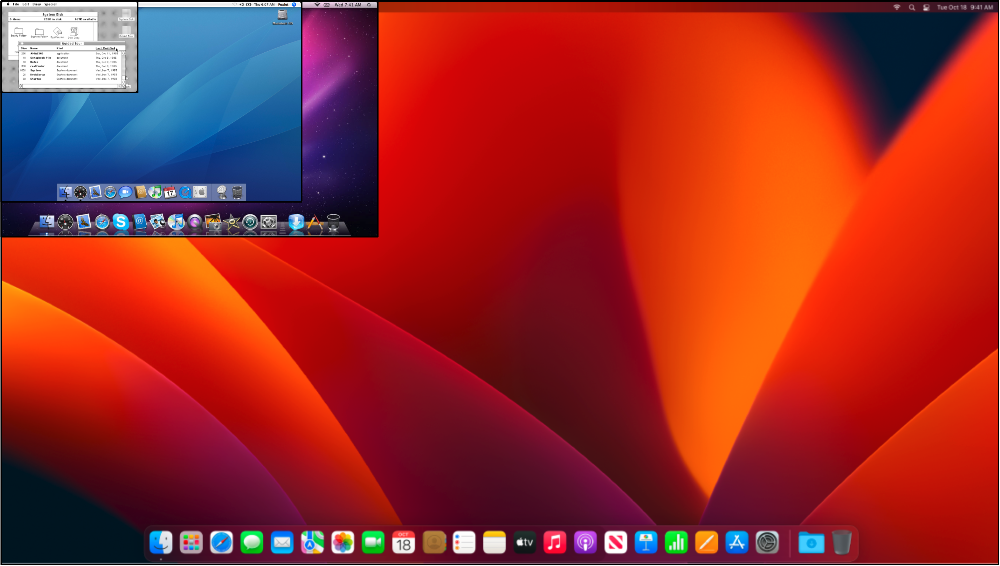

 

- **1984**: 512x342
- **1998**: 1024x768
- **2009**: 1440x900
- **2020**: 3840x2160

## L'escriptori d’ordinador, basat en el sistema d’arxius

Tradicionalment, els escriptoris d’ordinador s’han basat en el sistema d’arxius. És a dir:

- L’escriptori mostra finestres d’aplicacions
- Les aplicacions són arxius executables (o conjunts d’aquests)
- Les aplicacions accedeixen a altres arxius a través del sistema d’arxius

Aquest model, és herència dels sistemes operatius anteriors, basats en línies de comandes.

### Finestres d’aplicacions a l’escriptori

L’escriptori, bàsicament serveix per organitzar aplicacions. Per defecte:

- L’escriptori en un ordinador, mostra una o més aplicacions
- L’escriptori en un mòbil mostra una aplicació a pantalla completa

Hi ha configuracions més complexes, però menys utilitzades:

- Els sistemes de sobretaula mostres diversos escriptoris
- Els dispositius mòbils poden mostrar diverses aplicacions a l’escriptori

### L'escriptori d’ordinador, un entorn de treball net

Alguns entorns d’escriptori permeten organitzar carpetes i arxius al propi escriptori, molts usuaris en fan un abús.

    

        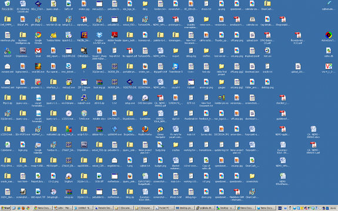
        
Windows

    

    

        
        
elementaryOS

    

 

Per evitar que l'escriptori estigui *brut*, i per tal que l’escriptori sempre estigui net, ElementaryOS només permet que a l’escriptori hi hagi finestres, però no arxius ni carpetes.

### Aplicacions d’escriptori, múltiples finestres

Les aplicacions poden obrir diferents finestres, aquest model era molt usat per separar funcionalitats o eines de l’aplicació.

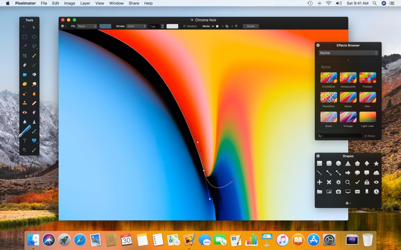
 
Pixelmator classic, 2007

 

Actualment es tendeix a simplificar, per tal de fer aplicacions que s’adaptin a diferents formats de pantalla i dispositius. Fent que les eines siguin **"panels"** accessibles des de una única finestra.

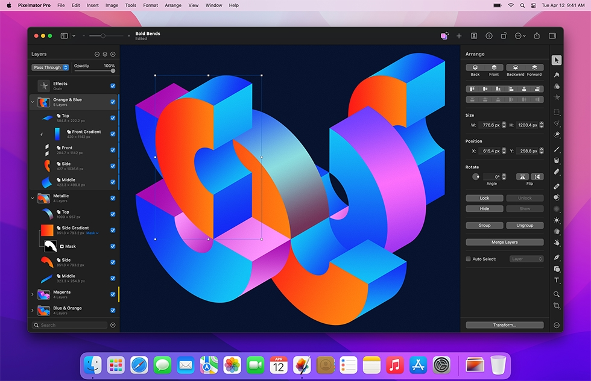
 
Pixelmator Pro, 2017

 

### Aplicacions d’escriptori, menú

Les aplicacions d’OSX poden afegir accions al menú del sistema, unifican-los i fent que els menús sempre estiguin a la mateixa posició de la pantalla, a més ajuda a identificar l’aplicació activa.

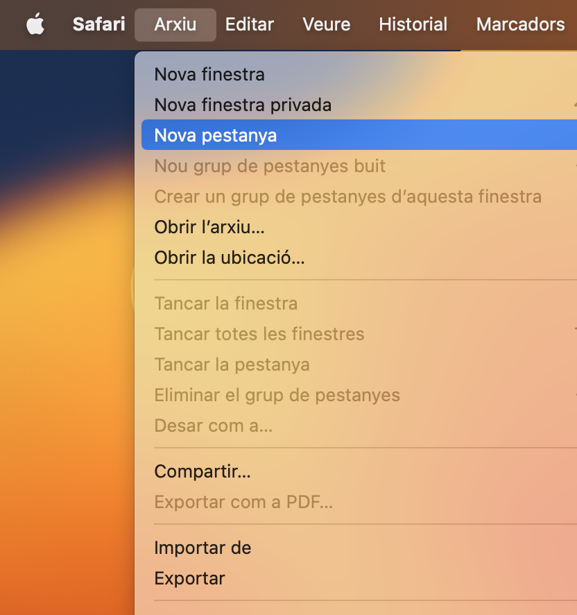
 
macOS

 

Les aplicacions de Windows tenen el menú integrat a la finestra principal, el què fa que el menú no tingui una posició fixa.

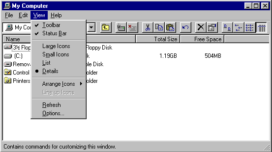
 
Windows

 

### Aplicacions d’escriptori, titlebar

La barra de títol està a la part superior de les finestres, habitualment amb els botons de tancar, minimitzar, maximitzar

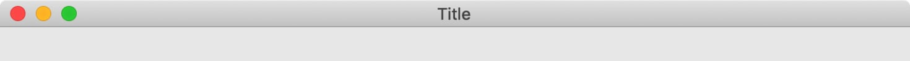
 
OSX Ventura, 2022

 

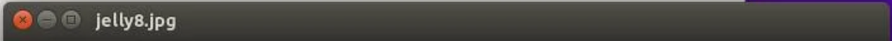
 
Ubuntu Unity, 2020

 

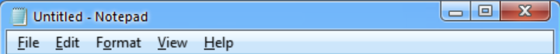
 
Windows 7, 2009

 

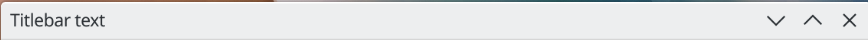
 
KDE Plasma 5, 2014

 

### Aplicacions d’escriptori, toolbar

Algunes aplicacions inclouen una toolbar amb accions d’accés ràpid

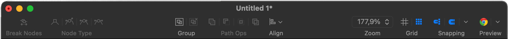
 
Toolbar macOS

 

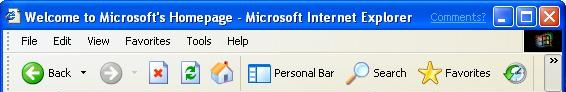
 
Toolbar Windows XP

 

### Aplicacions d’escriptori, titlebar+toolbar personalitzades

Actualment les aplicacions personalitzen la barra superior fent una barreja entre ‘titlebar’ i ‘topbar’, aprofitant l’espai i simplificant el disseny.

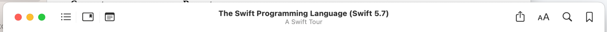

 

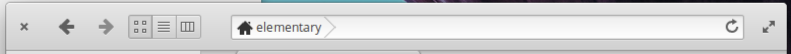

 

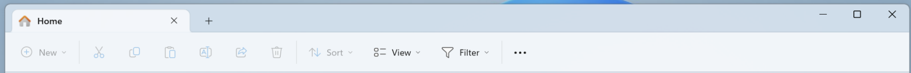

 

A més, combinar la titlebar i la toolbar promou l’ús d’un menú bàsic tipus mòbil a la toolbar, enlloc del clàssic menú amb ‘Arxiu, Editar, …’. Aquest tipus de menús s'adapten millor a diferents dispositius:

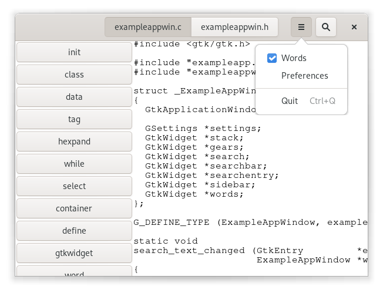
 
Menú a la Toolbar

 

### Aplicacions d’escriptori, pestanyes (aka ‘tabs’)

Per tal d’evitar obrir una finestra d’aplicació per cada instància d’aquesta que sigui necessària, es fan servir ‘tabs’ compartint la titlebar i la toolbar:

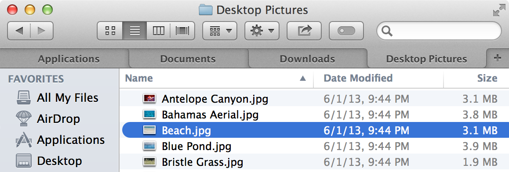
 

 

Algunes aplicacions trenquen el funcionament dels tabs (un tab per cada instà ncia d'aplicació o document), per fer que es mostrin diferents opcions de la toolbar. D’aquest disseny se’n diu “[Ribbon](https://en.wikipedia.org/wiki/Ribbon_(computing))”

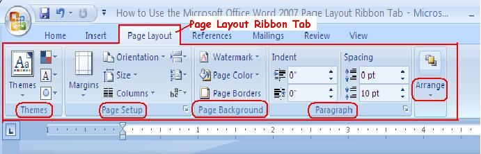
 

 

### Aplicacions d’escriptori, sidebar

La ‘sidebar’ és una (o dues) barres laterals amb informació i eines per complementar la toolbar, habitualment es poden mostrar o amagar i es permet que s’organitzin amb tabs. 

La **barra de l’esquerra** sol tenir la navegació, bé sigui d’arxius, layers del document, …

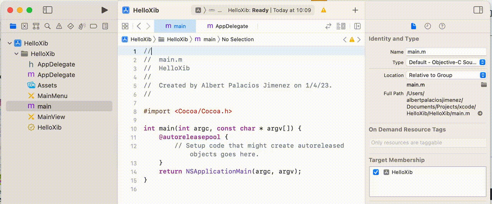
 

 

La **barra de la dreta** sol tenir panells d’eines, i a nivell d’usabilitat, s’hi permet l’organització amb tabuladors.

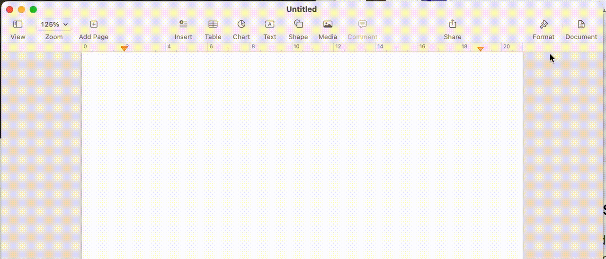
 

 

### Aplicacions d’escriptori, statusbar

La **"statusbar"** és una petita barra inferior que pot mostrar dades tècniques sobre l’estat de l’aplicació.

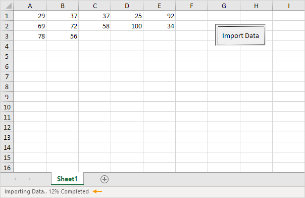
 

 

### Aplicacions d’escriptori, dialogs

Els **"dialogs"** són petites finestres que es mostren per sobre de la finestra d’aplicació i bloquegen el contingut d’aquesta.
Poden ser alertes o formularis que mostren un estat temporal de l’aplicació, per exemple d'una configuració per imprimir un document, la creació d’un nou projecte o la confirmació d’una acció.

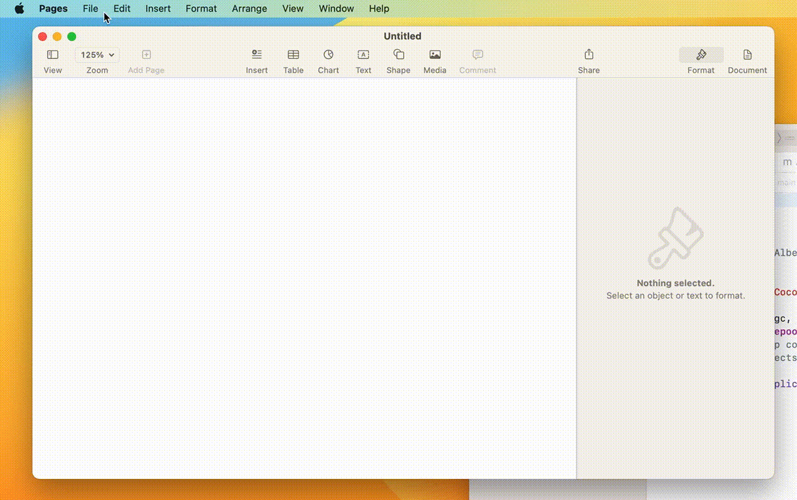
 

 

### Aplicacions d’escriptori, popovers

Els **"popovers"** són dialegs que mostren contingut directament relacionat amb l’element que s’ha clickat.

S’han de fer servir quan es vol facilitar accions ràpides sense sortir de la interfície principal.

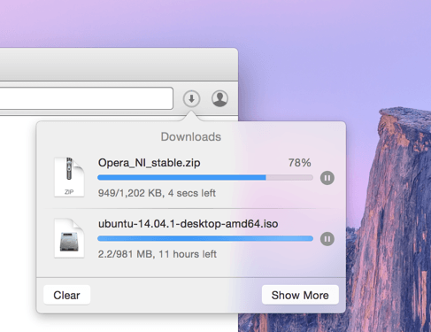
 

 