

    

        
© Albert Palacios Jiménez, 2023

    

    

        
    

 

# UI en dispositius mòbils

## L’escriptori de dispositius mòbils

Els dispositius mòbils prenen el concepte d’escriptori, però amaguen el sistema d’arxius per seguretat.

El nou paradigma, es basa en aplicacions que accedeixen a carpetes d’arxius específiques (la pròpia de l’aplicació, fotografies, documents, …)

    

        
        
Palm Pilot, 1997

    

    

        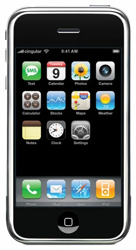
        
iPhone, 2007

    

 

**Nota:** També s'hereta el *"dock"* estil OSX

### Interacció, gestures

La interacció es realitza de manera tàctil, és a dir, hi ha una connexió directa entre l’entrada i els elements de la pantalla. 

Aquest fet, va introduir una nova manera d’interactuar amb els elements anomenada “gestures”:

- Tap: tocar la pantalla i aixecar el dit ràpid
- Double tap: tocar la pantalla dos cops de manera ràpida
- Drag: tocar la pantalla moure el dit en una direcció i aixecar-lo
- Pinch: Pessigar la pantalla amb dos dits
- Zoom: Lo contrari que ‘pinch’, separar el dits
- Panning: Tocar la pantalla amb un dit, moure’l sense aixecar-lo

 

 

[Handling gesture events](https://developer.apple.com/library/archive/documentation/AppleApplications/Reference/SafariWebContent/HandlingEvents/HandlingEvents.html)

### Finestres en dispositius mòbils

En general, la falta d’espai visual dels dispositius mòbils, fa que les aplicacions s’executin a pantalla completa.

A més, les diferents accions s’organitzen en sub-vistes creant una sensació de navegació.

Generalment hi ha una manera estàndard de tornar enrere cap a la vista anterior, que es manté per totes les aplicacions del sistema operatiu.

 

 

### Disseny de storyboards

La quantitat de sub-vistes, i la seva relació (la manera de navegar entre aquestes), es pot fer complexa ràpidament.

Per aquest motiu quan es dissenya l’aplicació, es fa un “stroyboard” amb totes les pantalles, i definint la navegació entre elles.

 

  

### Superposició de capes, shadows

Quan s’han de sobreposar elements, cal marcar bé els límits entre aquests. Bé sigui perquè es mostren diàlegs, o perquè es mouen elements per la pantalla. 

La guia de material design (Android), demana fer aquesta separació amb **[sombres](https://m2.material.io/design/environment/light-shadows.html#light)**.

A més sombra, més elevació i per tant més separació visual entre elements.

    

        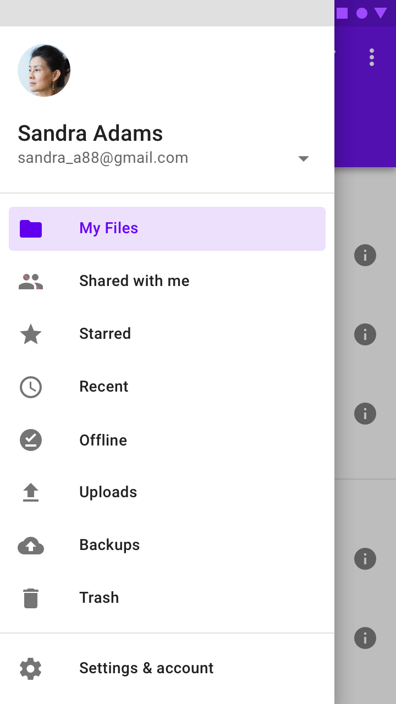
        
Sombra al mostrar el menú

    

    

        
        
Sombra al arrossegar

    

 

    

        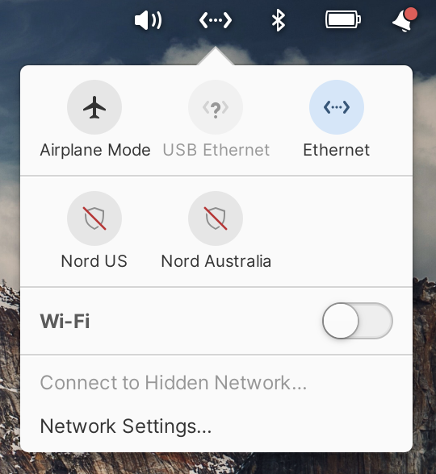
        
Bon ús de sombres, per resaltar un pop-over o botons

    

    

        
        
Mal ús, elements amb sombres sobreposades a altres

    

 

### Superposició de capes, glassmorphism

Algunes aplicacions, combinen les sombres amb **[glassmorphism](https://platzi.com/tutoriales/1640-frontend-developer-2019/9482-glassmorphism/)**. 
Amb aquesta tècnica, la separació visual s’aconsegueix a partir de superfícies transparents amb el fons desenfocat.

Crea l’efecte d’un vidre congelat, *frozenglass*

    

        
    

    

        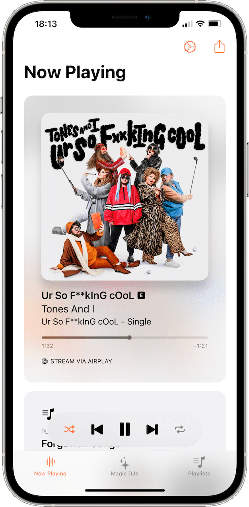
    

 

### ListView i navegació en dispositius mòbils

La manera natural de navegar entre sub-vistes en dispositius mòbils és a través de llistes i pantalles informatives o formularis.

    

        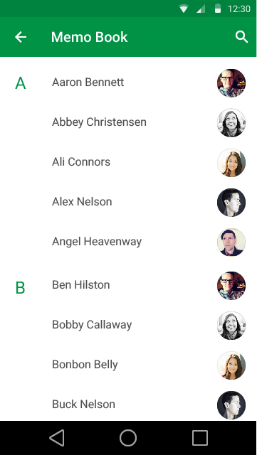
    

    

        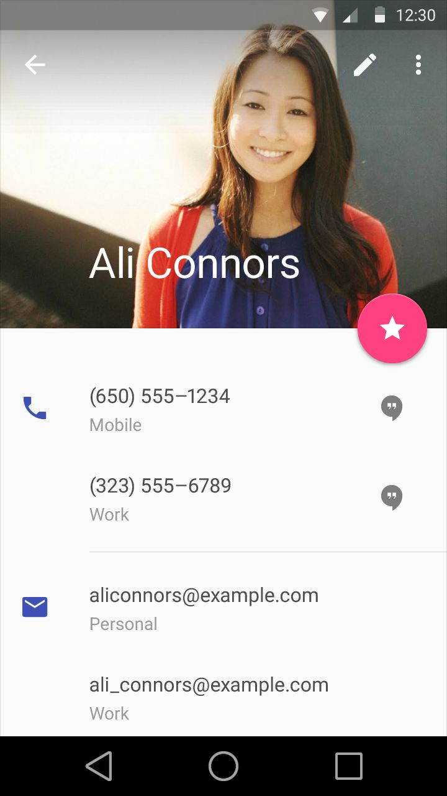
    

    

        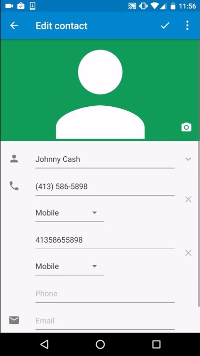
    

 

### GridView, disposició dins d'una vista

A vegades, una graella és una opció més adequada que una llista per mostrar un conjunt de ítems.

    

        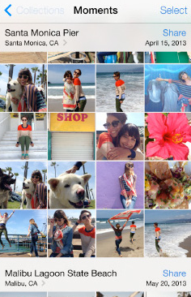
    

    

        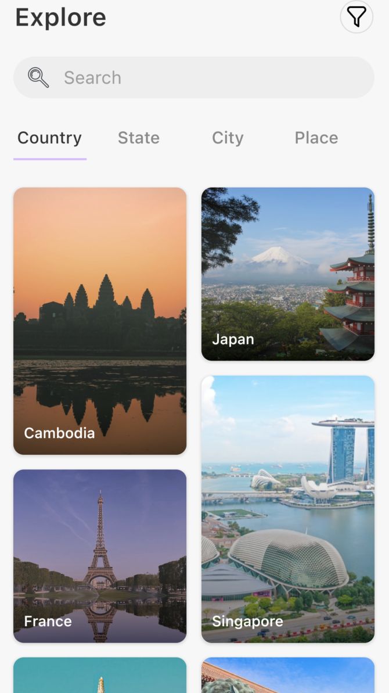
    

 

### Mida dels elements seleccionables

Cal tenir en compte que els dispositius mòbils solen interactuar a través dels dits, i per tant els elements interactius **no poden ser petits ni estar molt junts**.

Es recomana que els botons siguin com a mínim de **48x48** pixels. 

Això vol dir que els elements de les llistes i les graelles han de ser com a mínim de 48 pixels d’alt.

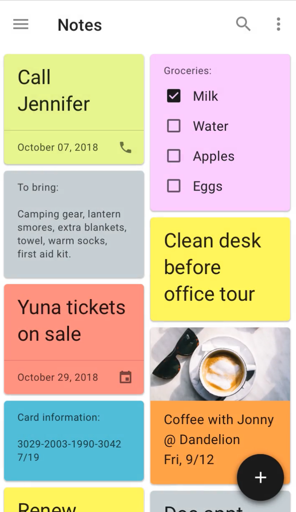
 

  

### Top bars, informació i accions

La barra superior de l’aplicació, [top bar](https://m3.material.io/components/top-app-bar/overview), mostra un títol amb informació sobre la secció o sub-vista actual, i accions ràpides.

Quan es tracta d’una sub-vista, és una bona pràctica incloure el botó d’anar enrere. Aquest botó pot incloure el nom de la secció anterior.

Si la barra superior inclou una imatge de fons, els textos i els icones han de ser llegibles

    

        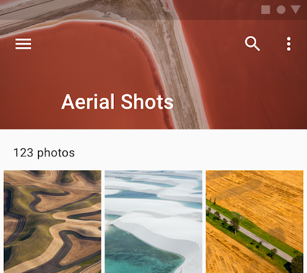
    

    

        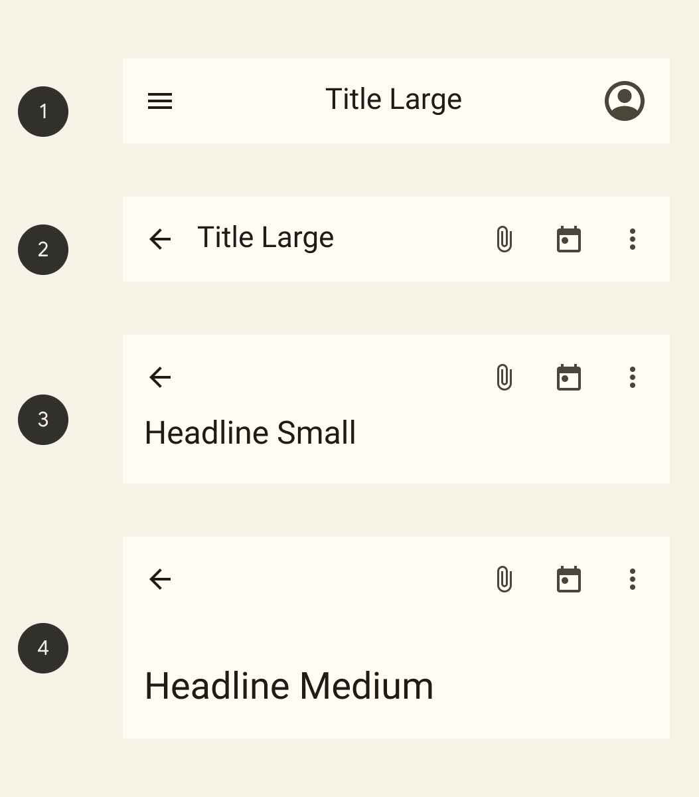
    

    

        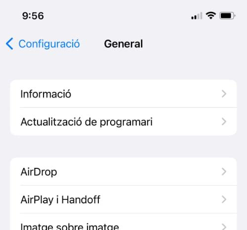
    

 

### Tab bars, navegació entre seccions

Algunes aplicacions fan ús de **[tab bars](https://developer.apple.com/design/human-interface-guidelines/tab-bars)** (també anomenades [bottom navigation](https://m2.material.io/components/bottom-navigation/flutter#using-bottom-navigation)), es tracta d’un element situat a la part inferior que permet organitzar les aplicacions en diferents **seccions** (continguts).

Les **tab bars**’** han d’ajudar a la navegació, no han d'oferir accions, ni opcions ni eines. És a dir una tab bar **NO equival a la toolbar**.

    

        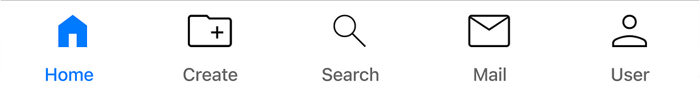
    

    

        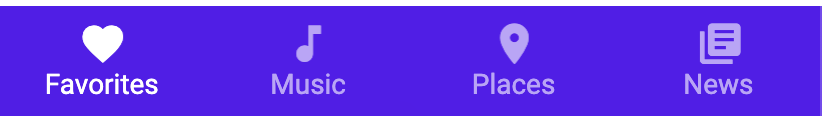
    

 

### Action sheets, alerts, popovers i altres diàlegs

Els **[dialogs](https://developer.apple.com/design/human-interface-guidelines/presentation)** són petites finestres que es mostren per sobre de la finestra d’aplicació i bloquegen el contingut d’aquesta.

Poden ser alertes que demanen la confirmació d’una acció, o una llista d’opcions.

    

        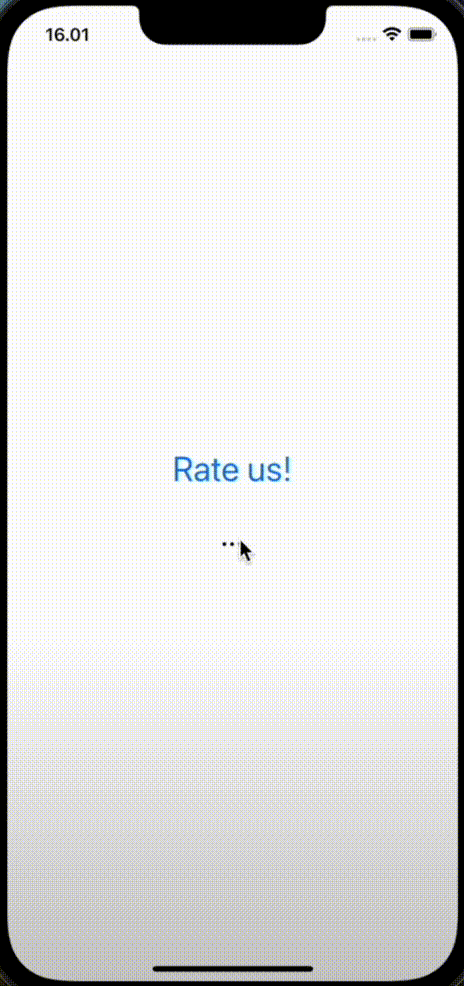
    

    

        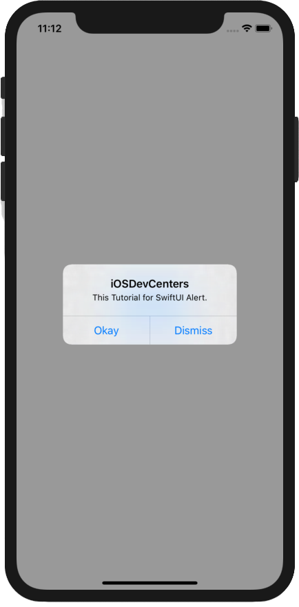
    

 

### Navigation drawer

Els [panells de navegació](https://m2.material.io/components/navigation-drawer), són diàlegs que poden mostrar menús, llistes d’accions, eines i fins i tot configuracions.

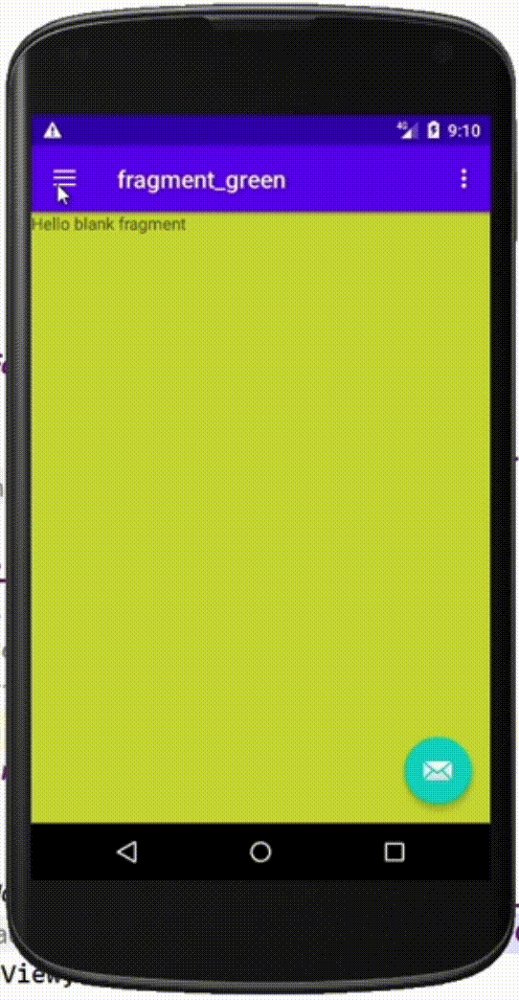
 

  

### Snackbar (toast)

Les **snackbar** són barres informatives que apareixen a la part inferior de la pantalla.
Poden tenir accions associades
Poden desaparèixer per si soles
NO trenquen la interactivitat de l’aplicació

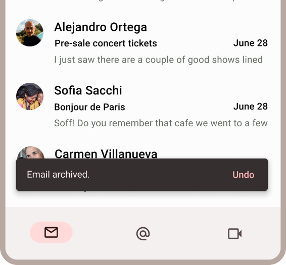
 

  

**Nota:** No són diàlegs, ja que no bloquegen la interacció amb l’aplicació
