

    

        
© Albert Palacios Jiménez, 2023

    

    

        
    

 

# Colors

## Teoria del color

La [teoría del color](https://ca.wikipedia.org/wiki/Teoria_del_color), és un grup de regles bàsiques en la mescla i combinació de colors, per aconseguir efectes visuals que poden fins i tot evocar emocions.

En condicions normals, l’ull humà té cèl·lules sensibles a tres longituds d’ona: la vermella, verda i blava. A partir dels quals veiem la resta de tonalitats. 

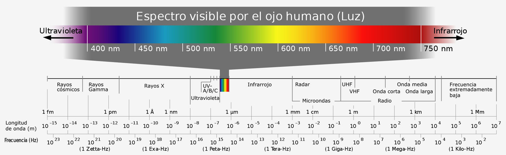
 

  
  

### Model RGB

Tradicionalment en pantalles, es fa servir el model RGB, és a dir els colors es formen a partir dels components Red, Green i Blue.

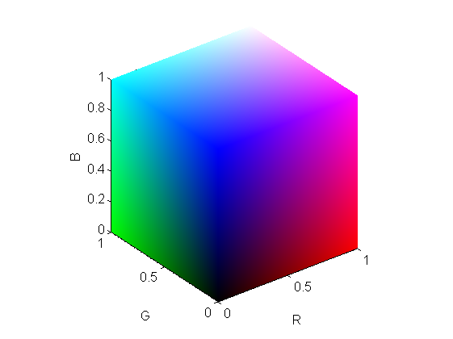
 

  

Depenent de la tecnologia, o el llenguatge de programació, els colors RGB es defineixen amb valors:

- Entre 0.0 i 1.0 (decimals)
- Entre 0 i 255 (enters)
- Entre 00 i FF (hexadecimal)
- Quan es parla de RGBA, la ‘A’ (alpha) fa referència a la transparència.

### Cercle cromàtic

El [cercle cromàtic](https://ca.wikipedia.org/wiki/Cercle_crom%C3%A0tic) mostra els colors visibles distribuïts en un cercle.

- Els colors en posicions oposades del cercle s’anomenen “Complementaris”

- Els colors dos colors del costat a un color del cercle s’anomenen “Anàlegs”

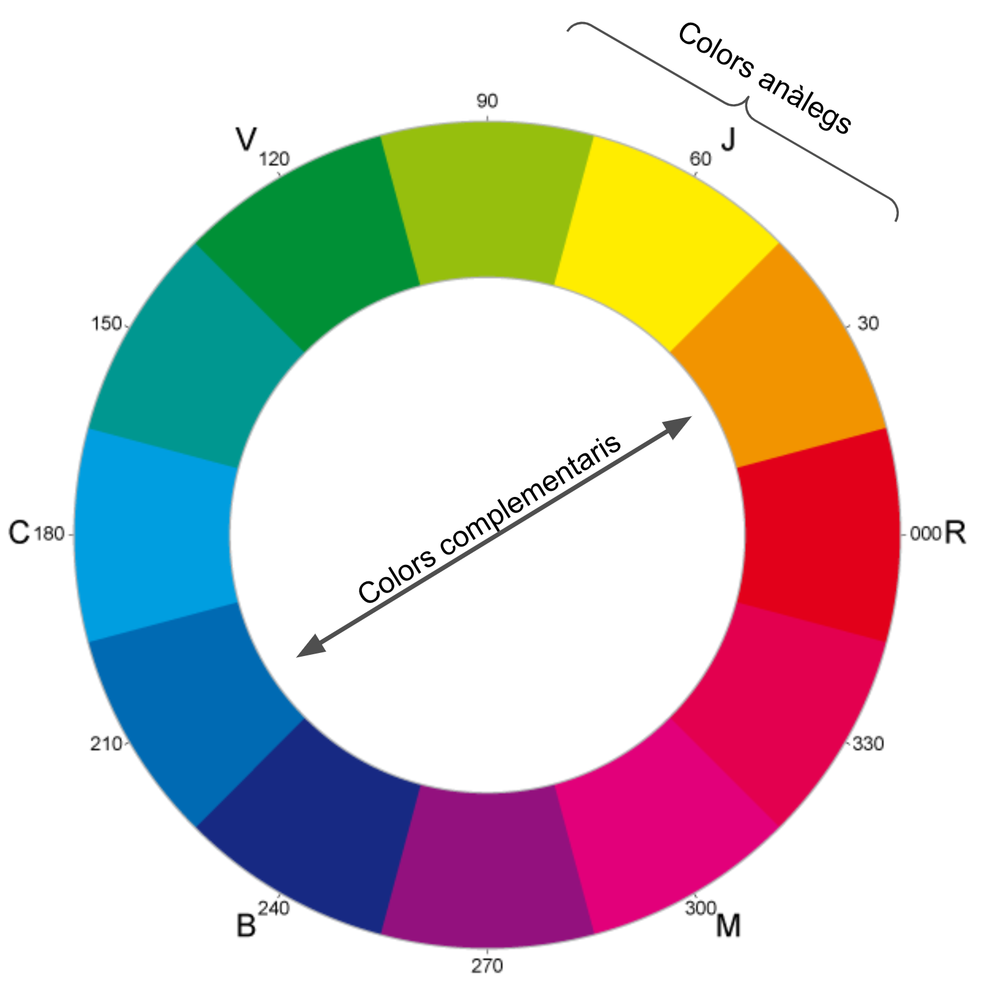
 

  

Algunes guies de disseny ([material](https://m2.material.io/design/color/the-color-system.html#color-usage-and-palettes)) expliquen com fer servir el cercle cromàtic per definir els colors primari i secundari de les aplicacions.

### Colors i emocions

**Colors càlids:** es relacionen amb emocions fortes com la passió o l’amor.  Es consideren colors intensos i es fan servir quan es vol afegir joventut o emoció als dissenys.

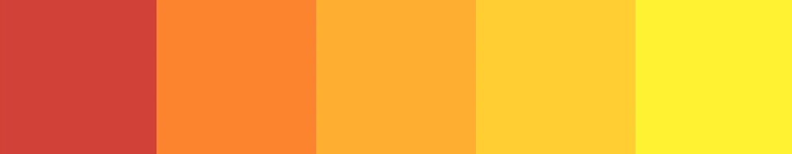
 

  

**Colors freds:** es relacionen amb calma, relaxació, lleialtat. Es consideren colors de confiança i es fan servir en la imatge de marques (especialment el blau per bancs i el verd per ecologisme)

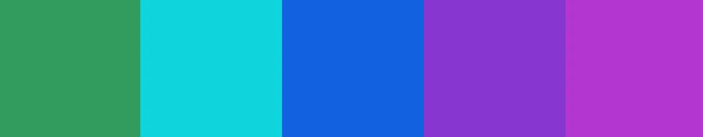
 

  

**Colors neutrals:** es relacionen amb elegancia i neutralitat. Es consideren colors subtils que i es fan servir com a fons, o per fer resaltar colors d’accent.

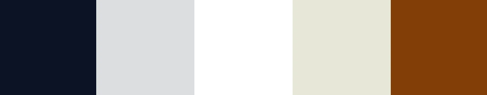
 

  

### Paleta de colors

Una paleta de colors és una combinació de colors, que combinen entre ells, i defineixen la imatge de la marca del producte.

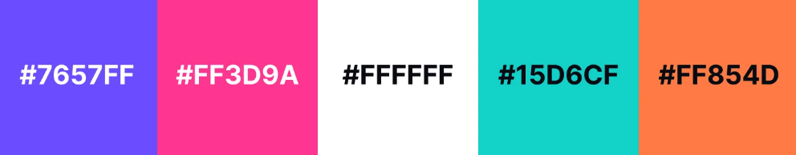
 

  

La paleta de colors ha de definir almenys:

- **Color principal** que es fa servir més a l’aplicació i els seus components (imatge de la marca)
- **Color secundari** és opcional i serveix per complementar al principal i fer que el color principal “no cansi”
- **Colors de superfície o fons**, solen ser neutres i complementen al principal i secundari
- **Colors d’atenció**, són colors de la paleta relacionats amb missatges d’error i alerta

### Contrast dels colors

Els icones i textos s’han de llegir amb claredat, això s’aconsegueix fent que hi hagi molt contrast entre la informació i el seu fons.

    

        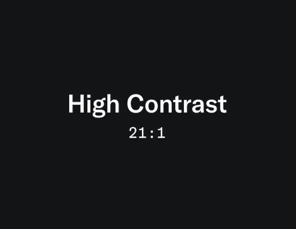
        
Lectura fàcil

    

    

        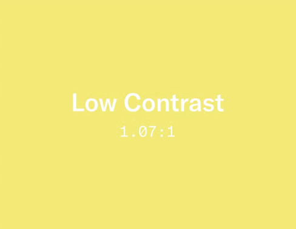
        
Dificultat per llegir

    

 

Cal tenir en compte, que hi ha [persones amb dificultats visuals](https://blog.iamsuleiman.com/techniques-to-display-text-overlay-background-images/), no poden llegir bé els textos si no hi ha prou contrast amb el fons.

    

        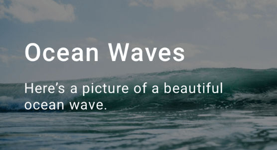
        
Lectura fàcil

    

    

        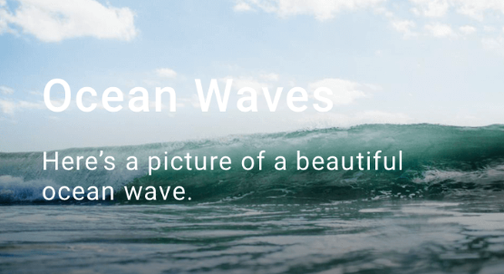
        
Dificultat per llegir

    

 

El contrast, pot fer resaltar un element o botó i induir a l’usuari a fer accions més fàcilment.

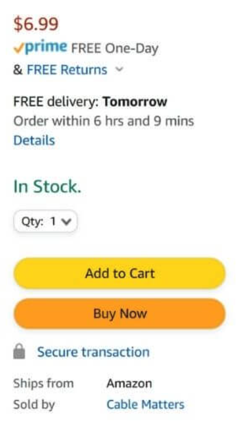
 

  
  

### Modes clar i fosc

Avantatges del mode fosc:

- Menys fatiga visual, al rebre menys llum de la pantalla

- Més bateria ja que la pantalla no emet tanta energia (llum)

- Millor visualització de colors i contrastos en aplicacions de disseny

    

        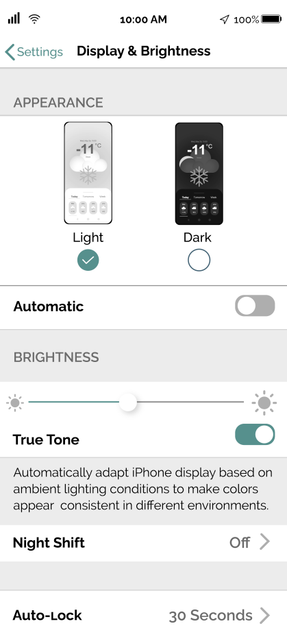
    

    

        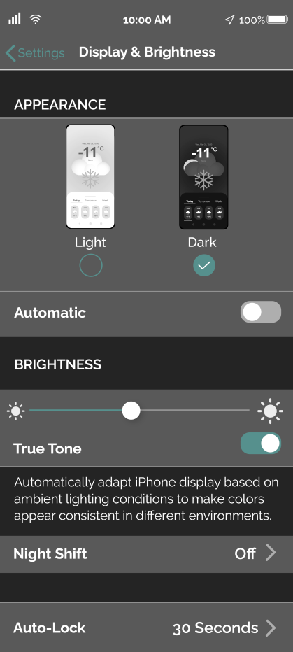
    

 
 

Actualment, les pròpies llibreries del sistema deixen escollir si les aplicacions fan servir els mòdes clar i/o fosc.

Tradicionalment:

- Les aplicacions de disseny (fotos, vídeo, 3D) han fet servir GUIs fosques
- Les aplicacions d’oficina han fet servir GUIs clares
- Les aplicacions de desenvolupament i programació solen deixar escollir a l’usuari

    

        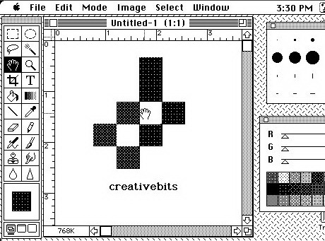
        
Photoshop 1985

    

    

        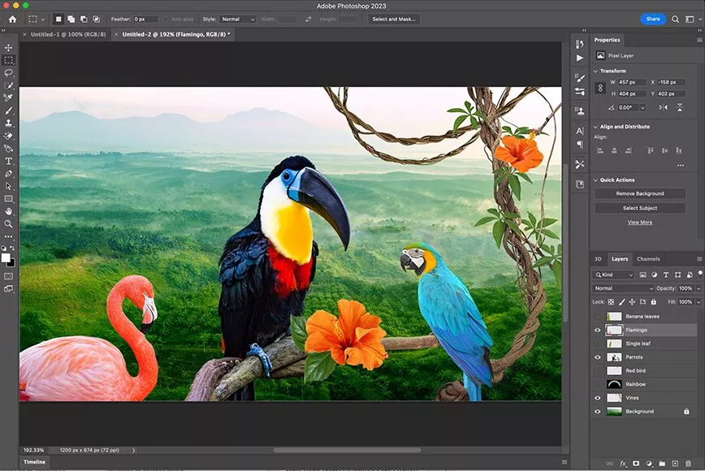
        
Photoshop 2023

    

 
