

    

        
© Albert Palacios Jiménez, 2023

    

    

        
    

 

# Tipografies

Les tipografies són una part molt important de la comunicació i de l’experiència d’usuari.

    

        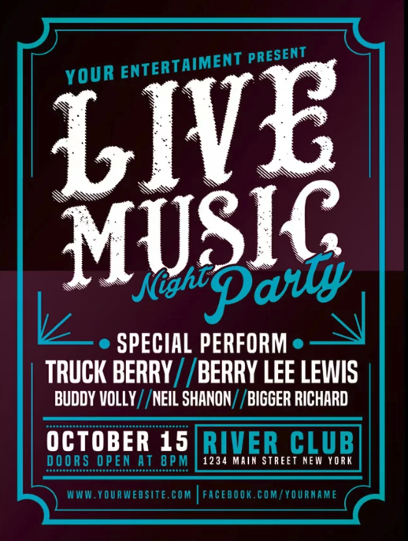
    

    

        
    

    

        
    

 

## Fonts 

Una **font** és una col·lecció de caràcters (lletres, nombres, signes de puntuació, …) que defineixen com mostrar un text.

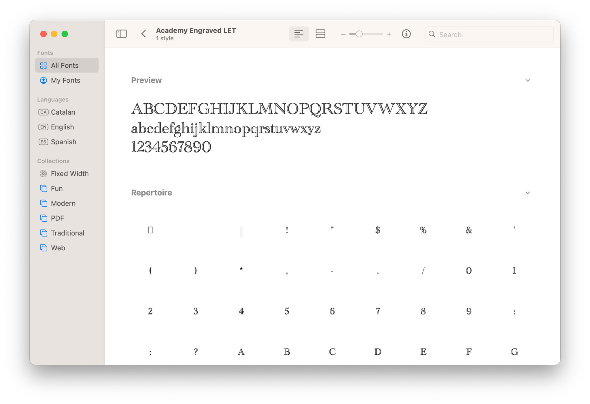 
 

  

## Typeface

El concepte de **Typeface** fa referència a un conjunt de fonts que comparteixen disseny, típicament són: Serif, Sans-Serif i Monospace

Les fonts poden ser una variació d’una typeface o definir-ne una de nova.

Per exemple Serif i Sans-serif (serif sense decoracions).

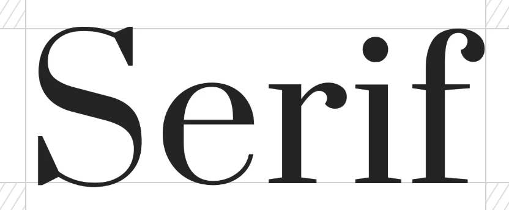 
 

  

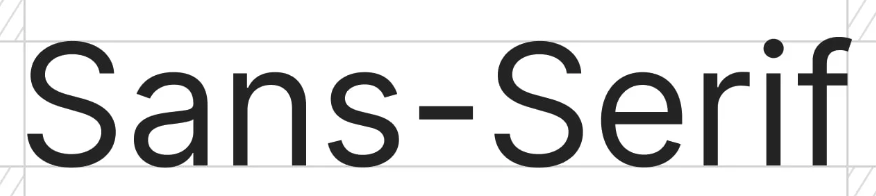 
 

  

## Variacions de les fonts

La majoría de fons, tenen 3 variacions:

- **Italic**, la cursiva es pot fer servir per emfatitzar paràgrafs sencers amb molt text, o petits grups de paraules que no han de resaltar per sobre la lectura normal del text.

- **Regular**, textos llargs que necessiten concentració a la lectura

- **Bold**, la negreta es fa servir per emfatitzar de manera efusiva un text, pot ser un títol o una acció important

### Font Weight

En realitat la negreta afecta el **pes de les fonts**, algunes fonts ofereixen diverses opcions des de molt lleugeres a molt pesades.

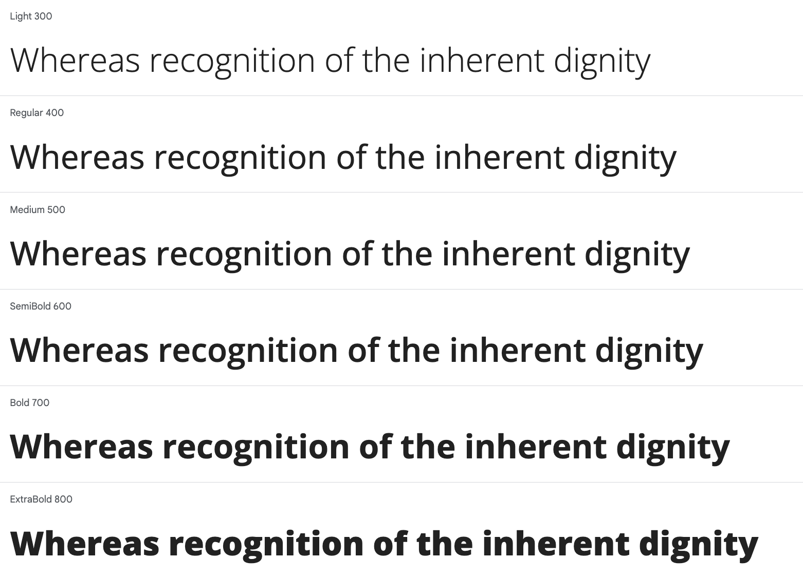 
 

 

## Anatomía dels caràcters

Les tipografies (fonts) formen part d'un llenguatge de disseny amb [carecterístiques](https://osmanassem.com/typography-the-anatomy-of-a-letter/) pròpies.

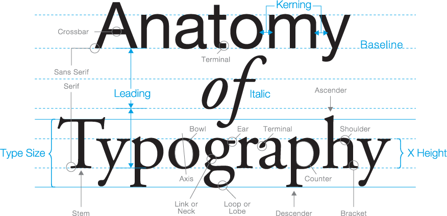 
 

  

### Mida de les fonts

Cal tenir en compte, que els caràcters sobresurten del seu espai natural.

- Perquè tenen parts per sobre de la **"meanline"** com les majúscules o lletres accentuades: à, ñ, …

- Perquè tenen parts per sota de la **"baseline"** com les lletres ‘q’ o ‘g’

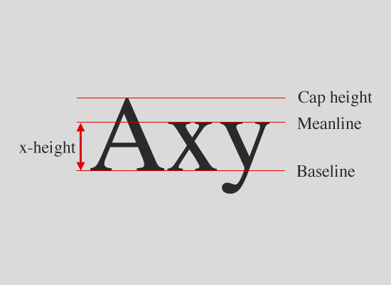 
 

  

### Alineació vertical dels textos

Habitualment, quan s’alinea verticalment un text, es fa a partir de la **"baseline"**

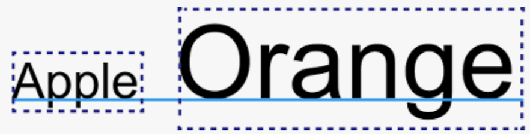 
 

  

Cal tenir-ho en compte quan s’alinea un text que està al costat d’un botó.

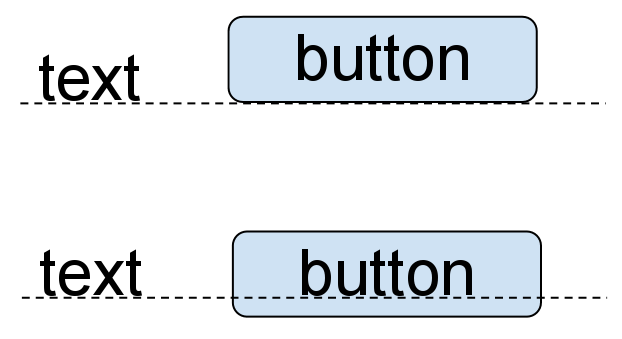 
 

 

Es llegeix millor si estàn verticalment alineats com en aquest segon exemple.

## Fonts del sistema i fonts de tercers

Cada sistema bé amb un conjunt de fonts pre instal·lades anomenades **"fonts del sistema"**.

Quan es desenvolupa una aplicació coneixent el sistema al que s’executa podem fer servir les fonts del sistema.

Quan una aplicació ha d’anar a diversos sistemes, o es desenvolupa una web, caldrà comprovar que l’usuari té la font que necessita l’aplicació, posar-la disponible o buscar-ne una alternativa.

Serveis com ‘[Google fonts](https://fonts.google.com/)’ o ‘[Adobe fonts](https://fonts.adobe.com/)’ permeten accedir a centenars de fonts gratuites o llicenciades.

### Safe fonts

Les **"safe fonts"** solen estar pre-instal·lades en tots els sistemes. 

Avantatges de fer servir ’safe fonts’:

- Les trobem en tots els sistemes (o casi)
- Carreguen més ràpidament
- No cal descarregar fonts addicionals
- No cal preocupar-se de llicències de distribució

Llista de **"safe fonts"**:

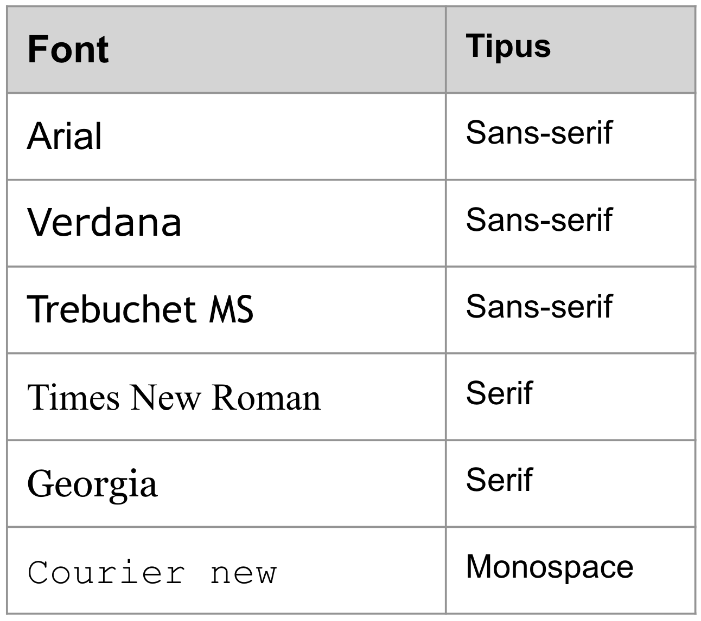 
 

 

## Exemple, diàlegs de benvinguda

Els diàlegs de benvinguda poden combinar colors i tipografies per fer una entrada més agradable a l’aplicació.

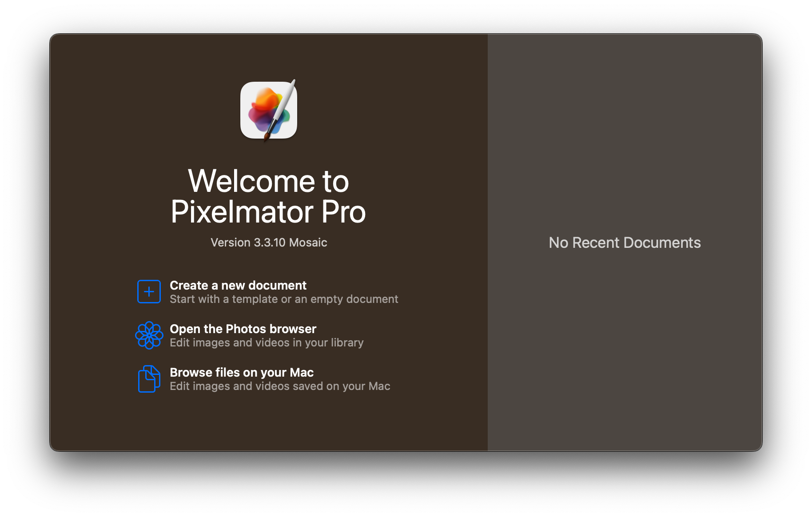 
 
Benvinguda a Pixelmator (nou document)

 
 
 

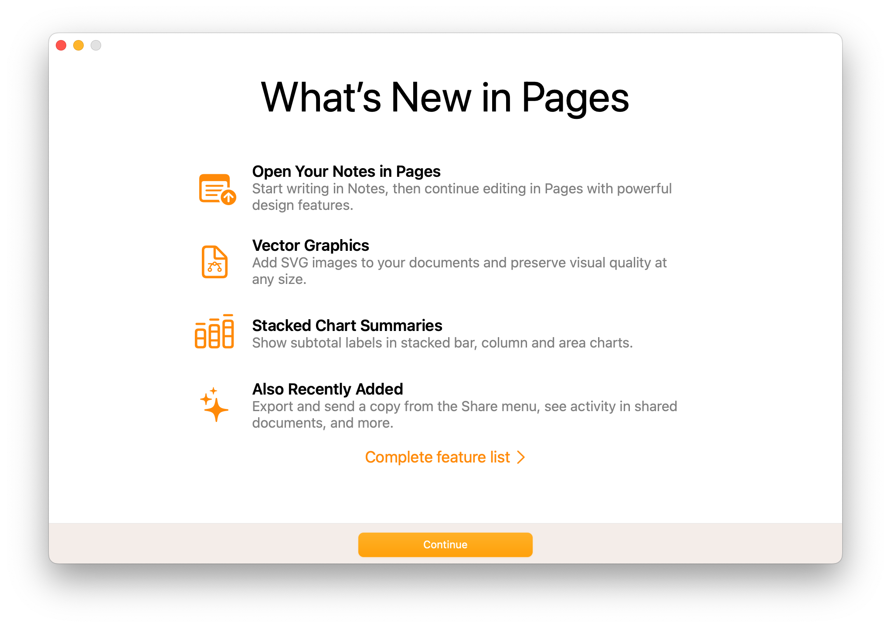 
 
Benvinguta a Pages (novetats)

 

## Exemple, ús de tipografies i colors

En el següent exemple es poden identificar:

- Paleta de colors definida
- Ús de negretes per emfatitzar textos
- Ús de textos grisos o petits per  dissimular excés d’informació
- Ús de tipografies en elements destacats i títols
- Forta imatge de marca a través dels colors càlids i neutres

    

        
    

    

        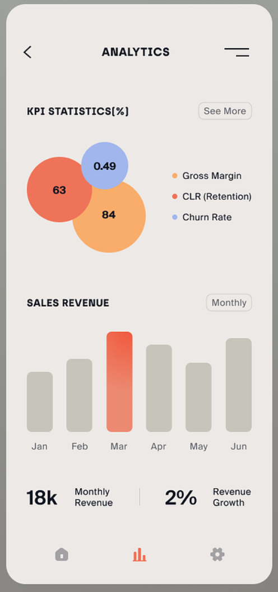
    

 
