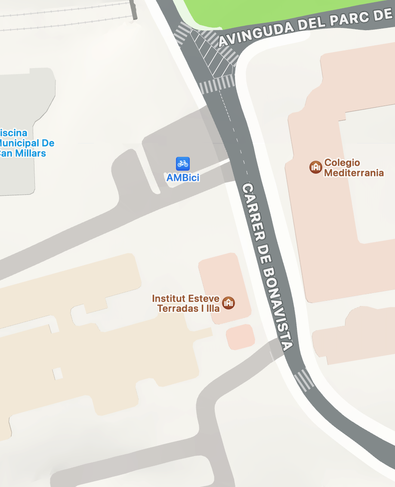

    

        
© Albert Palacios Jiménez, 2023

    

    

        
    

 

# Imatges i vectors

## Imatges Raster (píxels)

Computacionalment, les imatges es defineixen a partir de quadres de colors anomenats píxels.

Quan una imatge es defineix a partir d’una matriu de píxels, es diu que és "[raster](https://en.wikipedia.org/wiki/Raster_graphics)"

 

 

## Pantalles i píxels

A la pantalla, les imatges també es formen a partir de píxels, però cada tecnología de pantalla pot formar els píxels de manera diferent. 

En general totes ho fan a partir de punts de llum:

- Red (vermell)
- Green (verd)
- Blue (blau)

 

 

## Imatges amb transparències, RGBA

Alguns formats d’imatge (png), estàn pensats per poder sobreposar la imatge sobre altres imatges.

Per fer-ho, a part de definir els píxels com a valors RGB, afegeixen el valor de transparència [Alpha](https://en.wikipedia.org/wiki/RGBA_color_model) que defineix quan de transparent és aquell píxel.

 
 

 

**Nota:** Històricament, els programes de fotografia posen una quadricula de fons, per mostrar les parts transparents d’una imatge.

## Anti-aliasing

Anti-aliasing és una tècnica de processament d’imatges, que es fa servir per reduir “les dents de serra” en imatges digitals.

Hi ha diverses maneres de fer anti-aliasing, les més senzilles només mesclen els píxels adjacents i les més complicades intenten tenir en compte les formes geomètriques de les imatges.

 
 

  
  

## Dots per inch, DPI

Quan s’ha d’imprimir una imatge, es parla de DPI que són els punts per cada Inch (2.54 cm) que hi ha en una imatge.

Una imatge a 600DPI tindrà molta més definició que una a 72DPI, ocupant el mateix espai un cop impresses.

    

        
        
DPI 72

    

    

        
        
DPI 600

    

 
 

## Pixels per inch, PPI

Agafant el concepte de DPI per a impressions, les pantalles tenen un valor PPI.

La [densitat de la pantalla](https://m2.material.io/design/layout/pixel-density.html#pixel-density) es defineix en Pixels Per Inch (o PPI). És a dir, quants píxels hi ha en 1 Inch (2.54cm)

    

        
        
Low-density display

    

    

        
        
High-density display

    

 
 

## Pantalles d'alta densitat (retina display)

Retina display és el nom comercial que ha posat Apple als dispositius que tenen les pantalles amb alta densitat de pixels (PPI).

    

        
        
Pantalla "normal", iPhone 3GS

    

    

        
        
Pantalla retina, iPhone 4

    

 
 

**Important:** La idea no és posar més contingut en pantalla, sinó que el mateix contingut estigui més definit.

### Qualitat de les imatges en pantalles d'alta densitat

Els dispositius amb pantalles “no retina”, solen ser més antics i tenir menys capacitat de memòria, per aquests dispositius es fan servir imatges amb menys definició.

Per dispositius amb pantalla retina, solen ser més moderns i tenir més capacitat de memòria, habitualment es fan servir imatges amb el doble de definició.

**Nota:** Per convenció, els arxius amb més definició s’anomenen amb el mateix nom seguit de “@2x”.

    

        
        
iPhone 3GS

    

    

        
        
iPhone 4

    

 
 

### Aliasing en pantalles d'alta densitat

Quan no oferim una alternativa “@2x” al sistema, en pantalles retina el sistema ha d’agrandar les imatges inventant-se uns píxels que la imatge no té.

Habitualment, al fer més gran una imatge, es dupliquen els píxels, però això produeix “aliasing”, aleshores s’apliquen tècniques d’anti-aliasing que fan la imatge més borrosa.

Idealment oferirem dues imatges, una amb poca definició i una altra “@2x” amb el doble de definició per tal que el sistema no hagi de fer l’escalat.

    

        
        
Original

    

    

        
        
Escalada

    

    

        
        
Original@2x

    

 
 

**Important:** El motiu de no oferir només una imatge amb el doble de definició i que el sistema l’escali a petita, és que habitualment els dispositius sense pantalles retina, no són massa potents.

## Textos en pantalles d'alta densitat

Com que els textos no es formen a partir d’imatges, sinó a partir de la definició de la seva geometria, automàticament es veuen perfectes en pantalles retina.

La llibreria encarregada de dibuixar el text, segons la font escollida, perfila els contorns segons correspongui.

 
 

  
  

## Gràfics vectorials

Els [gràfics vectorials](https://www.digitional.com/a-simple-explanation-of-vector-graphics-illustrations/) ([Vector Graphics](https://www.coreldraw.com/en/learn/guide-to-vector-design/how-do-vector-graphics-work/)) es defineixen a partir de formes geomètriques i coordenades enlloc de matrius de píxels (semblant als textos)

Avantatges:

- Si tenen pocs elements, ocupen molt menys espai que els seu equivalent en imatge.
- Es poden escalar (agrandar) sense perdre definició.
- Es poden animar sense augmentar massa l’espai que ocupen
- El principal inconvenient és que no són adequats per guardar informació fotogràfica.

 
 
Inkscape

  
  

Al igual que els textos, els gràfics vectorials es veuen automàticament bé en pantalles retina.

El motiu és simple, al igual que les tipografies, els gràfics vectorials es defineixen a partir de formes geomètriques i coordenades, per tant el sistema sap com “inventar-se” els píxels per donar més definició. A més, afegeix l’aliasing amb coherència per evitar les "dents de serra"

 
 

  
  

### Vectoritzar imatges

Del procés de transformar una imatge ‘raster’ en un dibuix vectorial, se’n diu "vectoritzar". Tot i que algunes eines permeten vectoritzar automàticament, tradicionalment s’ha fet "a mà"

    

        
        
Original, raster

    

    

        
        
Vectoritzada

    

 

**Important:** Idealment, els logotips de les empreses tenen una versió vectorial. A més, a les aplicacions s’ha d’intentar fer servir la versió vectorial enlloc de la versió “raster”

## Exemple, mapes!

Al principi de Google Maps, els servidors de Google generaven les imatges dels mapes al servidor i enviaven aquestes imatges als clients.

**Apple va demanar a Google** que canviés la tecnologia de l'aplicació Maps per tal que fós amb dibuixos vectorials enlloc d'imatges descarregades del navegador.

Les avantatges de fer el dibuix amb gràfics vectorials enlloc d'imatges:

- Menys intercanvi de dades, més ràpid de carregar a telèfons mòbils ([fins a un 80% menys](https://bgr.com/general/apple-maps-data-consumption-80-percent-less-than-google-maps/))
- Dibuixios més nítids, adaptats a la densitat de pantalla de cada dispositiu

Google no ho volia, perquè no volia publicar les coordenades de les localitzacions dels seus mapes. I s'hi va negar.

Al final, [Apple va fer]((https://appleinsider.com/articles/12/08/03/inside_apples_new_vector_based_maps_in_ios_6)) la seva pròpia "Apple Maps".

    

        
        
Google Maps

    

    

        
        
Apple Maps

    

 
 

I ara, Google Maps també és vectorial:

 
 

  
  

