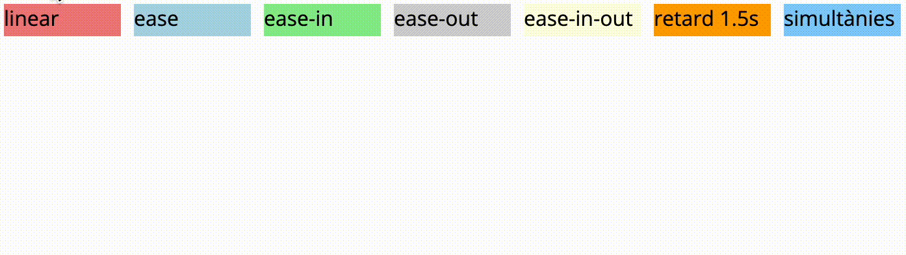
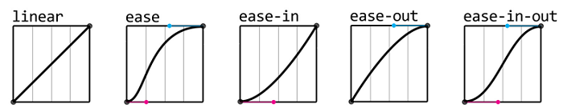
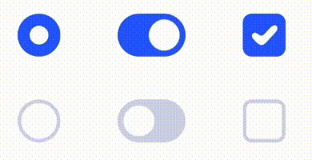
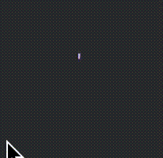
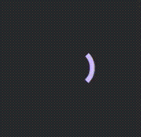
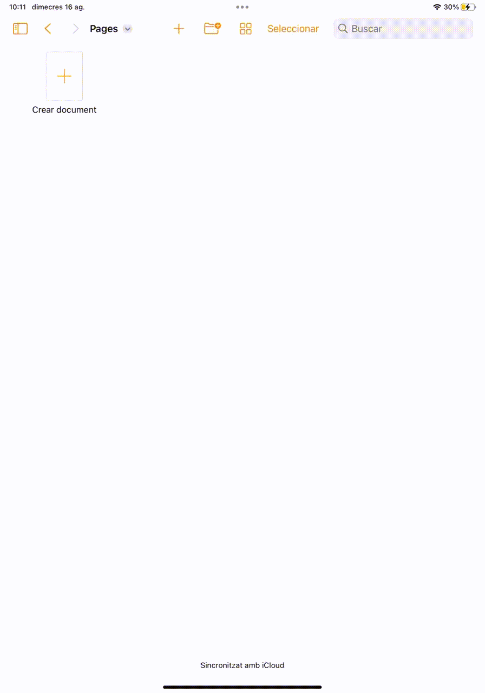

    

        
© Albert Palacios Jiménez, 2023

    

    

        
    

 

# Animacions

Les **animacions** són canvis als objectes o elements cada cert temps, per crear una sensació de moviment.

Es pot animar:

- La posició
- El color
- La mida
- La forma
- … (tot el què es pot canviar matemàticament)

## Frames per segon FPS

Cada imatge d’una animació s’anomena Frame

Una animació està formada per diversos frames

La quantitat de frames que podem mostrar cada segon són els FPS

Quan més alta és la quantitat de FPS, més suau es veu l’animació

<video width="275" height="480" controls autoplay loop>
  <source src="./assets/fps.mov" type="video/mp4">
  El teu navegador no suporta la reproducció de vídeo.
</video>

## Vídeos vs Animacions

Un **vídeo** és una seqüència d’imatges pre-definida (.mov,  mp4), també tenen pre-definit els FPS als que s’han de mostrar. No es poden “inventar” frames per augmentar els FPS.

Una **animació** defineix les propietats que s’han de canviar i <u>en quin temps s’ha de fer aquest canvi</u>, el nombre de FPS depèn de la capacitat de procés de l’equip i pot variar segons les circumstàncies. 

Una animació **NO** defineix el nombre de FPS, s’entén que sempre serà el més alt possible.

## Paràmetres d’animació

Les animacions es defineixen a partir de:

- Retard (temps que triga a iniciar-se l’animació)
- El valor d’inici (posició inicial, color inicial, mida inicial, …)
- El valor final
- El temps que dura l’animació (pot ser en ms, segons, …)
- Tipus de repetició (si s’executa 1 cop, N cops o infinites vegades)
- Tipus de direcció (si s’inverteix l’inici i el final)
- La funció de transició

### Funció de transició

La funció de transició, defineix com progresa l’animació durant el temps establert.

Normalment, hi ha diversos tipus pre-definits. Per exemple, una funció ‘linear’ és aquella en què tots els valors intermitjos són proporcionals al temps que falta per acabar.

 

 
 

## Importància de les animacions

Les animacions permeten simular experiències físiques quan s’interactua amb els objectes virtuals de les pantalles.
Ajuden a millorar l’experiència d’usuari i fer que les interfícies siguin més atractives. 

Les més habituals són:

- Micro-interaccions
- Progrés
- Navegació
- Storytelling

### Micro-interaccions

Informen que una acció s’ha completat, i si s’ha realitzat o no amb èxit.

 

 
 

### Progrés

Animacions que informen de l’estat en què progresa una acció.

- Són determinades si es pot estimar quan acabarà l’acció
- Són indeterminades si no es pot saber quan acabarà

    

        
        
Determinat

    

    

        
        
Indeterminat

    

 
 

### Navegació

Les animacions de navegació ajuden a guiar l’usuari a través de la interfície, bé sigui canviant de vistes o mostrant diàlegs.

    

        
        
Determinat

    

    

        
        
Indeterminat

    

 
 

### Storytelling

Són aquelles animacions que no estan relacionades amb la interfície, també poden ser decoratives.

Ajuden a millorar l’experiència d’usuari i la relació amb la marca **(branding)**.

 

 
 