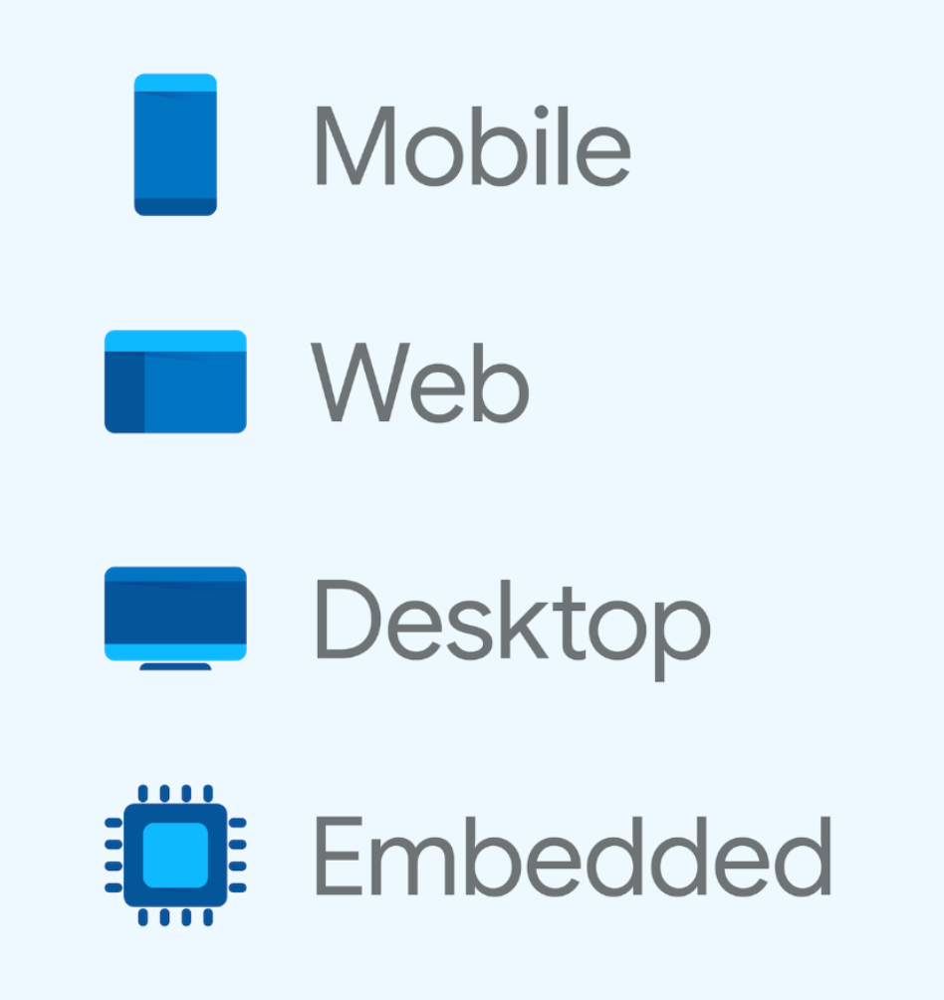
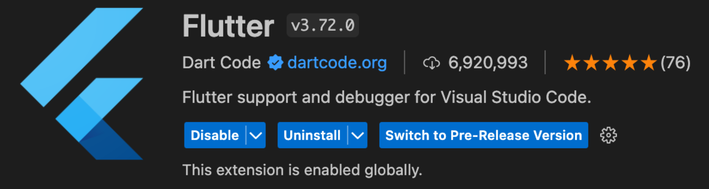
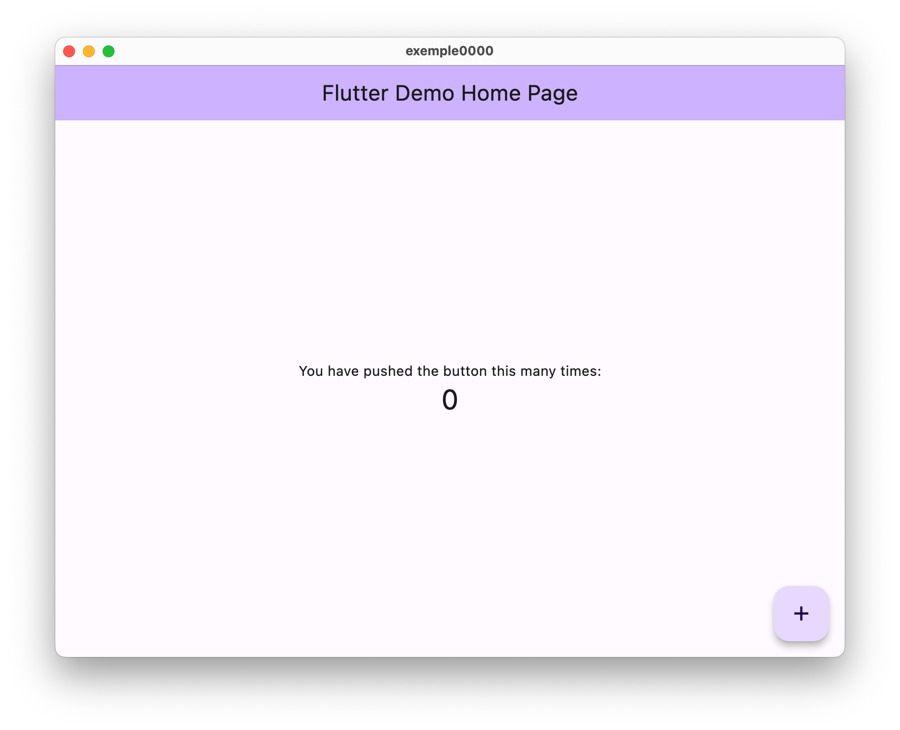
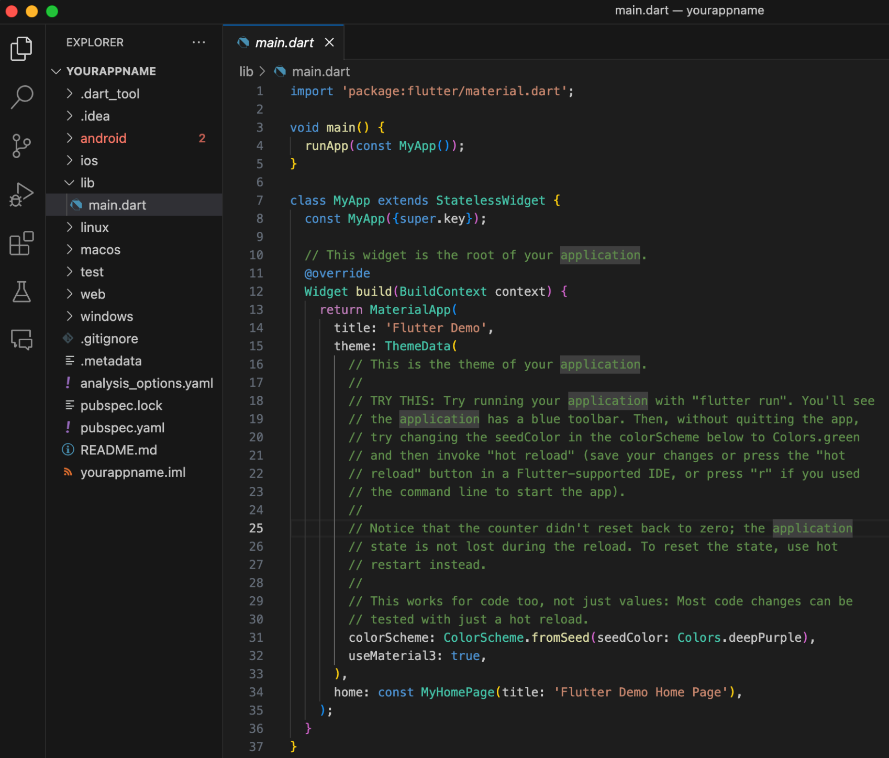
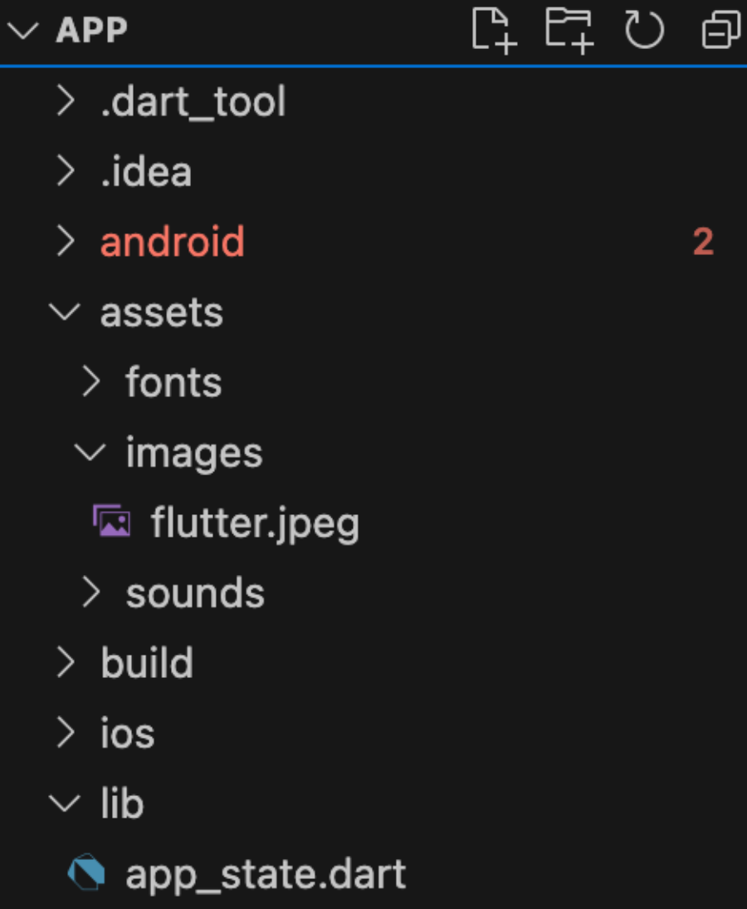
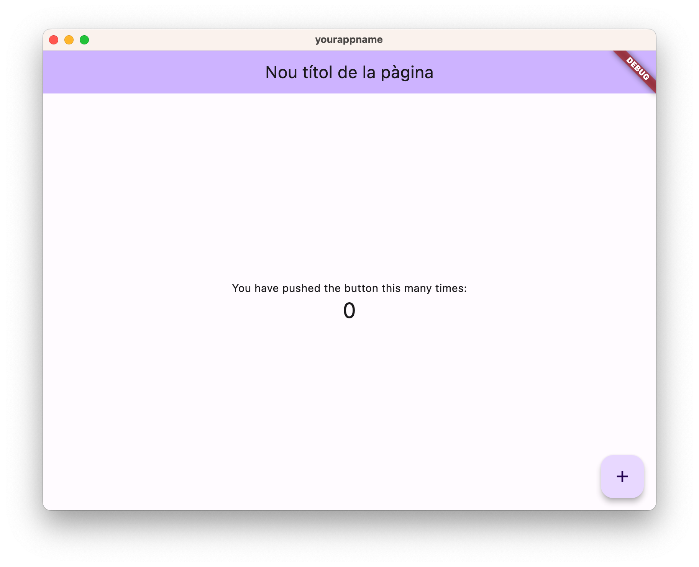
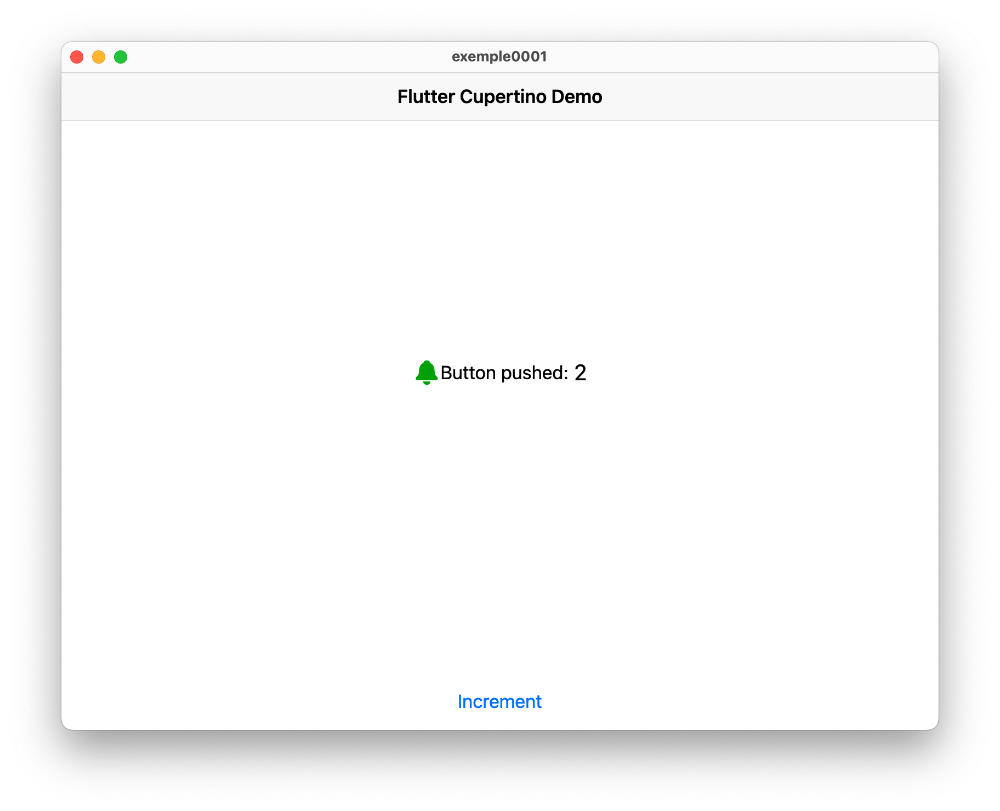

<div style="display: flex; width: 100%;">
    <div style="flex: 1; padding: 0px;">
        <p>© Albert Palacios Jiménez, 2023</p>
    </div>
    <div style="flex: 1; padding: 0px; text-align: right;">
        
    </div>
</div>
<br/>

<br/>
<center>
<br/></center>
<br/>
<br/>

# Flutter

Flutter és un **Framework** de programació basat en llenguatge Dart, per a desenvolupament d’aplicacions multiplataforma.

[**Vídeo:** Introducing flutter](https://youtu.be/fq4N0hgOWzU?si=ygU_Dsa8ORWz6OKM)

Flutter, permet crear aplicacions per diferents plataformes, fent servir el mateix tipus de codi i eines de programació.

<br/>
<center>
<br/></center>
<br/>
<br/>

Les aplicacions que fan servir les llibreries del sistema s’anomenen natives.

Les Apps Flutter són natives, però NO fa servir les llibreries del sistema, només les eines de compilació.

**Avantatges** de les apps Flutter:

- Desenvolupament multiplataforma
- Hot-reload al desenvolupar (proves sense reiniciar l’app)
- Interfícies basades en widgets, molt personalizables
- Accés a funcionalitats natives (es pot perdre multiplataforma)
- Molta [documentació](https://docs.flutter.dev/get-started/install) i [vídeos](https://www.youtube.com/@flutterdev) de programació explicatius
- Comunitat de desenvolupament de llibreries a [pub.dev](https://pub.dev/)
- Al compilar a codi nadiu, es poden enviar les aplicacions a les App Stores

**Desavantatges** de les apps Flutter:

- Ocupen més espai que les natives (mínim 4.5 megues)
- No tenen tantes llibreries funcionals com les natives
- S’han de compilar apart en cada sistema (no pots fer una app iOS desde Linux)

## Apps vs Webapps

Cal apuntar, que les aplicacions web estan limitades per les mesures de seguretat del navegador. 

És a dir, que al web no tot funciona com s’espera en una app normal:

- Les crides al servidor han d’estar habilitades
- Flutter web no és amigable amb SEO, s’ha de planificar
- El hot-reload no sempre funciona com s’espera
- Flutter web no pot accedir a les llibreries natives del sistema
- Les aplicacions web poden ocupar força espai i no carregar-se immediatament

## Instal·lació

Per instal·lar flutter, a la **"Command Palette"** de **Visual Studio Code** escriure "Flutter", escollir "New Project" i instal·lar l'SDK de Flutter. Si el poseu a la carpeta de GitHub, per configurar el PATH cal fer:

```bash
export PATH=$HOME/Documents/GitHub/flutter/bin:$PATH
```

* Per instruccions més detallades:

[https://docs.flutter.dev/get-started/install](https://docs.flutter.dev/get-started/install)

**Important:** No oblidar-se de posar la ruta de Flutter al path del sistema! Per tenir-lo disponible des de la eina de comandes.

Per actualitzar flutter es pot fer servir:

```bash
flutter upgrade
flutter upgrade --force # Si es vol forçar algun error
```

**Nota:** Per tenir disponible la comanda *"flutter"* s'ha de configurar el *path*. En sistemes UNIX es pot fer temporalment amb "export Path" i la carpeta on està Flutter:

```bash
export PATH="$PATH:${HOME}/Documents/Projects/flutter/flutter/bin/"
```

### Dependències i validació

Per cada sistema flutter té diferents dependències, cal consultar la documentació d’instal·lació.

- Si es vol fer servir l’emulador de Android o exportar projectes cap aquesta plataforma, cal tenir instal·lat “Android Studio” i Java.
- Si es vol fer servir l’emulador iOS o exportar projectes cap aquesta plataforma, cal tenir instal·lat XCode i una clau de desenvolupament vàlida

Es pot validar que la instal·lació de Flutter és correcte amb:

```bash
flutter doctor
```

### Extensió a VisualStudioCode

<br/>
<center>
<br/></center>
<br/>
<br/>

## Crear un nou projecte

Per crear un nou projecte amb Flutter, es pot fer servir la comanda:

```bash
flutter create exemple0000
```

O més elaborat:

```bash
flutter create --org com.yourdomain.yourAppName -t skeleton exemple0000
```

Aleshores apareix la carpeta ‘yourAppName’ amb els arxius del projecte:

```bash
cd exemple0000
```

**Important:** **NO** facis servir espais als noms de carpeta de TOTA la ruta on tens l’aplicació, tampoc espais ni caràcters estranys com accents o símbols de puntuació

## Compilar i fer anar una aplicació

Per provar el codi podem executar la instrucció:

```bash
flutter run
```

<br/>
<center>
<br/></center>
<br/>

### Versió de desenvolupament

La comanda **‘flutter run’** és execució en mode de desenvolupament.

En mode desenvolupament:

- Permet fer servir les eines per debugar el codi
- S'activa el **‘hot-reload’**, que permet veure els canvis sense tornar a compilar de manera instantània (si no s'han fet canvis d'objecte importants al codi).
- La versió de desenvolupament ocupa més espai

Per escollir directament la plataforma (per exemple una aplicació MacOS):

```bash
flutter run -d macos
```

Si tenim Chrome instal·lat i volem provar l’aplicació web:

```bash
flutter run -d chrome
```

## Release (crear el programa final)

Si es vol fer una versió per distribuir sense les funcionalitat de desenvolupament (per exemple una aplicació Linux):

```bash
flutter run --release -d linux
```

Amb la comanda anterior, obtenim una aplicació totalment nativa que pot servir per veure quin rendiment té realment.

Si volem generar un binari entregable hem de fer: (exemple per macos)

```bash
flutter clean && flutter build macos
```

I es crea la carpeta ‘build/macos/Build/Products/Release/’ amb l’aplicació binària.

Tot i que cada sistema té peculiaritats de distribució diferents, a la [documentació](https://docs.flutter.dev/testing/build-modes) hi ha més detalls.

## Impeller

Flutter està canviant el seu motor gràfic (Skia) per un més modern i ràpid que han anomenat [Impeller](https://docs.flutter.dev/perf/impeller) i està pensat per funcionar amb APIs gràfiques modernes (Vulkan/WebGPU/Metal)

Els primers sistemes en tenir Impeller van ser OSX i iOS (2022), tot i que els altres han d’anar després.

Per fer anar l’aplicació amb el nou motor gràfic, es pot posar:

```bash
flutter run --enable-impeller -d android
```

## Estructura dels projectes Flutter

**Important** 

El codi del nou projecte, està a la carpeta **‘lib’**, i per defecte només hi ha l’arxiu principal **‘main.dart’**:

El llenguatge Dart és molt semblant a Java, tot i que en general és més segur i ràpid.

**Nota:** És fàcil reconèixer les carpetes finals de cada producte: android, ios, linux, … tot i que estan visibles, fan falta llibreries pròpies de cada sistema per compilar-hi.

<br/>
<center>
<br/></center>
<br/>
<br/>

Si volem incloure altres arxius, com imatges, tipografies o sons, ho hem de fer en una carpeta anomenada **"assets"**, a la mateixa arrel del projecte.

<br/>
<center>
<br/></center>
<br/>
<br/>

A més, hem de modificar l’arxiu **"pubspec.yaml"** per incloure les rutes dels arxius addicionals.

```yaml
assets:
    - assets/images/
    - assets/sounds/snd.mp3
fonts:
    - family: CustomFont
fonts:
    - asset: assets/fonts/CustomFont.ttf
```

### Stateless vs Stateful widgets

A Flutter, tota la interfície es forma a partir de ‘Widgets’, hi ha dos tipus de widgets:

- **Stateless** widget, un widget que no canvia visualment ni respon a events d’usuari. Per exemple un Icona, un Text, …

- **Statefull** widget, un widget que és dinàmic, és a dir que pot canviar d’aparença i respondre a events d’usuari.

Quan un widget Statefull canvia algun valor, cal cridar al mètode ‘setState()’ per actualitzar-lo visualment.

**Nota:** La diferenciació entre 'Stateless' i 'Stateful' es fa per optimització, no cal definir widgets amb estat si aquests no tenen canvis visuals ni interactivitat

### Codi inicial, main

```dart
import 'package:flutter/material.dart';

void main() {
    runApp(const MyApp());
}
```

En aquest codi, veiem:

- Que fem servir l’estètica ‘material’, de Material design, important el paquet corresponent.
- Defineix la funció principal del codi “main”, que només crida a executar una aplicació “Flutter” amb la funció “runApp”
- Es crea una instància de l’aplicació amb ‘const MyApp()’ 
- Es defineix MyApp com a constant per millorar el rendiment

**Nota:** Amb Flutter no cal posar ‘new’ per definir objectes, és opcional.

Els projectes Flutter defineixen els components (widgets) com a nous objects dins d'altres widgets.

Definició 'MyApp', el codi principal:

```dart
class MyApp extends StatelessWidget {
    // Constructor per defecte rep el valor de “key” que necessita la 
    // classe superior és a dir que no cal definir ‘key’ perquè ja l’hereda
    const MyApp({super.key}); 

    // Sobreescriure el mètode ‘build’ (com es redibuixa aquest widget)
    @override 
    Widget build(BuildContext context) {
        // Cal retornar un Widget, en aquest cas torna un Widget 
        // tipus ‘MaterialApp’ amb diferents paràmetres: title, theme, home
        return MaterialApp(
            title: 'Flutter Demo',
            theme: ThemeData(
                colorScheme: ColorScheme.fromSeed(seedColor: Colors.deepPurple),
                useMaterial3: true,
            ),
            // La pàgina principal de la nostra aplicació
            home: const MyHomePage(title: 'Flutter Demo Home Page'),
        );
    }
}

Definició del widget 'MyHomePage', la vista que es veu per defecte:

```dart
class MyHomePage extends StatefulWidget {
    // Constructor, a part de la ‘key’ necessita un ‘title’
    const MyHomePage({super.key, required this.title});
    // ‘title’ no defineix l’estat, no canvia i rebem el seu valor 
    // amb el constructor
    final String title;

    // Com que és ‘Stateful’, li creem un estat per guardar-ne les dades
    @override
    State<MyHomePage> createState() => _MyHomePageState();
}
```

L’estat de la vista MyHomePage, el definirem en una nova classe anomenada ‘_MyHomePageState’, que tindrà:

- Les variables que defineixen l’estat
- Les funcions que canvien pròpiament l’estat (les variables anteriors)
- La definició de la funció ‘build’ per saber com es dibuixa (i funciona) el widget

Definició de l'estat del widget 'MyHomePage'

```dart
class _MyHomePageState extends State<MyHomePage> {

    // Variables que defineixen l’estat
    int _counter = 0;

    // Funcions de la clase (sumar un 1 a ‘_counter’)
    void _incrementCounter() {
    // Com que fan un canvi a una variable d’estat, cridem a ‘setState()’
        setState(() { 
	        // Dins de ‘setState’ és on canviem la variable d’estat
            _counter++; 
        });
    }

    // Es sobreescriu ‘build’ per definir com es dibuixa aquest widget
    @override
    Widget build(BuildContext context) {
        return Scaffold(
            appBar: AppBar(
            backgroundColor: Theme.of(context).colorScheme.inversePrimary, 
                title: Text(widget.title),
            ),
            body: Center(
                child: Column(
                    mainAxisAlignment: MainAxisAlignment.center,
                    children: <Widget>[
                        const Text( 'Button pushed:', ),
                        Text('$_counter', 
                            style: Theme.of(context).textTheme.headlineMedium,),
                    ],
                ),
            ),
            floatingActionButton: FloatingActionButton(
                onPressed: _incrementCounter,
                tooltip: 'Increment',
                child: const Icon(Icons.add),
            ),
        );
    }
}
```

**Important:**

Els widgets **statefull** han de definir el mètode **build**, que és qui descriu quins altres widgets conté (formen) el widget.

### Compilar i provar l'aplicació

Per provar que funciona el ‘hot-reload’, amb l’aplicació funcionant en mode de desenvolupament. Posa l'aplicació en funcionament, en mode desenvolupament:

```bash
flutter run -d linux
```

Canvia la línia:

```dart
home: const MyHomePage(title: 'Flutter Demo Home Page'),
```

per aquest nova:
```dart
home: const MyHomePage(title: 'Nou títol de la pàgina'),
```

guardar l’arxiu i sense apagar l’aplicació a la línia de comandes apretar la lletra **"r"** del teclat, s’han de veure els canvis a l’aplicació.

<br/>
<center>
<br/></center>
<br/>

### Treure l'etiqueta 'DEBUG':

Cal afegir *"debugShowCheckedModeBanner: false,"* al widget **"MaterialApp"**:

```dart
class MyApp extends StatelessWidget {

    const MyApp({super.key}); 

    @override 
    Widget build(BuildContext context) {
        return MaterialApp(

            // Afegir aquesta línia per treure el banner ‘debug’
            debugShowCheckedModeBanner: false,

            title: 'Flutter Demo',
            theme: ThemeData(
                colorScheme: ColorScheme.fromSeed(seedColor: Colors.deepPurple),
                useMaterial3: true,
            ),
            home: const MyHomePage(title: 'Flutter Demo Home Page'),
        );
    }
}
```

### Exemple, Canviar l’estètica a “Cupertino”

Flutter permet adaptar el tema (l’estètica) de les aplicacions a diferents sistemes.

Es poden buscar temes, widgets i altres llibreries a [pub.dev](https://pub.dev/)

Com que Cupertino és un tema oficial, es pot fer servir directament.

En aquest exemple, canviarem l’estètica de Material (Android) a Cupertino (iOS)

L’arxiu **"pubspec.yaml"** conté la configuració del projecte, part d’aquesta configuració és la llista de paquets necessaris per fer anar el projecte.

En aquest arxiu canviarem el valor de ‘uses-material-design’ a ‘false’
```yaml
uses-material-design: false
```

I afegirem la línia ‘cupertino_icons: ^1.0.2” a la secció **"dependencies"**

```yaml
dependencies:
    flutter:
        sdk: flutter
    cupertino_icons: ^1.0.2
```

Per descarregar les dependències segons els nous canvis a “pubspec.yaml”

```bash
flutter pub get
```

Per veure les dependències del projecte que es poden actualitzar hi ha la comanda:

```bash
flutter pub outdated
```

Per actualitzar les dependències a la última versió:

```bash
flutter pub upgrade --major-versions
```

**Nota:**  dd Fer anar ‘flutter run’ automàticament mira si fan falta nous paquets

També cal canviar el codi per fer servir *"cupertino"* enlloc de *"material"*, canviar la línia:

```dart
import 'package:flutter/material.dart';
```

Per aquesta, i guardar l’arxiu “main.dart”

```dart
import 'package:flutter/cupertino.dart';
```

A la App, al mètode *"build"* de la classe *"MyApp"* cal retornar el widget *"cupertino"* enlloc del widget *"MaterialApp"*, aquest widget té menys paràmetres:

```dart
class MyApp extends StatelessWidget {
    const MyApp({super.key});

    // This widget is the root of your application.
    @override
    Widget build(BuildContext context) {
        return CupertinoApp(
            debugShowCheckedModeBanner: false,
            theme: CupertinoThemeData(brightness: Brightness.light),
            home: MyHomePage(
                title: 'Flutter Cupertino Demo',
            ),
        );
    }
}
```

Les aplicacions *"Cupertino"* fan servir diferents widgets que les android, per això també cal canviar el codi del mètode *"build"* de la clase *"_MyHomePageState_"*

```dart
  @override
  Widget build(BuildContext context) {
    return CupertinoPageScaffold(
      navigationBar: CupertinoNavigationBar(
        middle: Text(widget.title),
      ),
      child: Center(
        child: Column(
          mainAxisAlignment: MainAxisAlignment.center,
          children: <Widget>[
            Expanded(
              child: Row(
                mainAxisAlignment: MainAxisAlignment.center,
                children: <Widget>[
                  const Icon(
                    CupertinoIcons.bell_fill,
                    color: Color(0xFF00AA00),
                    size: 25.0,
                  ),
                  const Text(
                    'Button pushed:',
                  ),
                  Text(
                    ' $_counter',
                    style: TextStyle(fontSize: 20),
                  ),
                ],
              ),
            ),
            CupertinoButton(
              onPressed: _incrementCounter,
              child: const Text('Increment'),
            ),
          ],
        ),
      ),
    );
  }
```

**Exemple 0001**

<br/>
<center>
<br/></center>
<br/>