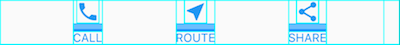
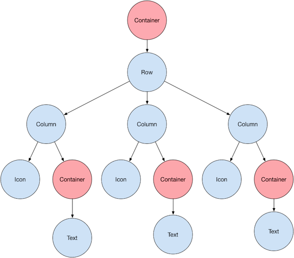
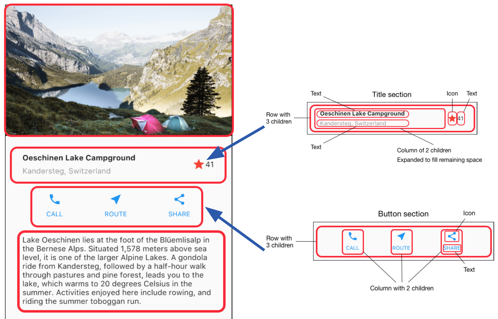
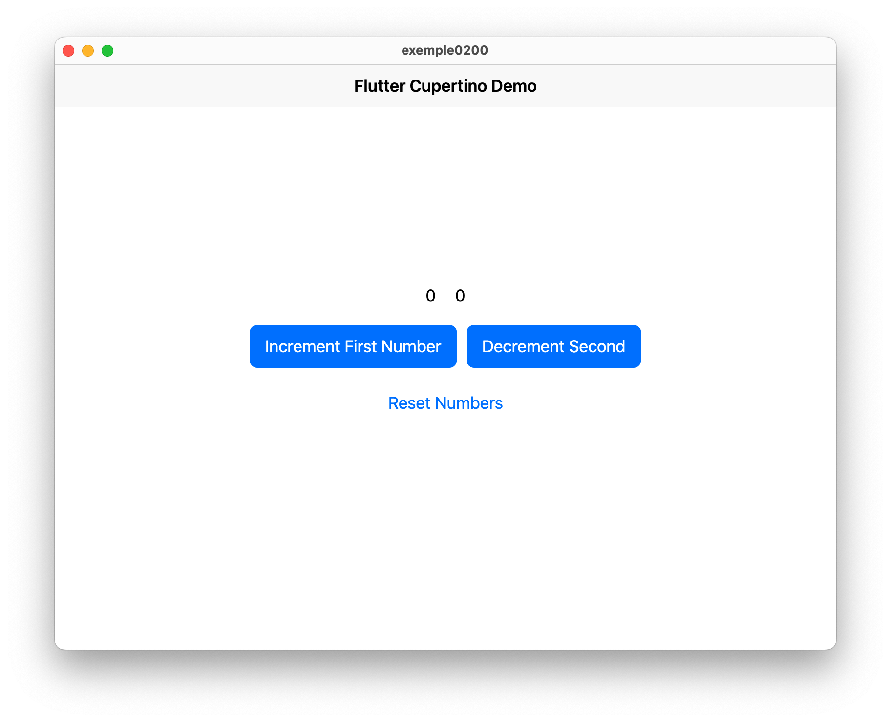
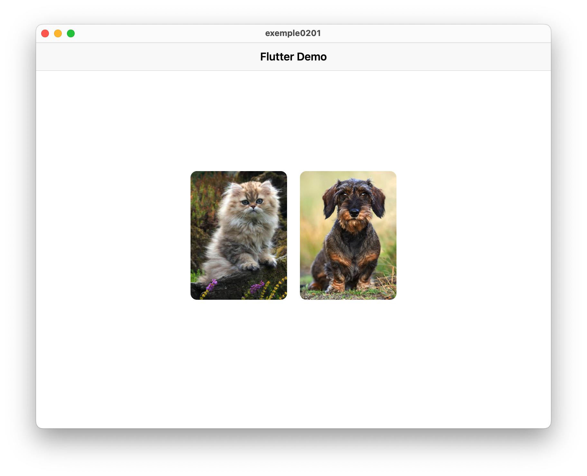
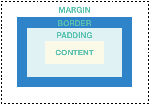
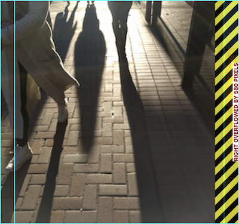
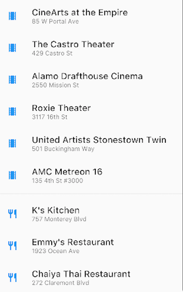

<div style="display: flex; width: 100%;">
    <div style="flex: 1; padding: 0px;">
        <p>© Albert Palacios Jiménez, 2023</p>
    </div>
    <div style="flex: 1; padding: 0px; text-align: right;">
        
    </div>
</div>
<br/>

<br/>
<center>
<br/></center>
<br/>
<br/>

# Widgets

A Flutter tot el codi s’organitza en ‘widgets’ o ‘components’, es tracta d’objectes Dart que permeten definir la interfície i el codi al mateix temps.

Com que Flutter és molt flexible, es poden fer aplicacions amb estètica Material (Android) o bé Cupertino (iOS), però són dos conjunts de widgets diferents.

La [documentació](https://api.flutter.dev/) té molts exemples de com fer servir els objectes, i un munt de mini tutorials al seu canal de [YouTube](https://www.youtube.com/@flutterdev)

Els catàlegs de widgets i la seva documentació es pot trobar a:

- Material, [catàleg](https://docs.flutter.dev/ui/widgets/material) i [documentació](https://api.flutter.dev/flutter/material/MaterialApp-class.html)

- Cupertino, [catàleg](https://docs.flutter.dev/ui/widgets/cupertino) i [documentació](https://api.flutter.dev/flutter/cupertino/CupertinoApp-class.html)

**Nota:** La documentació de ‘Cupertino’ no és tan complerta com la de Material

Els Widgets s’organitzen en una estructura d’arbre, és a dir hi ha un widget principal que té un o més widgets fills, i cada un d’aquests widgets també poden tenir un o més fills.

<style>
.image-container {
    display: flex;
    justify-content: space-between;
    width: 100%;
}

.image-item {
    display: flex;
    flex-grow: 1;
    flex-direction: column;
    padding: 0px;
    display: flex;
    justify-content: center;
    align-items: center;
}

.image-item img {
    max-height: 250px;
    height: auto;
    width: auto;
    max-width: 90%;

}

.image-item div {
    color: #444444;
    text-align: center;
}
</style>
<div class="image-container">
    <div class="image-item">
        
    </div>
    <div class="image-item">
        
    </div>
</div>
<br/>

## Codi Flutter, ‘childs’ i ‘children’

Molts widgets de Flutter necessiten que es defineixen altres elements dins. La notació sol ser:

- L’atribut **"child"** si en aquella posició hi va un altre widget.
- L’atribut **"children"** si en aquella posició i va una llista de widgets.

```dart
Widget build(BuildContext context) {
  return Scaffold(
    appBar: AppBar(
      backgroundColor: Theme.of(context).colorScheme.inversePrimary,
      title: const Text('Nintendo DB'),
    ),
    body: Row(
      children: <Widget>[
        _sideBar(),
        ChangeNotifierProvider(
          create: (context) => AppData(),
          child: const FineWidget(),
        )
      ],
    )
  );
}
```

Gairebé tots els elements de les aplicacions s’organitzen amb **"Rows"** o **"Columns"**.

<br/>
<center>
<br/></center>
<br/>

**Exemple0200:**

En aquest exemple s'organitza una aplicació en una columna que conté dues files, la primera amb números i la segona amb botons:

```dart
body: Center(
  child: Column(
    mainAxisAlignment: MainAxisAlignment.center,
    children: <Widget>[
      Row(
        mainAxisAlignment: MainAxisAlignment.center,
        children: <Widget>[
          Text(
            '$_firstNumber',
            style: Theme.of(context).textTheme.headlineMedium,
          ),
          const SizedBox(width: 20),
          Text(
            '$_secondNumber',
            style: Theme.of(context).textTheme.headlineMedium,
          ),
        ],
      ),
      const SizedBox(height: 20),
      Row(
        mainAxisAlignment: MainAxisAlignment.center,
        children: <Widget>[
          ElevatedButton(
            onPressed: _incrementFirstNumber,
            child: const Text('Increment First Number'),
          ),
          const SizedBox(width: 10),
          ElevatedButton(
            onPressed: _decrementSecondNumber,
            child: const Text('Decrement Second Number'),
          ),
          const SizedBox(width: 10),
          ElevatedButton(
            onPressed: _resetNumbers,
            child: const Text('Reset Numbers'),
          ),
        ],
      ),
    ],
  ),
)
```

<br/>
<center>
<br/></center>
<br/>

Per facilitar encara més la construcció de layouts, hi ha altres elements com: 

- [ListView](https://api.flutter.dev/flutter/widgets/ListView-class.html) per definir una llista amb scroll
- [GridView](https://api.flutter.dev/flutter/widgets/GridView-class.html) per fer graelles d’elements també amb scroll

## Tipus de widgets

Segons la seva funció, la [documentació](https://docs.flutter.dev/ui/widgets) de Flutter organitza els Widgets en diferents tipus. Les principals:

- [Animation and motion](https://docs.flutter.dev/ui/widgets/animation): per fer animacions i transicions
- [Assets, images and icons](https://docs.flutter.dev/ui/widgets/assets): per adjuntar imatges i arxius amb les aplicacions
- [Basics](https://docs.flutter.dev/ui/widgets/basics): els widgets imprescindibles en qualsevol aplicació
- [Input](https://docs.flutter.dev/ui/widgets/input): per fer formularis
- [Interaction](https://docs.flutter.dev/ui/widgets/interaction): per capturar events (clicks, taps, …)
- [Layout](https://docs.flutter.dev/ui/widgets/layout): per organitzar els widgets (maquetació i disposició)
- [Scrolling](https://docs.flutter.dev/ui/widgets/scrolling): per afegir scrolls quan els widgets sobrepasen la mida disponible
- [Styling](https://docs.flutter.dev/ui/widgets/styling): per canviar l'aspecte visual dels widgets

## Codi dels widgets, estructura d’arbre

Imaginem que volem posar una imatge a sobre d’un text, aleshores haurem de fer servir un widget columna.

**"Column"** permet definir els fills a través del paràmetre *"children"*, que ha de ser un array  de Widgets.

- La funció *"asset"* de l’objecte imatge té l’arxiu a mostrar com a paràmetre

- El text es defineix amb un String i opcionalment amb un estil.

```dart
Column(
    children: [
        Image.asset('images/lake.jpg'),
        Text('Hello World'),
    ],
);
```

**Exemple 0201:**

Codi:

```dart
body: Center(
  child: Column(
    mainAxisAlignment: MainAxisAlignment.center,
    children: <Widget>[
      Row(
        mainAxisAlignment: MainAxisAlignment.center,
        children: <Widget>[
          Container(
            width: 150,
            height: 200,
            decoration: BoxDecoration(
              borderRadius: BorderRadius.circular(10),
            ),
            child: ClipRRect(
              borderRadius: BorderRadius.circular(10),
              child: Image.asset(
                'assets/images/cat.png',
                fit: BoxFit.cover,
              ),
            ),
          ),
          const SizedBox(width: 20),
          Container(
            width: 150,
            height: 200,
            decoration: BoxDecoration(
              borderRadius: BorderRadius.circular(10),
            ),
            child: ClipRRect(
              borderRadius: BorderRadius.circular(10),
              child: Image.asset(
                'assets/images/dog.png',
                fit: BoxFit.cover,
              ),
            ),
          ),
        ],
      ),
    ],
  ),
),
```

En aquest codi es mostren dues imatges, els widgets *ClipRRect* s'encarregen de centrar la imatge dins d'un relleu arrodonit.

<br/>
<center>
<br/></center>
<br/>

El codi flutter aprofita el fet que amb Dart els paràmetres dels constructors poden ser opcionals, per oferir centenars d’objectes amb desenes de configuracions depenent dels paràmetres que poses al constructor.

Per exemple, el widget **"MaterialApp"** defineix el widget principal d’una aplicació amb estètica *Material*:

```dart
return MaterialApp(
    debugShowCheckedModeBanner: false,
    title: 'Aplicació Flutter',
    theme: ThemeData(
    colorScheme: ColorScheme.fromSeed(seedColor: Colors.blue),
        useMaterial3: true,
    ),
    home: _setLayout(context),
)
```

## Codi dels widgets, atributs

[Scaffold](https://api.flutter.dev/flutter/material/Scaffold-class.html) accepta dos atributs, una barra de títol superior [AppBar](https://api.flutter.dev/flutter/material/AppBar-class.html) i un cos *"body"*.

En aquest exemple el cos és una fila hortizontal [Row](https://api.flutter.dev/flutter/widgets/Row-class.html) amb dos elements, una ‘_sideBar’ generada per la funció ‘_sideBar() i [Expanded](https://api.flutter.dev/flutter/widgets/Expanded-class.html) ocupa la resta d’espai amb el què genera la funció ‘_content()’.

```dart
Widget build(BuildContext context) {
  return Scaffold(
    appBar: AppBar(
      backgroundColor: Theme.of(context).colorScheme.inversePrimary,
      title: const Text('Nintendo DB'),
    ),
    body: Row(
      children: <Widget>[
        _sideBar(),
        Expanded(child: _content())
      ],
    )
  );
}
```

## Widget Container

El widget container és un widget genèric al que se li pot donar estil.

```dart
Container(
    decoration: const BoxDecoration(
        color: Colors.black26,
    ),
    child: Column(
        children: [
            _buildImageRow(1),
            _buildImageRow(3),
        ],
    ),
)
```

<br/>
<center>
<br/></center>
<br/>

Quan un Widget sobrepassa la mida disponible, Flutter mostra una barra d’error amb la zona en conflicte.

<br/>
<center>
<br/></center>
<br/>

Els widgets han d’estar ben dimensionats, o posats a dins d’altres widgets que gestionin aquesta situació:

- Scrolls
- Escalats
- …

## Widget ListView

El widget ListView permet definir diversos widgets fills i s’encarrega de gestionar l’scroll automàticament. (També horitzontal)

<br/>
<center>
<br/></center>
<br/>

## Construir a partir de Widgets (builder)

A vegades la llista de widgets que s’han de mostrar, depenen de la informació que hi ha en un array o llista.

En aquest cas es fa servir un **builder** per tal que els elements es formin automàticament a partir d’un únic exemple que s'aplica a tots els ítems de la llista

En aquest l’exemple de llista es diu ‘data’ i es formen elements amb un text ‘nom’ i una imatge.

```dart
return ListView.builder(
  itemCount: data.length,
  itemBuilder: (BuildContext context, int index) {
    return ListTile(
      title: Text(
        data[index]['nom'],
        style: const TextStyle(fontSize: 12),
      ),
      leading: Image.asset(
        'assets/images/${data[index]["imatge"]}',
        height: 35.0,
        width: 35.0,
        fit: BoxFit.contain,
      ),
      onTap: () => {
        setState(() => item = index)
      }
    );
  }
);
```

## Widgets amb estat i sense estat

Per motius d’optimització i rendiment, hi ha dos tipus de widgets els que tenen informació del seu estat (poden canviar valors que fan el dibuix diferent) i els que no (no canvien els valors).

### Widgets sense estat (StatelessWidget)

Els widgets **"stateless"** no tenen estat, i per tant no poden tenir informació que canvia durant l’execució de l’aplicació.

Poden rebre paràmetres al constructor i tenir funcions, però no canvien l’estat.

```dart
class LayoutPersonatge extends StatelessWidget {
    final dynamic itemData;

    // Constructor
    LayoutPersonatge({Key? key, required this.itemData}) : super(key: key);

    // Retornar un 'Color' a partir del text, fent servir el mapa de colors anterior
    Color getColorFromString(String colorString) {
        return colorMap[colorString.toLowerCase()] ?? Colors.black;
    }

    @override
    Widget build(BuildContext context) {
        return Text(“Hola”);
    }
}
```

### Widgets amb estat (StatefulWidget)

Els widgets **"stateful"** tenen estat, és a dir variables que poden canviar de valor i haver de redibuixar el widget.

L’estat es defineix en una clase apart, on també es defineix el mètode *"build"*

Els paràmetres que es reben són final (constants) i es poden accedir des de l’estat amb *"widget.parametre"*, en l’exemple anterior *"widget.seccio"*

```dart
class LayoutMobileScreen0 extends StatefulWidget {

    final String seccio;
    const LayoutMobileScreen1({Key? key, required this.seccio}) : super(key: key);

    @override
    State<LayoutMobileScreen0> createState() => _StateLayoutMobileScreen0();
}

class _StateLayoutMobileScreen0 extends State<LayoutMobileScreen0> {

    _StateLayoutMobileScreen0();

    @override
    Widget build(BuildContext context) {
        return Text(“Hola”);
    }
}
```
### Widgets, "accions" i "setState"

A vegades els widgets permeten definir una acció, per exemple ‘onTap’ és si l’usuari toca el widget.

En aquest cas, l’atribut ‘onTap’ accepta una funció, que és l’acció a realitzar si l’usuari toca el widget.

Quan fem canvis que canvien els continguts del widget, els posem dins de ‘setState’ per avisar a Flutter que ha de redibuixar la pantalla.

```dart
return ListView.builder(
  itemCount: data.length,
  itemBuilder: (BuildContext context, int index) {
    return ListTile(
      title: Text(
        data[index]['nom'],
        style: const TextStyle(fontSize: 12),
      ),
      leading: Image.asset(
        'assets/images/${data[index]["imatge"]}',
        height: 35.0,
        width: 35.0,
        fit: BoxFit.contain,
      ),
      onTap: () => {
        setState(() => item = index)
      }
    );
  }
);
```

### Compartir dades i notificacions

En Flutter es pot fer servir un **Singleton** però no és recomanat, el motiu és que per optimitzar el rendiment i redibuix dels widgets, és més recomanable fer servir *notifyLiteners()*.

Quan hi han canvis a la informació (d'arxius o servidors), aquest l'objecte comú *"notifica"* als widgets que estan interessats en aquella informació, que cal redibuixar els seus continguts.


```dart
class AppData with ChangeNotifier {


  // Escull quin arxiu cal llegir i en carrega les dades
  void load (String type) async {

    // Forcem esperar 1 segon per veure el progrés
    await Future.delayed(const Duration(seconds: 1));

    // Carreguem les dades de l'arxiu
    var textArxiu = await rootBundle.loadString(arxiu);
    var dadesArxiu = json.decode(textArxiu);

    // Avisem que les dades estàn disponibles
    notifyListeners();
  }

}
```

Per tal que funcionin els **"Notifiers"**, cal encapsular tota l’aplicació dins d’un **"ChangeNotifierProvider"** i definir quin objecte és el que s’encarrega de gestionar les dades.

```dart
runApp(
    ChangeNotifierProvider(
        create: (context) => AppData(),
            child: const App(),
    ),
);
```

**Exemple 0203:**


