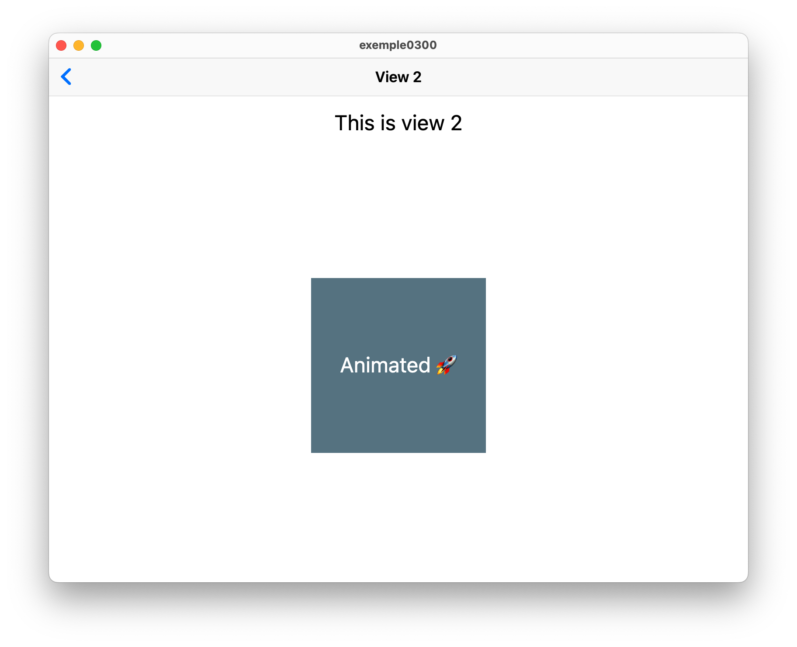
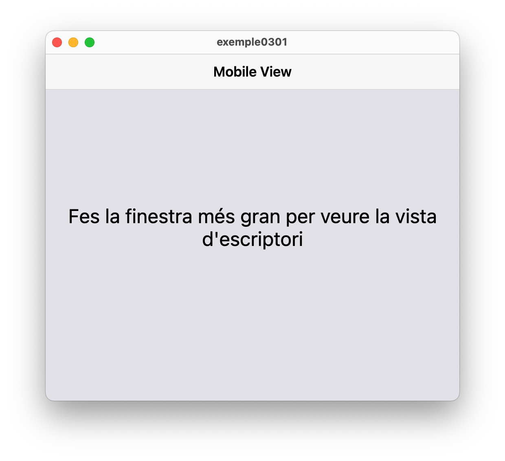

<div style="display: flex; width: 100%;">
    <div style="flex: 1; padding: 0px;">
        <p>© Albert Palacios Jiménez, 2023</p>
    </div>
    <div style="flex: 1; padding: 0px; text-align: right;">
        
    </div>
</div>
<br/>

# Vistes i navegació

A Flutter les vistes també són Widgets.

Flutter proporciona diverses maneres de navegar entre pantalles. La més comuna és utilitzar el widget Navigator. El Navigator gestiona una pila de rutes (vistes/pantalles) i proporciona mètodes per empènyer noves rutes a la pila o treure-les.

- **Navigator.push**: Utilitzat per empènyer una nova ruta a la pila de navegació. En aquest exemple, MaterialPageRoute es construeix amb SecondPage com la nova pantalla.
- **Navigator.pop**: Utilitzat per treure la ruta superior de la pila de navegació i tornar a la pantalla anterior.

Per exemple, per canviar de vista apretant un botó:

```dart
CupertinoButton(
    child: const Text('Go to View 1'),
    onPressed: () {
        Navigator.push(
        context,
        CupertinoPageRoute(builder: (context) => View1()),
        );
    },
),
```

**Nota:** Amb els widgets de *Cupertino* la barra de navegació ja mostra el botó *"<"* per tornar enrrera fent un *".pop"* de manera automàtica.

**Exemple 0300:**

```bash
cd exemple0300
flutter run -d macos
```

<br/>
<center>
<br/></center>
<br/>

## Vistes segons la mida de la pantalla

Es pot comprovar la mida de la pantalla, per mostrar les vistes segons calgui:

**Exemple 0301:**

En aquest exemple s'escull la vista segons si l'espai disponible és superior o inferior a 600 píxels:

```dart
  @override
Widget build(BuildContext context) {
return LayoutBuilder(
    builder: (context, constraints) {
    if (constraints.maxWidth > 600) {
        return ViewDesktop();
    } else {
        return ViewMobile();
    }
    },
);
}
```

```bash
cd exemple0301
flutter run -d macos
```

<br/>
<center>
<br/></center>
<br/>
<br/>

