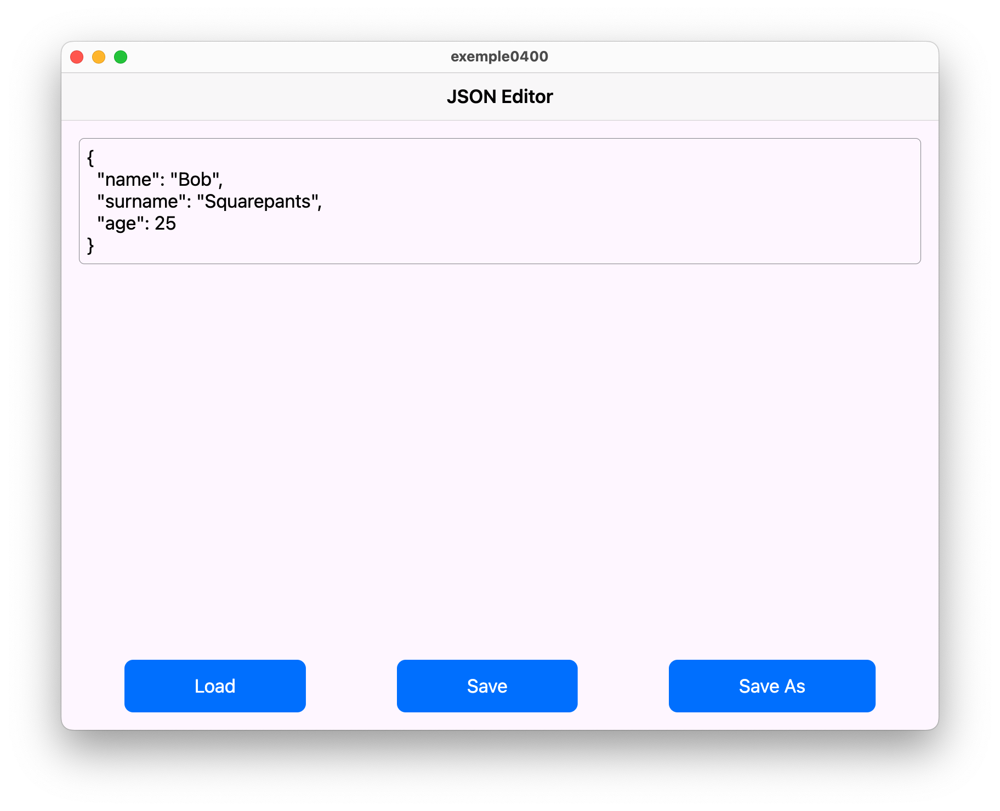
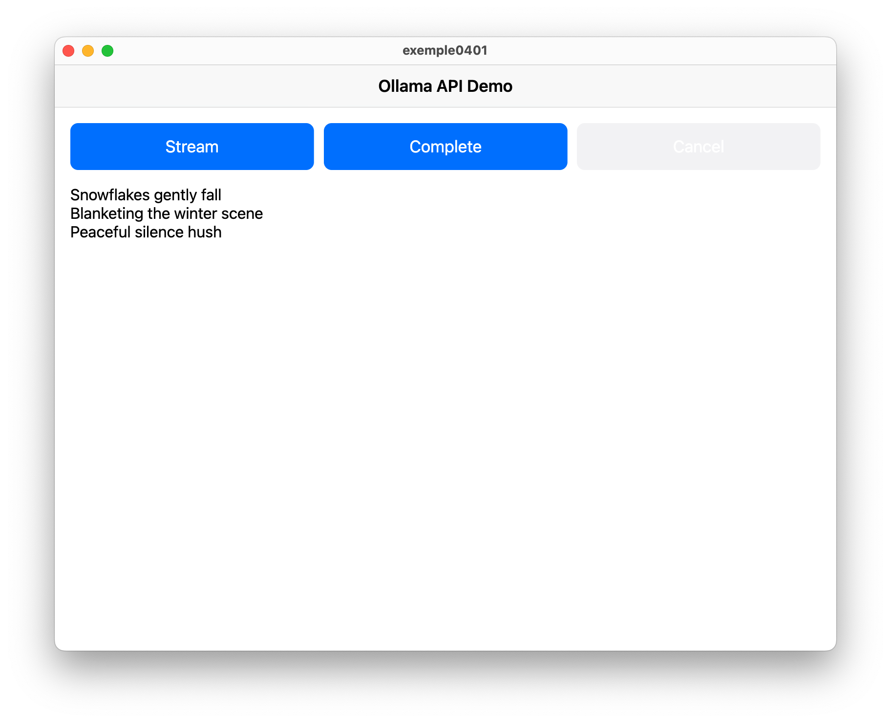
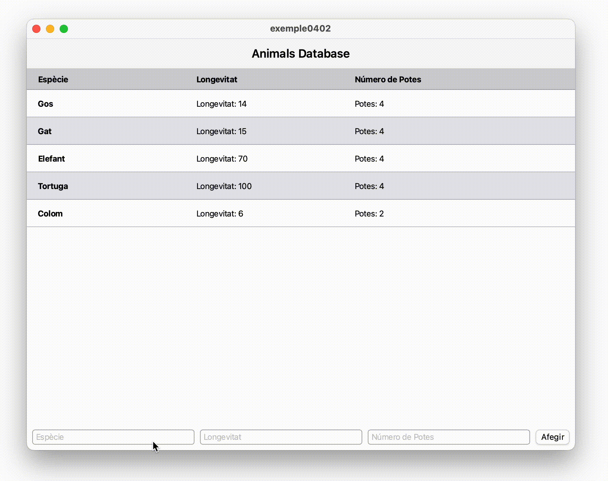

<div style="display: flex; width: 100%;">
    <div style="flex: 1; padding: 0px;">
        <p>© Albert Palacios Jiménez, 2023</p>
    </div>
    <div style="flex: 1; padding: 0px; text-align: right;">
        
    </div>
</div>
<br/>

<br/>
<center>
<br/></center>
<br/>
<br/>

# Dades

Flutter pot fer servir un **Singleton** però no és recomanat, el motiu és que per optimitzar el rendiment i redibuix dels widgets, és més recomanable fer servir *notifyLiteners()*.

Quan hi han canvis a la informació (d'arxius o servidors), aquest l'objecte comú *"notifica"* als widgets que estan interessats en aquella informació, que cal redibuixar els seus continguts.

Així, enlloc de que el controlador hagi de decidir quins widgets cal actualitzar, aquests es redibuixen automàticament només si és necessari.

Per tal que funcionin els **"Notifiers"**, cal encapsular tota l’aplicació dins d’un **"ChangeNotifierProvider"** i definir quin objecte és el que s’encarrega de gestionar les dades.

```dart
runApp(
    ChangeNotifierProvider(
        create: (context) => AppData(),
            child: const App(),
    ),
);
```

I la classe que s'encarrega de gestionar les dades (conceptualment que fa la feina del *singleton*) fa servir el *mixin* **ChangeNotifier** per poder fer crides a *notifyListeners()*. I així redibuixar els widgets que depenen d'aquelles dades.

```dart
class AppData with ChangeNotifier {


  // Escull quin arxiu cal llegir i en carrega les dades
  void load (String type) async {

    // Forcem esperar 1 segon per veure el progrés
    await Future.delayed(const Duration(seconds: 1));

    // Carreguem les dades de l'arxiu
    var textArxiu = await rootBundle.loadString(arxiu);
    var dadesArxiu = json.decode(textArxiu);

    // Avisem que les dades estàn disponibles
    notifyListeners();
  }

}
```

## Arxius

Per llegir i escriure arxius en Flutter calen les següents dependències a l'arxiu *"pubspec.yaml"*:

```yaml
dependencies:
  flutter:
    sdk: flutter
  provider: ^6.0.1
  path_provider: ^2.0.11
  file_picker: ^8.0.6 
```

Documentació:

- [Writing files](https://docs.flutter.dev/cookbook/persistence/reading-writing-files)

**Exemple 0400:**

```bash
cd exemple0400
flutter pub upgrade --major-versions # actualitzar dependencies
flutter run -d macos
```

Per llegir arxius *.json*:

```dart
Future<void> loadFile(String path) async {
  _fileLoading = true;
  notifyListeners();

  try {
    final file = File(path);
    if (kDebugMode) {
      print("Trying to read file from: ${file.path}");
    }
    if (await file.exists()) {
      _jsonContent = await file.readAsString();
      jsonController.text = _jsonContent;
      _loadedFilePath = path; // Guarda el camí del fitxer carregat
    } else {
      _jsonContent = '{}';
      if (kDebugMode) {
        print("File does not exist!");
      }
    }
  } catch (e) {
    if (kDebugMode) {
      print("Error reading file: $e");
    }
  } finally {
    _fileLoading = false;
    notifyListeners();
  }
}
```

Per guardar arxius en format *.json*:

```dart
Future<void> saveFile(String path) async {
  _fileSaving = true;
  notifyListeners();

  try {
    final file = File(path);
    final jsonData = const JsonEncoder.withIndent('  ').convert(jsonDecode(
        jsonController
            .text)); // Utilitza el text del controlador i el formateja
    await file.writeAsString(jsonData);
    _loadedFilePath = path; // Actualitza el camí del fitxer guardat
  } catch (e) {
    if (kDebugMode) {
      print("Error saving file: $e");
    }
  } finally {
    _fileSaving = false;
    notifyListeners();
  }
}
```

<br/>
<center>
<br/></center>
<br/>

## Crides post

**Exemple 0401:**

Per fer anar aquest exemple cal un servidor ollama amb el model 'phi3'

```bash
cd exemple0401
flutter pub upgrade --major-versions # actualitzar dependencies
flutter run -d macos
```

<br/>
<center>
<br/></center>
<br/>

## SQLite

Documentació: [SQLite a Flutter](https://docs.flutter.dev/cookbook/persistence/sqlite)

Cal importar el paquet 'sqflite' per fer anar una base de dades *SQLite* a flutter:

```yaml
dependencies:
  flutter:
    sdk: flutter
  provider: ^6.0.0
  sqflite: ^2.0.0+3
  path: ^1.8.0
```

A part d'iniciar el *Notifier*, s'ha d'inicar la base de dades al iniciar l'aplicació:

```dart
void main() {
  runApp(
    ChangeNotifierProvider(
      create: (context) => AppData()..initializeDatabase(),
      child: const MyApp(),
    ),
  );
}
```

Per iniciar la connexió amb la base de dades:

```dart
_db = await openDatabase(
  path,
  onCreate: (db, version) {
    return db.execute(
      'CREATE TABLE animals(especie TEXT PRIMARY KEY, longevitat INTEGER, numeropotes INTEGER)',
    );
  },
  version: 1,
);
```

Després ja es poden fer crides, enlloc de fer un *DAO* es fa que els objectes que modelen les files de la taula tinguin funcions per transformar a *Map<String, dynamic>*:

```dart
class AnimalsModel {
  final String especie;
  final int longevitat;
  final int numeropotes;

  AnimalsModel({
    required this.especie,
    required this.longevitat,
    required this.numeropotes,
  });

  Map<String, dynamic> toMap() {
    return {
      'especie': especie,
      'longevitat': longevitat,
      'numeropotes': numeropotes,
    };
  }

  factory AnimalsModel.fromMap(Map<String, dynamic> map) {
    return AnimalsModel(
      especie: map['especie'],
      longevitat: map['longevitat'],
      numeropotes: map['numeropotes'],
    );
  }
}
```

```dart
  Future<void> addAnimal(AnimalsModel animal) async {
    if (_db != null) {
      await _db!.rawInsert(
        'INSERT INTO animals (especie, longevitat, numeropotes) VALUES (?, ?, ?)',
        [animal.especie, animal.longevitat, animal.numeropotes],
      );
      _animals.add(animal);
      notifyListeners();
    }
  }
```

**Exemple 0401:**

En aquest exemple senzill es gestiona una taula SQLite:

<br/>
<center>
<br/></center>
<br/>
