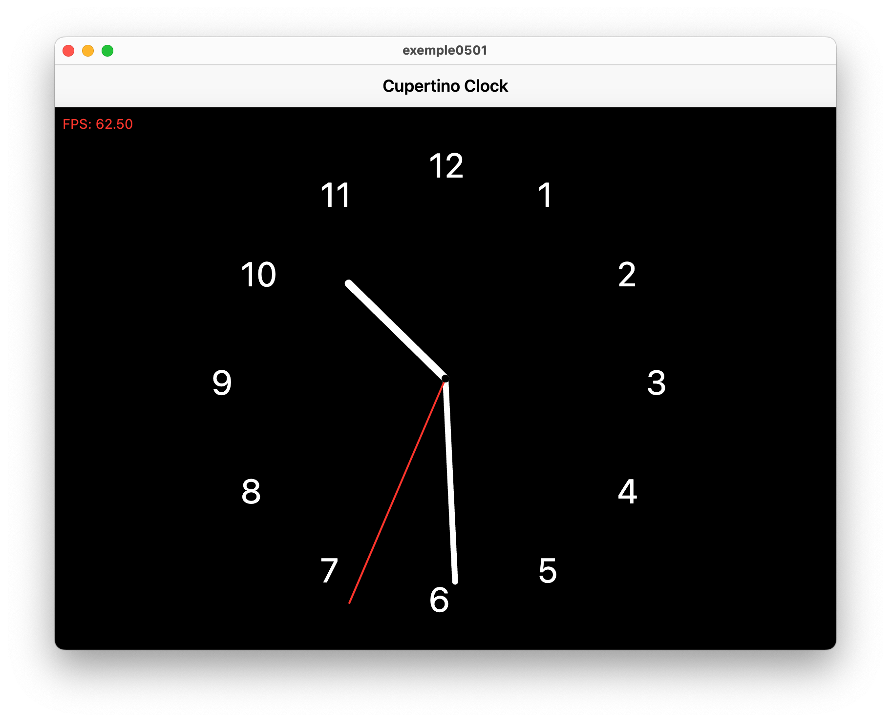
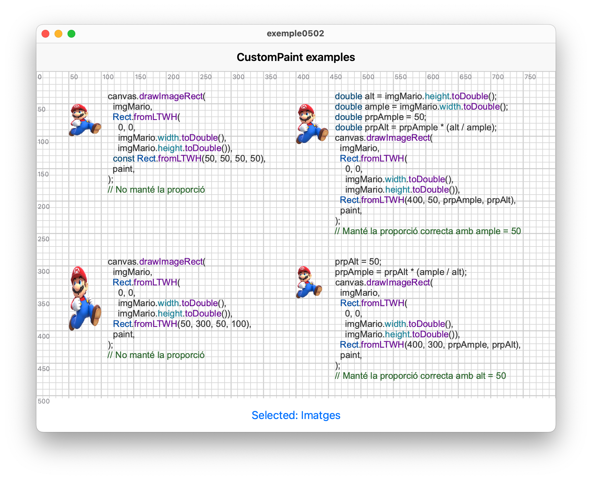
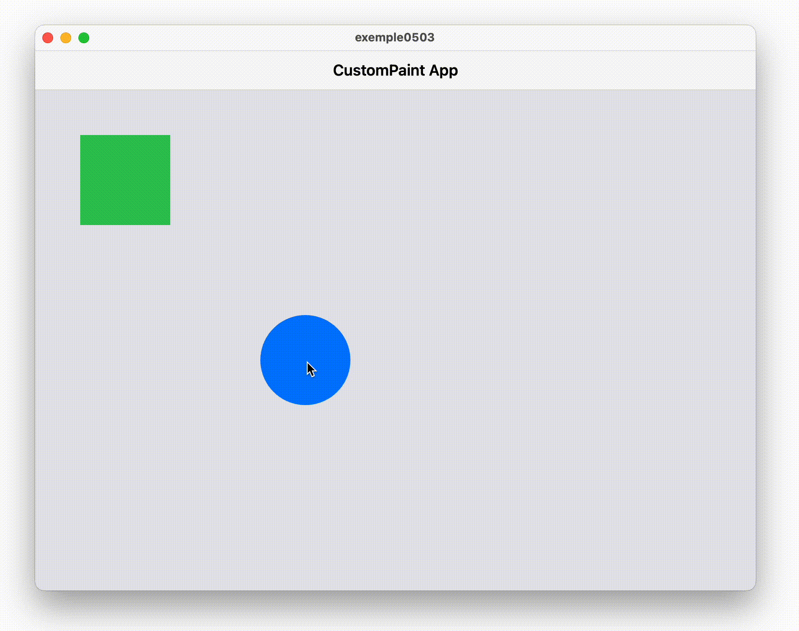

<div style="display: flex; width: 100%;">
    <div style="flex: 1; padding: 0px;">
        <p>© Albert Palacios Jiménez, 2023</p>
    </div>
    <div style="flex: 1; padding: 0px; text-align: right;">
        
    </div>
</div>
<br/>

<br/>
<center>
<br/></center>
<br/>
<br/>

# CustomPainter

**CustomPainter** és la versió del **Canvas** implementada per Flutter. Proporciona una superfície de dibuix sobre la qual es poden renderitzar formes, imatges i text. És similar a un llenç de pintura on es poden dibuixar diferents elements gràfics utilitzant operacions de dibuix proporcionades per Flutter.

[**Vídeo:** Custom Painter](https://www.youtube.com/watch?v=kp14Y4uHpHs)

Guies sobre Canvas:

- [Kodeco](https://www.kodeco.com/26483389-flutter-canvas-api-getting-started)
- [Getstream](https://getstream.io/blog/definitive-flutter-painting-guide/)

## Widgets personalitzats

Com que a Flutter tots els compontents són widgets, quan necessitem una superfície de dibuix també ho hem de fer en un Widget anomenat **CustomPaint**.

Aquest widget agafa com atribut un **painter** que hem de definir nosaltres:

```dart
CustomPaint(
    painter: ShapePainter(),
    child: Container(),
)
```

Per definir el *painter* hem de crear un objecte amb *"extends CustomPainter"*.

L'objecte (Widget) estès de *CustomPainter* ha de tenir almenys dos mètodes *"@override"*:

- **paint** que diu com s'ha de fer el dibuix
- **shouldRepaint** retorna *true* si s'ha de tornar a dibuixar perquè han canviat o *false* si no cal tornar a dibuixar perquè serà el mateix dibuix que l'anterior cop que s'ha dibuixat

Exemple:

```dart
class CircleTriangle extends CustomPainter {

  @override
  void paint(Canvas canvas, Size size) {
    // canvas és el context de dibuix (l'area on dibuixem)
    // paint són les propietats que s'han d'aplicar per fer el dibuix al canvas

    final paint = Paint()
      ..style = PaintingStyle.fill;

    // Dibuixar un cercle verd de 50 píxels de radi
    paint.color = Colors.green;
    canvas.drawCircle(Offset(size.width / 2, size.height / 2), 50, paint);

    // Dibuixar un triangle taronja amb costats de 25 píxels
    paint.color = Colors.orange;
    var path = Path();
    path.moveTo(size.width / 2, size.height / 2 - 50);
    path.lineTo(size.width / 2 - 25, size.height / 2 + 50); 
    path.lineTo(size.width / 2 + 25, size.height / 2 + 50);
    path.close();
    canvas.drawPath(path, paint);
  }

  @override
  bool shouldRepaint(CustomPainter oldDelegate) => true;
}
```

**Nota:** Es pot fer servir un mateix objecte paint i aprofitar-lo per diferents dibuixos, modificant-ne les propietats

**Exemple 0500:**

Aquest exemple mostra un *"CustomPainter"* que té una llista de *"Shapes"* a dibuixar. Aquests polígons (o Shapes) poden ser quadrats o rodones de diferents mides i colors aleatòriament i s'afegeixen:

- Apretant el botó 'Add Shape'
- Fent click sobre l'àrea de dibuix

Per detectar la posició on l'usuari ha fet 'click' es fa servir el widget **"GestureDetector"**, que obté la posició on s'ha fet click amb el mètode *"onTapDown"*:

[**Vídeo:** GestureDetector](https://www.youtube.com/watch?v=WhVXkCFPmK4)

```dart
GestureDetector(
    onTapDown: (details) {
        final RenderBox renderBox =
            context.findRenderObject() as RenderBox;
        final Offset localPosition =
            renderBox.globalToLocal(details.globalPosition);
        addShapeAtPosition(
            localPosition.dx,
            localPosition.dy -
                56); // 56 is the height of CupertinoNavigationBar
    },
    child: Container(
        color: CupertinoColors.lightBackgroundGray,
        child: CustomPaint(
            painter: ShapePainter(shapes),
            child: Container(),
        ),
    ),
),
```

Dins del *GestureDetector* és on es posa el *CustomPaint*, per detectar els events que fa l'usuari a l'àrea de dibuix.

La llista de *shapes* es gestiona des de l'aplicació, al *CustomPaint* només se li passa aquesta llista com a paràmetre perquè la pogui dibuixar.

<br/>
<center>
<br/></center>
<br/>

## Animacions

Per tal de poder animar els Widgets que fan ús de *CustomPaint* es pot fer servir un **AnimationController**.

Per iniciar l'animació:

```dart
  @override
  void initState() {
    super.initState();
    _controller =
        AnimationController(vsync: this, duration: const Duration(seconds: 1))
          ..repeat();
    _lastDrawTime = DateTime.now();
  }
```

Per esborrar correctament l'animació de la memòria:

```dart
  @override
  void dispose() {
    _controller.dispose();
    super.dispose();
  }
```

Per passar la informació de l'animació al painter:

```dart
CustomPaint(
    painter: ClockPainter(_controller, _calculateFps),
    size: Size(constraints.maxWidth, constraints.maxHeight),
);
```

**Exemple 0501:**

Aquest exemple mostra un Widget personalitzat amb *CustomPaint* que és un rellotge animat mostrant els Frames Per Segon (FPS) de dibuix.


<br/>
<center>
<br/></center>
<br/>

## Imatges al Canvas

Respecte les imatges s'han de tenir en compte dos punts:

- Les imatges han d'estar pregarregades per dibuixar-les al canvas
- El format d'imatge del canvas és diferent al dels widgets

### Pre carregar les imatges

Hi ha diversos mètodes, un d'ells és fer servir **"FutureBuilder"** que mostra un Widget alternatiu (per exemple de càrrega) fins que les imatges s'han carregat correctament:

[**Vídeo:** Future Builder](https://youtu.be/zEdw_1B7JHY?si=x_T8CFh7eH8ft69i)

```dart
  Future<ui.Image?>? imageFuture;

  @override
  void initState() {
    super.initState();
    imageFuture = _loadImage('assets/images/mario.png');
  }

  void _setSelection(String value) {
    setState(() {
      selectedOption = value;
    });
  }
```

El *Future<ui.Image?>* és un objecte que indica que un cop disponible el tipus serà *ui.Image*, però que inicialment no se sap quan estarà disponible.

```dart
Expanded(
    child: LayoutBuilder(
        builder: (context, constraints) {
        return FutureBuilder<ui.Image?>(
            future: imageFuture,
            builder: (context, snapshot) {
            if (snapshot.connectionState == ConnectionState.waiting) {
                // Carregant ...
                return const Center(child: CupertinoActivityIndicator());
            } else if (snapshot.hasError) {
                return Center(child: Text('Error: ${snapshot.error}'));
            } else if (!snapshot.hasData || snapshot.data == null) {
                return const Center(child: Text('Image not available'));
            }
            // Mostrar el CustomPaint si ja s'han carregat els arxius
            return CustomPaint(
                painter: DrawingPainter(selectedOption, snapshot.data!),
                size: Size(constraints.maxWidth, constraints.maxHeight),
            );
            },
        );
        },
    ),
),
```

### Imatges amb format ui.Image

El canvas necessita carregar les imatges en format *ui.Image*, per fer-ho:

```dart
static Future<ui.Image?> _loadImage(String asset) async {
    try {
        final ByteData data = await rootBundle.load(asset);
        final Uint8List bytes = Uint8List.view(data.buffer);
        final Completer<ui.Image> completer = Completer();
        ui.decodeImageFromList(bytes, (ui.Image img) {
        completer.complete(img);
        });
        return completer.future;
    } catch (e) {
        if (kDebugMode) {
        print('Error loading image: $e');
        }
        return null;
    }
}
```

**Exemple 0502:**

Aquest exemple mostra diversos exemples de dibuix amb CustomPaint i el codi per aconseguir aquell tipus de dibuix.

<br/>
<center>
<br/></center>
<br/>

**Exemple 0503:**

Aquest exemple mostra com fer servir [GestureDetector](https://docs.flutter.dev/ui/interactivity/gestures) per arrossegar elements d'un canvas.

Cal definir les funcions que observen l'arrossegament (*onPanUpdate* i *onPanEnd*):

```dart
child: GestureDetector(
  onPanUpdate: onPanUpdate,
  onPanEnd: onPanEnd,
  child: Container(
    width: constraints.maxWidth,
    height: constraints.maxHeight,
    color: CupertinoColors.lightBackgroundGray,
    child: CustomPaint(
      painter: ShapePainter(
        greenSquare: greenSquare,
        blueCircle: blueCircle,
        isCircleOnTop: isCircleOnTop,
      ),
      child: Container(),
    ),
  ),
),
```

Cal definir què passa quan s'arrossega per sobre la pantalla. En aquest cas, canviar la posició dels objectes si cal:

```dart
void onPanUpdate(DragUpdateDetails details) {
  final RenderBox renderBox = context.findRenderObject() as RenderBox;
  final Offset globalPosition = details.globalPosition;
  final Offset localPosition = renderBox.globalToLocal(globalPosition);

  // Adjusting the local position based on the height of CupertinoNavigationBar and SafeArea
  final double navigationBarHeight =
      const CupertinoNavigationBar().preferredSize.height;
  final double safeAreaHeight = MediaQuery.of(context).padding.top;
  final Offset adjustedLocalPosition = Offset(localPosition.dx,
      localPosition.dy - navigationBarHeight - safeAreaHeight);

  setState(() {
    if (isGreenSquareDragged) {
      greenSquare = Rect.fromLTWH(
          adjustedLocalPosition.dx - offset.dx,
          adjustedLocalPosition.dy - offset.dy,
          greenSquare.width,
          greenSquare.height);
    } else if (isBlueCircleDragged) {
      blueCircle = Rect.fromLTWH(
          adjustedLocalPosition.dx - offset.dx,
          adjustedLocalPosition.dy - offset.dy,
          blueCircle.width,
          blueCircle.height);
    }
  });
}
```

Cal fixar-se que al objecte de dibuix se li passen els objectes *greenSquare* i *blueCirle* que tenen la informació de la posició dels objectes a dibuixar: 

```dart
child: CustomPaint(
  painter: ShapePainter(
    greenSquare: greenSquare,
    blueCircle: blueCircle,
    isCircleOnTop: isCircleOnTop,
  ),
  child: Container(),
)
```

<br/>
<center>
<br/></center>
<br/>

