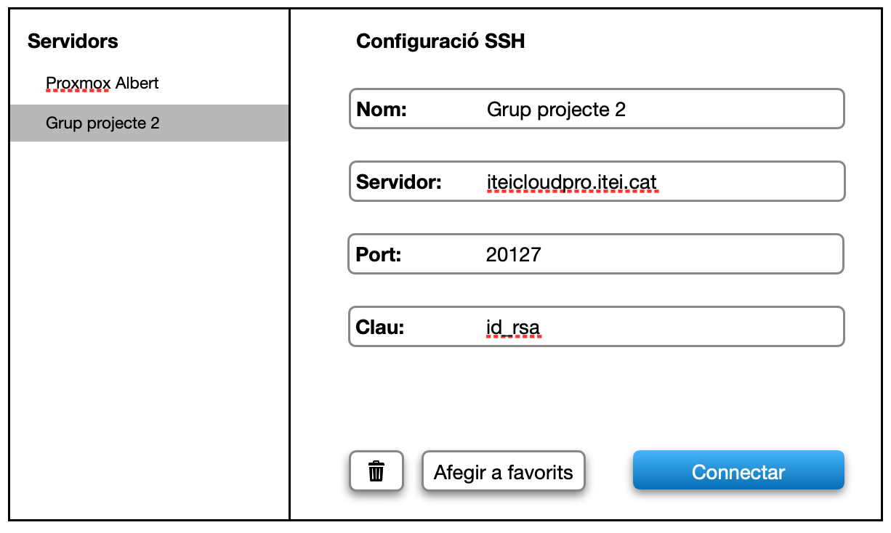
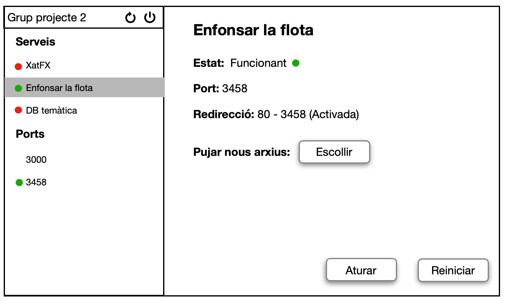
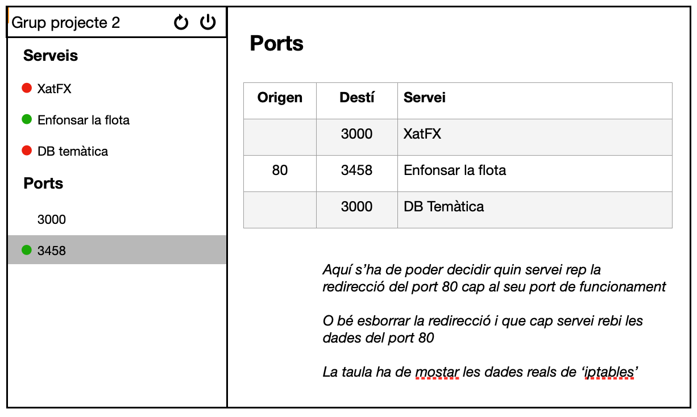

    

        
© Albert Palacios Jiménez, 2024

    

    

        
    

 

# Exercici 05

Fes una aplicació 'Flutter' que permeti posar gestionar serveis/servidors al Proxmox:

- Ha de permetre mostrar el serveis/servidors remots (si estàn funcionant i el port que ocupen).
- Ha de permetre posar en funcionament, reiniciar i aturar els servidors remots.
- Ha de permetre pujar nou codi de local a un servidor remot.
- Ha de permetre configurar/desconfigurar ports del Proxmox remot.

Necessitaràs els següents widgets personalitzats:

- Un widget que mostra una llista amb títols en negreta i items seleccionables més petits amb identació.
- Un widget que mostri sigui un cercle verd o vermell, segons l'estat boleà (true/false)
- Un widget que és un camp de text, amb un títol i una part editable.
- Un widget que mostra una taula de ports, redireccions i permet sel·leccionar la que obté la redirecció 80 (o desconfigurar-la).
- Un widget que mostra l'estat d'un servidor (en funcionament, aturat, reiniciant o error).

**Nota**: Fes servir widgets de progrés indeterminats per indicar que s'està fent una operació que pot trigar uns moments.

Aquest és l'storyboard esperat:

 

 

 

 

 

 

 

 

 

**Important**: És responsabilitat vostre fer tota la gestió d'errors i excepcions, i evitar que l'aplicació es quedi penjada o l'usuari no sàpiga com continuar.