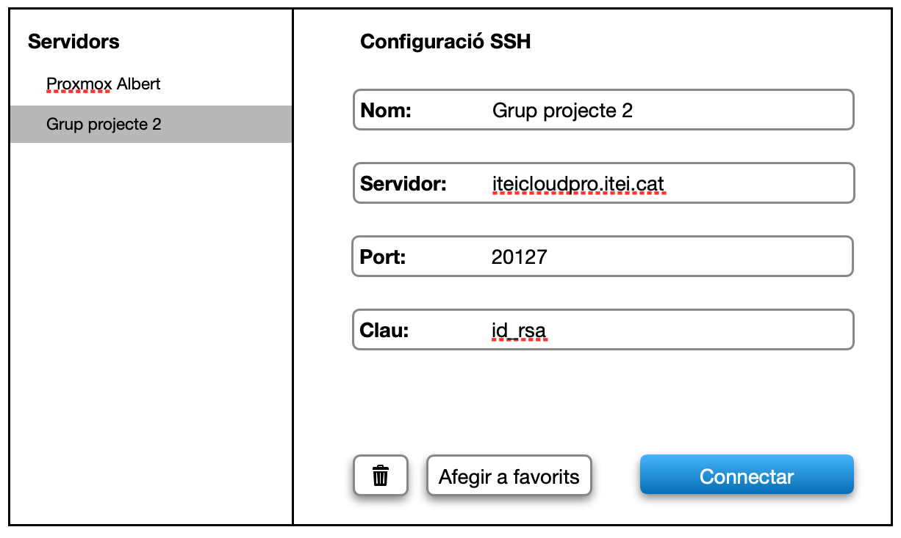
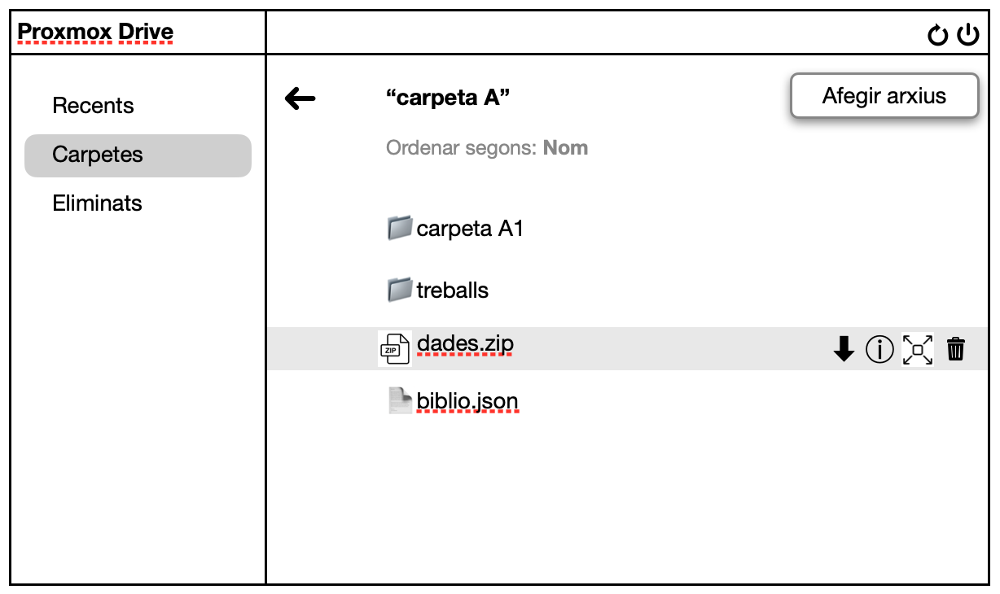
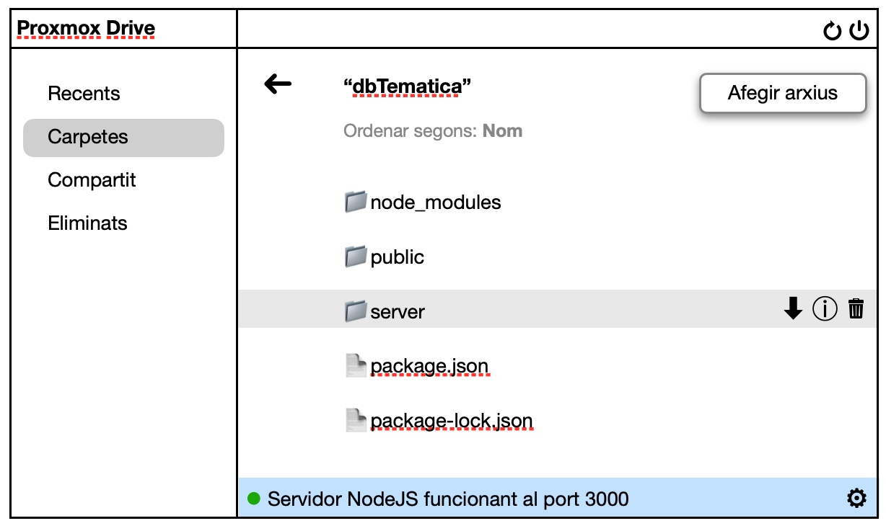

    

        
© Albert Palacios Jiménez, 2024

    

    

        
    

 

# Gestor d'arxius al Proxmox

Fes una aplicació 'Flutter' que permeti gestionar arxius al Proxmox.

Tota la obtenció de dades i intercanvi d'arxius es farà amb comandes *SSH* i *SCP*.

## Configuració de comptes

Ha de permetre configurar varis servidors remots, amb les seves credencials.

L'arxiu amb les configuracions ha de ser de tipus *.json* en alguna carpeta de l'aplicació (local).

 

 

 

## Gestió d'arxius

Ha de permetre gestionar els arxius i carpetes remots del proxmox. Un cop seleccionat un arxiu o carpeta, ha de permetre:

- Canviar-li el nom
- Descarregar-lo
- Esborrar-lo
- Mostrar informació i permissos d'usuari

 

 

 

També ha de permetre pujar arxius locals al servidor remot.

**Nota:** En cas que es puji una carpeta aquesta es comprimirà en format *.zip* mantenint els permissos, i es descomprimirà al servidor automàticament, sense deixar rastre de l'arxiu comprimit d'intercanvi.

### Arxius comprimits

Si es puja un arxiu comprimit tipus **.zip**, s'ha de permetre descomprimir-lo al servidor remot.

## Servidors i ports

Si es detecta una carpeta de servidor tipus **NodeJS** o **Java**, ha de permetre posar-lo en funcionament, reiniciar-lo o aturar-lo:

- Si no està en funcionament, ha de permetre posar-lo en funcionament

- Si està funcionant, ha de permetre reiniciar-lo o aturar-lo

**Important**: En tot cas, ha de mostrar i configurar la redirecció de ports per tal que funcioni el servidor.

 

 

 

## Widgets personalitzats

Necessitaràs els següents widgets personalitzats:

- Un widget que mostra una llista amb títols en negreta i items seleccionables més petits amb identació.
- Un widget que mostri sigui un cercle verd o vermell, segons l'estat boleà (true/false)
- Un widget que és un camp de text, amb un títol i una part editable.
- Un widget per configurar i desconfigurar redireccions del port 80 cap a un altre port.
- Un widget que mostra l'estat d'un servidor (en funcionament, aturat, reiniciant o error).
- Altres widgets que creguis convenients...