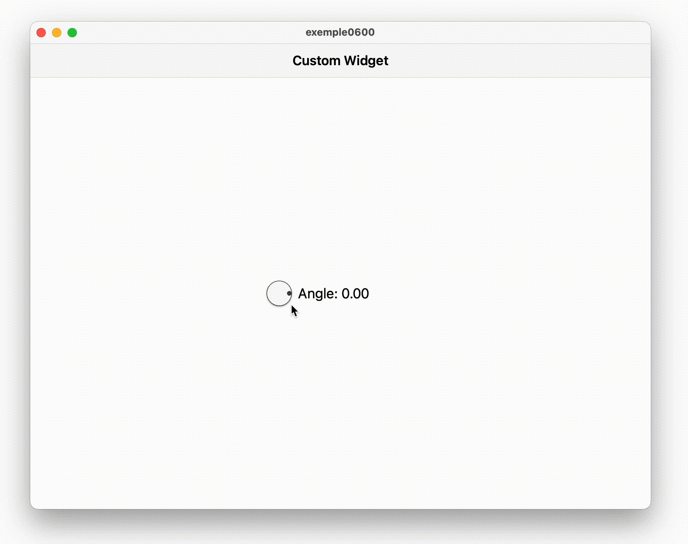

<div style="display: flex; width: 100%;">
    <div style="flex: 1; padding: 0px;">
        <p>© Albert Palacios Jiménez, 2023</p>
    </div>
    <div style="flex: 1; padding: 0px; text-align: right;">
        
    </div>
</div>
<br/>

<br/>
<center>
<br/></center>
<br/>
<br/>

# Widgets personalitzats

Com que a *Flutter* tot es basa en *Widgets*, podem fer-nos els nostres propis widgets segons les necessitats de la nostra aplicació.

Per fer-ho cal definir un objecte *extends StatefulWidget* i els seus atributs:

```dart
class Picker360 extends StatefulWidget {
  final double value;
  final double size;
  final bool enabled;
  final Function(double)? onChanged;

  const Picker360(
      {Key? key,
      required this.value,
      this.enabled = true,
      this.size = 16,
      required this.onChanged})
      : super(key: key);

  @override
  Picker360State createState() => Picker360State();
}

// Definir a l'estat el comportament del widget personalitzat
```

**Opcionalment**, si gràficament no podem construir el nostre widget a partir d'altres widgets, fem servir *CustomPainter* per definir l'aspecte gràfic que necessitem:

```dart
class Picker360Painter extends CustomPainter {
  final Color colorBackgroundSecondary0;
  final double angle;
  final Color borderColor;
  final Color pickerColor;

  Picker360Painter(this.colorBackgroundSecondary0, this.angle,
      this.pickerColor, this.borderColor);

  @override
  void paint(Canvas canvas, Size size) {
    ...
  }
}
```

Finalment, només hem de fer servir el nostre widget com qualsevol altre:

```dart
Row(
  mainAxisAlignment: MainAxisAlignment.center,
  crossAxisAlignment: CrossAxisAlignment.center,
  children: [
    Picker360(value: _angle, onChanged: onChanged),
    const SizedBox(width: 8),
    SizedBox(
      width: 150,
      child: Text(
        "Angle: ${_angle.toStringAsFixed(2)}",
        style: const TextStyle(fontSize: 18),
      ),
    )
  ],
)
```

**Exemple 0600**

Aquest exemple mostra un widget personalitzat anomenat *Picker360*:

<br/>
<center>
<br/></center>
<br/>

# Llibreries d'estil

Amb els widgets personalitzats es poden fer llibreries completes amb widgets que imiten l'estil d'un sistema:

- [**MacOS**](https://pub.dev/packages/flutter_cupertino_desktop_kit)
- [**Demo**](https://optimisme.github.io/flutter_cupertino_desktop_kit/gh-pages/example/)

