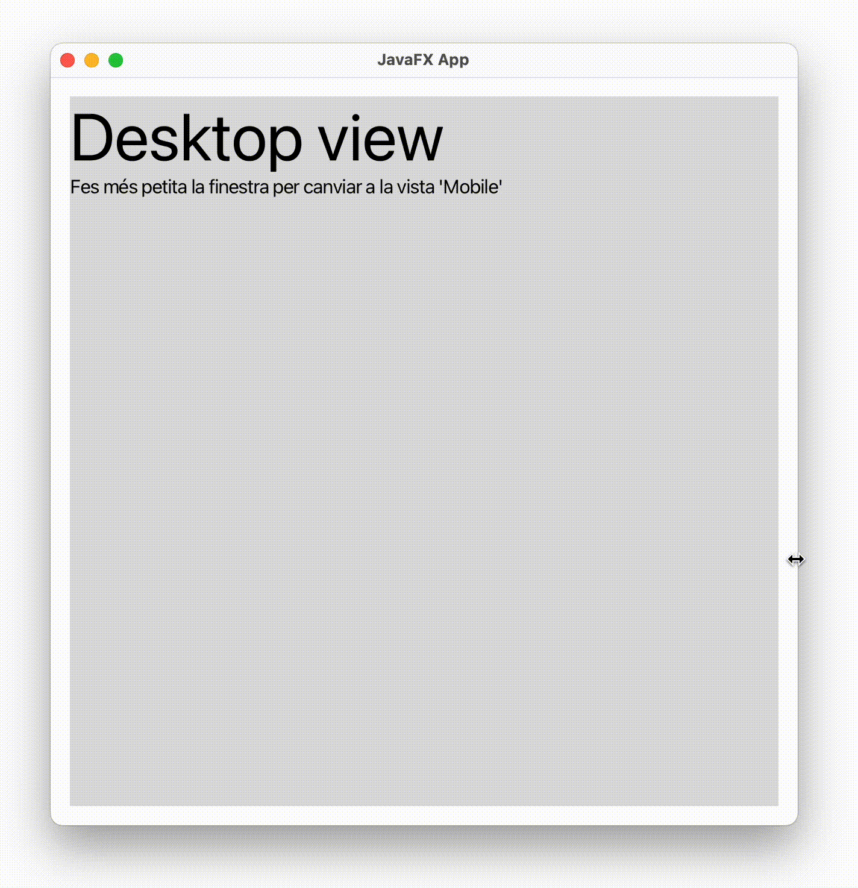

<div style="display: flex; width: 100%;">
    <div style="flex: 1; padding: 0px;">
        <p>© Albert Palacios Jiménez, 2023</p>
    </div>
    <div style="flex: 1; padding: 0px; text-align: right;">
        
    </div>
</div>
<br/>

# Vistes

A **JavaFX** la gestió de Vistes amb JavaFX cal fer-la des del codi manualment. Aquesta gestió no és complicada però es pot fer pesada.

La classe **'UtilsViews.java'** permet gestionar un conjunt de vistes de manera senzilla.

## Exemple 0100

L'exemple '0100' fa servir *'UtilsViews'* per afegir dues vistes a l'escena que es mostren segons la mida de la finestra.

```java
// Add scene views
UtilsViews.parentContainer.setStyle("-fx-font: 14 arial;");
UtilsViews.addView(getClass(), "Desktop", "/assets/layout_desktop.fxml");
UtilsViews.addView(getClass(), "Mobile", "/assets/layout_mobile.fxml");

Scene scene = new Scene(UtilsViews.parentContainer);
```

Configura l'escena per tal que si canvia la mida mostri una vista o una altre:

```java
// Listen to window width changes (call _setLayout on change)
scene.widthProperty().addListener((ChangeListener<? super Number>) new ChangeListener<Number>() {
    @Override
    public void changed(ObservableValue<? extends Number> observable, Number oldWidth, Number newWidth) {
        _setLayout(newWidth.intValue());
    }
});
```

```java
// Set view deppending on scene width
private void _setLayout(int width) {
    if (width < 600) {
        UtilsViews.setView("Mobile");
    } else {
        UtilsViews.setView("Desktop");
    }
}
```

Defineix les mides de la finestra (per defecte i mínimes)

```java
stage.setScene(scene);
stage.setTitle("JavaFX App");
stage.setMinWidth(MIN_WIDTH);
stage.setWidth(WINDOW_WIDTH);
stage.setMinHeight(MIN_HEIGHT);
stage.setHeight(WINDOW_HEIGHT);
stage.show();
```

<center>
<br/></center>
<br/>

## Exemple 0101

L'exemple '0101' fa servir *'UtilsViews'* per mostrar el canvi entre diferents vistes.

Al main, s'afegeixen les vistes a l'escena. Al afegir cada vista se li dóna un nom (View0, View1, ...) per poder-les referenciar més endavant:

```java
UtilsViews.parentContainer.setStyle("-fx-font: 14 arial;");
UtilsViews.addView(getClass(), "View0", "/assets/view0.fxml");
UtilsViews.addView(getClass(), "View1", "/assets/view1.fxml");
UtilsViews.addView(getClass(), "View2", "/assets/view2.fxml");

Scene scene = new Scene(UtilsViews.parentContainer);
```

Com que UtilsViews és té atributs i funcions estàtiques, es poden cridar des de qualsevol controlador. Per exemple, des de *Controller0':

```java
@FXML
private void toView2(ActionEvent event) {
    UtilsViews.setView("View2");
}

@FXML
private void animateToView0(ActionEvent event) {
    UtilsViews.setViewAnimating("View0");
}
```

En el codi anterior:

- **UtilsViews.setView("View2")** canvia a la vista 'View2' sense animació
- **UtilsViews.setViewAnimating("View0")** canvia de vista 'View0' amb animació

<center>
<br/></center>
<br/>


