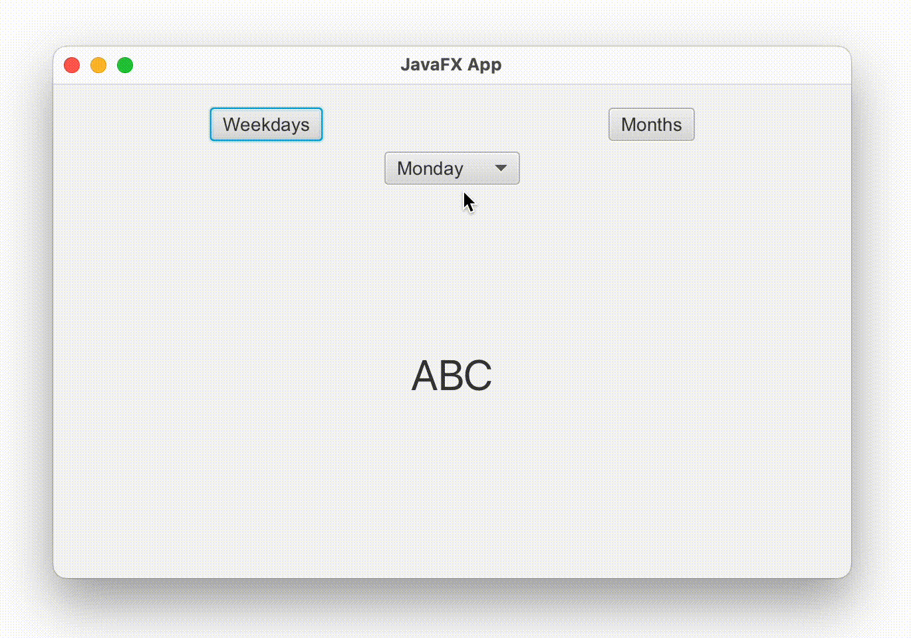
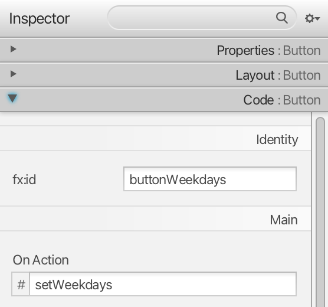
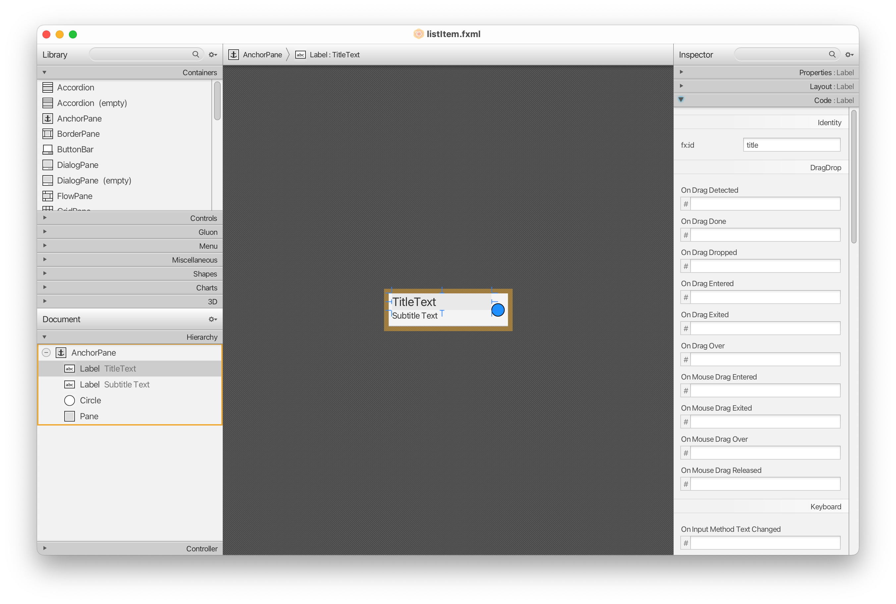
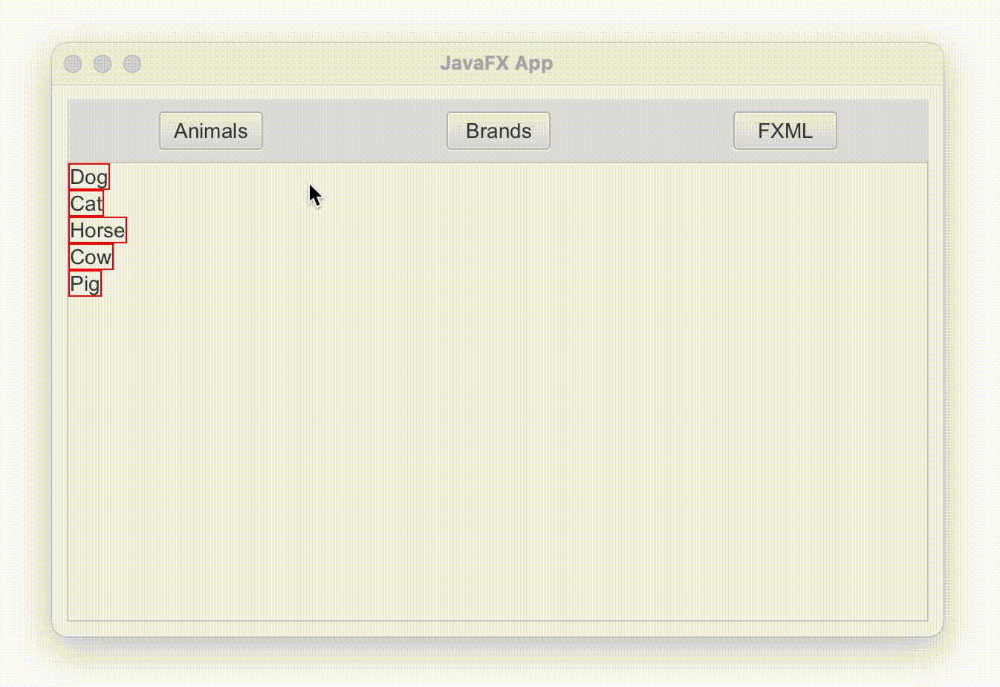

<div style="display: flex; width: 100%;">
    <div style="flex: 1; padding: 0px;">
        <p>© Albert Palacios Jiménez, 2023</p>
    </div>
    <div style="flex: 1; padding: 0px; text-align: right;">
        
    </div>
</div>
<br/>

# Subvistes

Els components **.fxml** també serveixen per definir Subvistes, i emplenar aquestes amb dades externes de manera dinàmica.

Això permet, per exemple definir com són els ítems d'una llista des de *Gluon SceneBuilder*.

## Initializable

Si volem definir la configuració dels elements d'una vista, programàticament quan s'inicia la vista, cal definir el controlador com **"Initializable"**:

```java
public class Controller implements Initializable
```

Aleshores, podem sobrecarregar la funció **"initialize"**, que es crida quan s'inicia la vista:

```java
    @Override
    public void initialize(URL url, ResourceBundle rb) {

        // Define the list of values
        choiceBox.getItems().addAll(weekdays);

        // Set the 'default' value
        choiceBox.setValue(weekdays[0]);

        // Set the action when user changes the value
        choiceBox.setOnAction((event) -> {
            choiceLabel.setText(choiceBox.getSelectionModel().getSelectedItem());
        });
    }
```

### Exemple 0200

Aquest exemple mostra com modificar programàticament els elements d'una vista *.fxml*.

<center>
<br/></center>
<br/>

A *Gluon SceneBuilder* es defineixen els identificadors i les accions dels botons:

<center>
<br/></center>
<br/>

Al codi del controlador, el codi de les accions definides a la vista:

```java
// Change 'choiceLabel' text to match 'choiceBox' action
choiceBox.setOnAction((event) -> {
    choiceLabel.setText(choiceBox.getSelectionModel().getSelectedItem());
});
```

```java
// When 'buttonMonths' is clicked
@FXML
private void setMonths(ActionEvent event) {
    String value = "January";

    choiceBox.getItems().clear();
    choiceBox.getItems().addAll(months);
    choiceBox.setValue(value);

    choiceLabel.setText(value);
}
```

### Exemple 0201

Programàticament es poden carregar subvistes *.fxml* a mode de plantilla, i emplenar els seus camps des del codi.

Si es fa sense plantilles, el codi es pot complicar ràpidament:

```java
@FXML
private void setAnimals(ActionEvent event) {
    ArrayList<String> list = new ArrayList<>();
    for (String name : animals) {
        list.add(name);
    }

    yPane.getChildren().clear();
    for (String s : list) {
        Label label = new Label(s);
        label.setStyle("-fx-border-color: red;");
        yPane.getChildren().add(label);
    }

}
```

Carregar una vista a mode de plantilla (en aquest exemple *listItem.fxml*), i transformar-la en una llista d'elements és relativament senzill:

```java
// Load the .fxml template
URL resource = this.getClass().getResource("/assets/listItem.fxml");

// Clear the destination
yPane.getChildren().clear();

// For each list item
for (String[] listElement : list) {

    // Create a new element from 'listItem.fxml'
    FXMLLoader loader = new FXMLLoader(resource);
    Parent itemTemplate = loader.load();
    ControllerListItem itemController = loader.getController();

    // Set element values with information from 'listElement'
    itemController.setTitle(listElement[1]);
    itemController.setSubtitle(listElement[0]);
    itemController.setCircleColor(listElement[2]);

    // Add the new element to 'yPane'
    yPane.getChildren().add(itemTemplate);
}
```

L'arxiu de la subvista *"listItem.fxml"*, només defineix el format però no el contingut:

<center>
<br/></center>
<br/>

Aleshores, l'aplicació carrega una llista formatada com a *"listItem.fxml"*

<center>
<br/></center>
<br/>