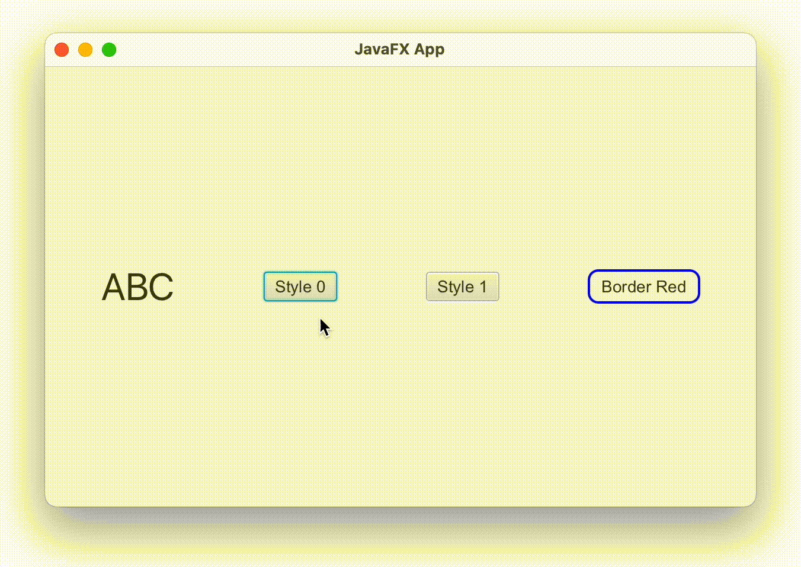

<div style="display: flex; width: 100%;">
    <div style="flex: 1; padding: 0px;">
        <p>© Albert Palacios Jiménez, 2023</p>
    </div>
    <div style="flex: 1; padding: 0px; text-align: right;">
        
    </div>
</div>
<br/>

# Estils

**JavaFX** permet aplicar estils tipus *.css* als elements definits amb *.fxml*. Les propietats són diferents a les de *HTML*.

## Exemple 0300

Arxiu *"./src/main/resources/assets/style0.css"*:

```css
.root {
    -fx-background-color: #f0f0f0;
}

Button {
    -fx-background-color: #007bff;
    -fx-text-fill: white;
    -fx-padding: 10px;
}

.label {
    -fx-font-size: 24px;
    -fx-text-fill: #00aa00;
}
```

Tal i com a CSS, els estils es poden definir:

- Amb # a partir de l'identificador
- Amb . pel nom de classe
- Amb el nom de l'element directament (per exemple Button)

A *Gluon SceneBuilder* es pot definir l'estil a fer servir a l'apartat 'Properties':

- *Style* per definir estils directament a l'element
- *Style Class* per definir el nom de la classe que afecta l'element
- *Id* per definir a partir de l'identificador CSS

<center>
<br/><div style="color: #444444;">Aplicar estil '.root'</div></center>
<br/><br/>

<center>
<br/><div style="color: #444444;">Aplicar estils individuals</div></center>
<br/><br/>

Això queda plasmat al codi *.fxml*:

```xml
<Button ... style="-fx-border-color: blue; -fx-border-width: 2; -fx-border-radius: 8; -fx-background-color: rgba(0,0,0,0);" text="Border Red" />
```

```xml
<Label ... styleClass="label" text="ABC">
```

Programàticament es pot canviar el full d'estil que afecta un objecte:

```java
    private void setStyle0(ActionEvent event) {
        container.getStylesheets().clear();
        container.getStylesheets().add("/assets/style0.css");
    }
```

Programàticament també es pot canviar directament l'estil d'un element:

```java
labelStyle.setStyle("-fx-border-color: red;");
```

<br/>
<center>
<br/></center>
<br/>
<br/>