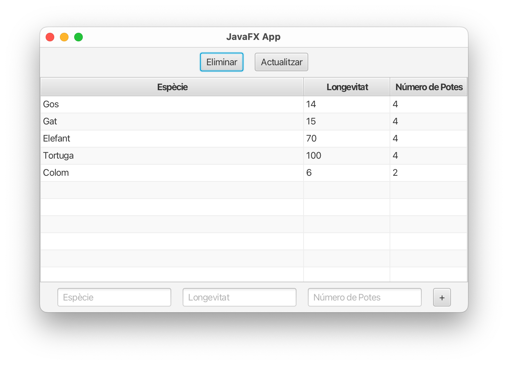

    

        
© Albert Palacios Jiménez, 2023

    

    

        
    

 

# Dades

La gestió de dades amb JavaFX es fa igual que en Java, és recomanable fer servir els patrons de disseny "DAO" i "Singleton" per organitzar i simplificar el codi.

## Exemple 0500

Aquest exemple mostra la gestió de la taula *animals* a la base de dades  *dades.sqlite*, fent servir: JavaFX, AppData Singleton i AnimalsDAO.

 

 

 
 
