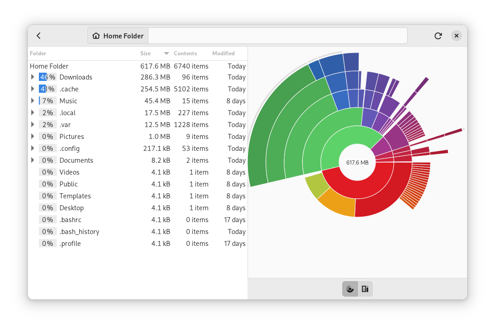

## Exercici 06

Fes una eina que permeti escollir una carpeta de l'ordinador, i té dues parts.

A l'esquerra:

- Mostri l'espai que ocupa la carpeta escollida
- Mostri l'espai que ocupen les seves subcarpetes de manera recursiva
- Mostri l'espai que ocupen els arxius de totes les carpetes anteriors

A la dreta:

- Amb un *Canvas* visualitza gràficament l'espai de les carpetes i arxius per poder detectar carpetes o arxius grans ràpidament.

Un exemple és l'aplicació [Baobab, disk usage analyzer](https://apps.gnome.org/ca/Baobab/) de Gnome

 

 