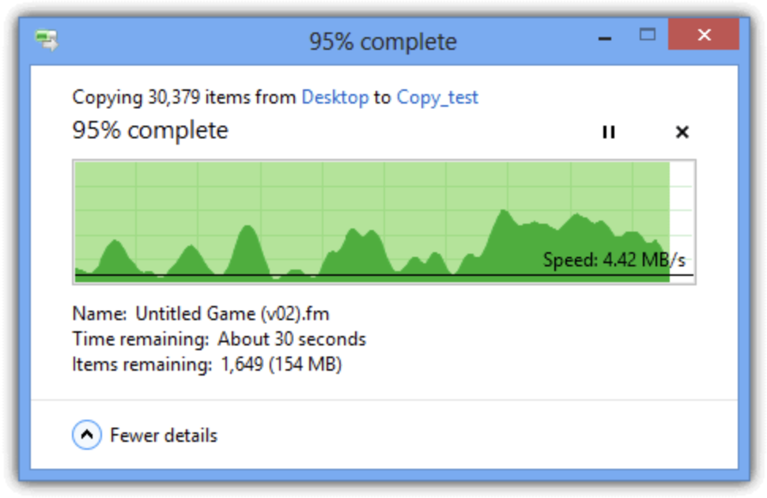
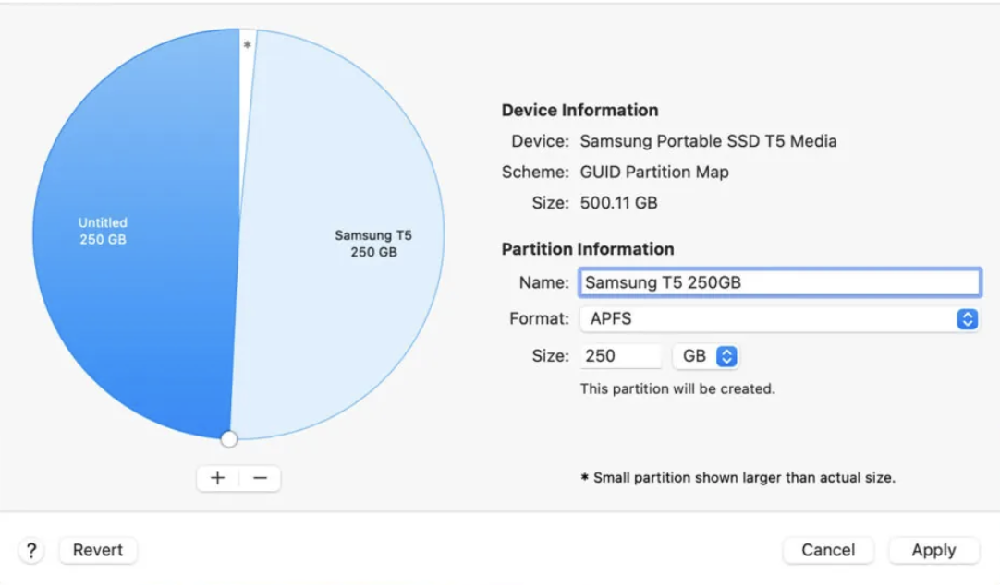
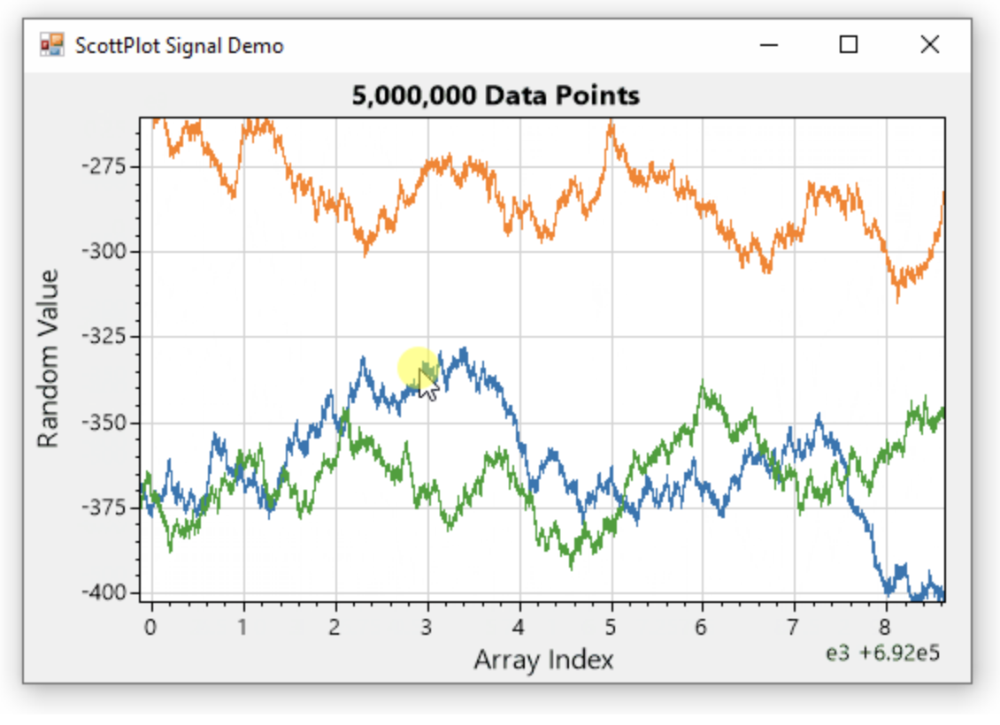
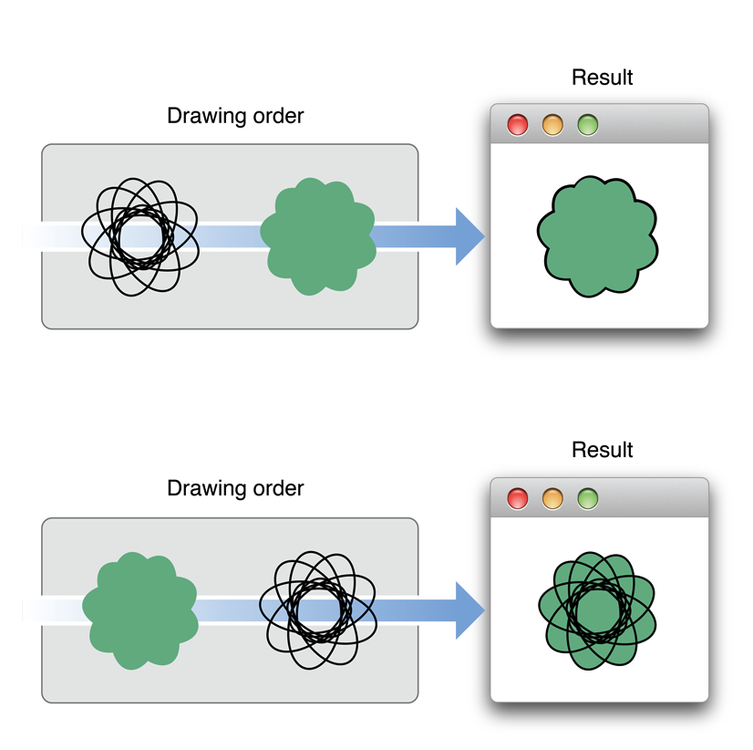
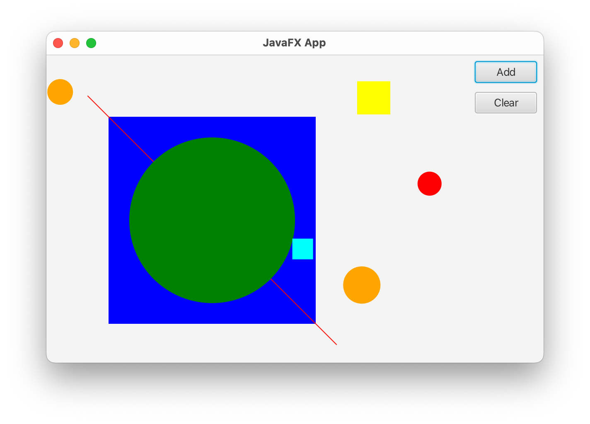
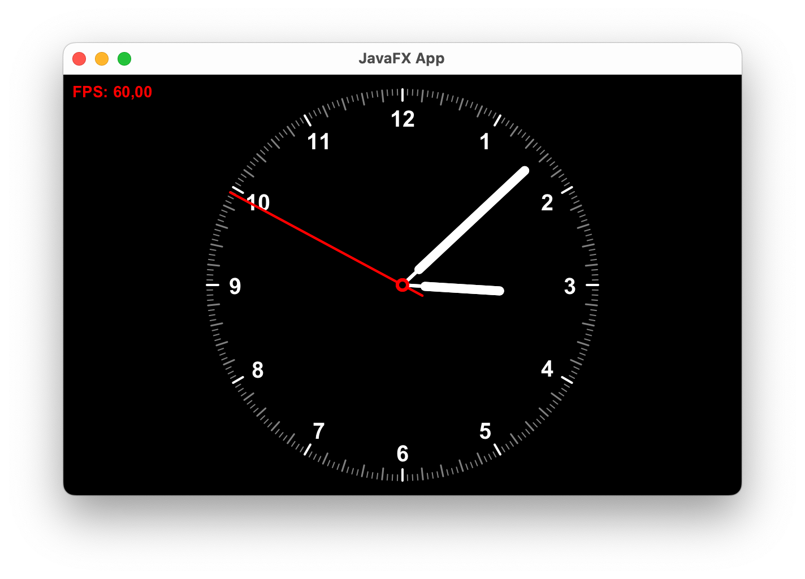
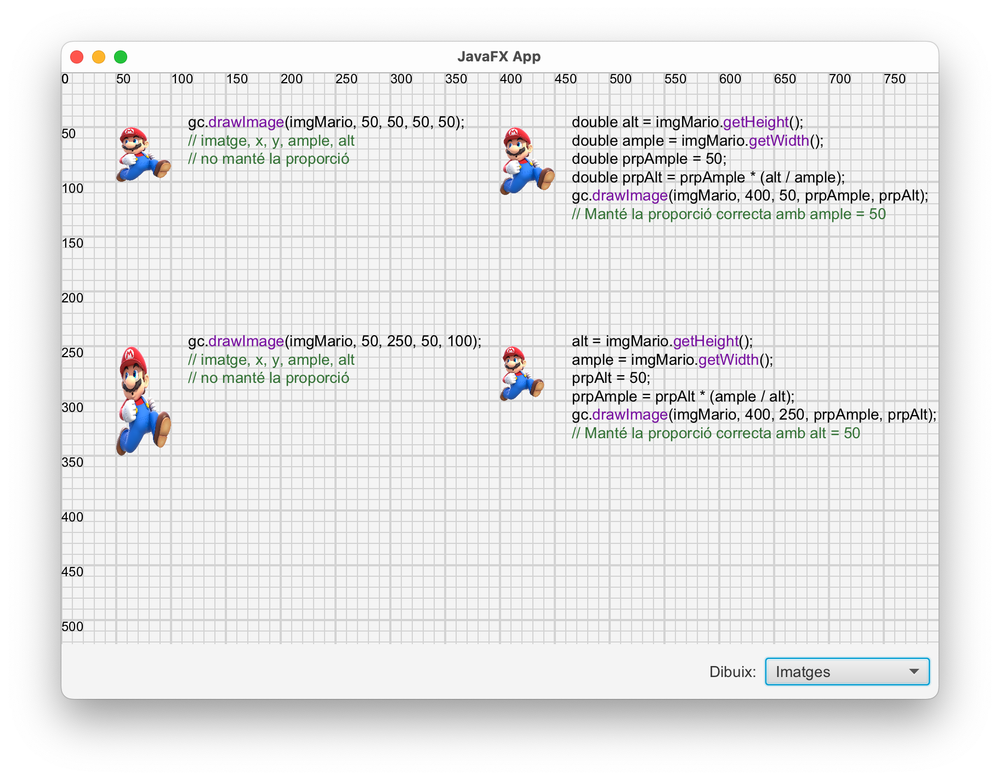
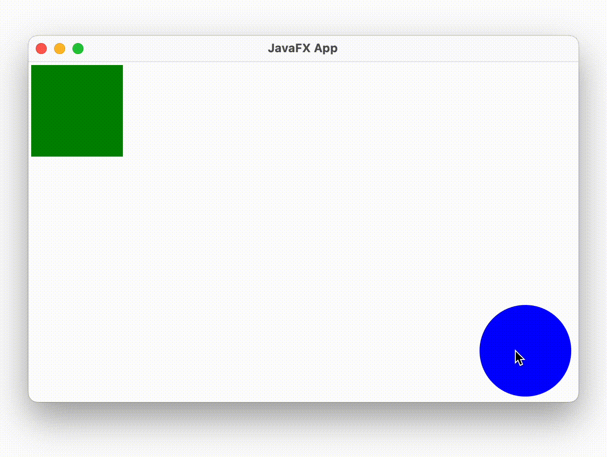
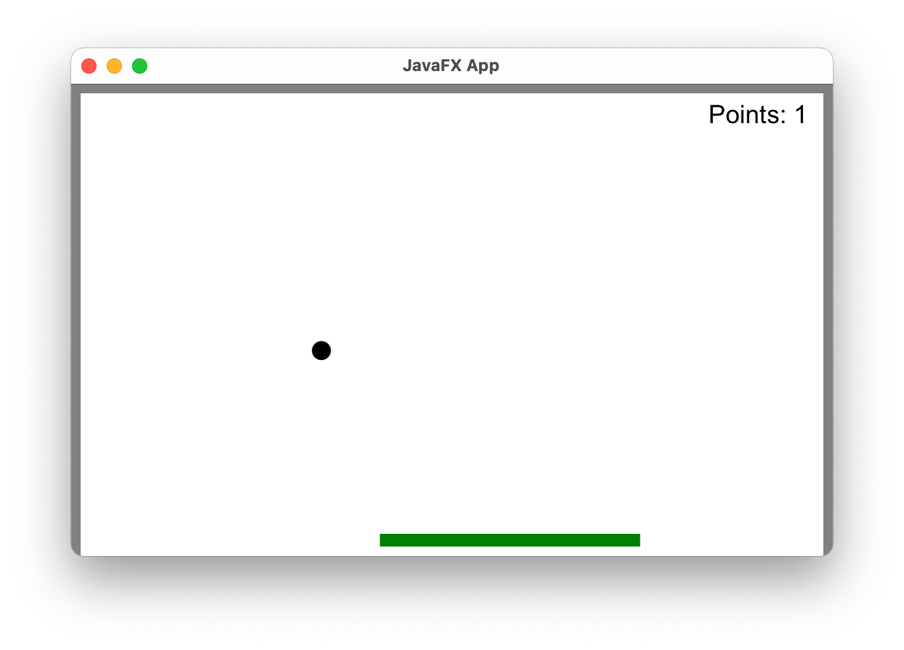

<div style="display: flex; width: 100%;">
    <div style="flex: 1; padding: 0px;">
        <p>© Albert Palacios Jiménez, 2023</p>
    </div>
    <div style="flex: 1; padding: 0px; text-align: right;">
        
    </div>
</div>
<br/>

# Canvas

El **Canvas** és una classe en JavaFX que proporciona una superfície de dibuix sobre la qual es poden fer formes, imatges i text. És similar a un llenç de pintura on es poden dibuixar diferents elements gràfics utilitzant operacions de dibuix proporcionades per la classe *GraphicsContext*.

El **Canvas** és útil per fer dibuixos dinàmics, gràfics en temps real, jocs, situacions on els elements gràfics es generen programàticament.

El **Canvas** o objectes similars existeixen en gairebé tots els llenguatges de programació amb interfícies visuals, també en pàgines web.

Exemples d'aplicacions amb dibuixos personalitzats:

<br/>
<center>
<br/></center>
<center>
<br/></center>
<center>
<br/></center>
<br/>
<br/>

## Canvas a JavaFX

Per fer servir el *Canvas* cal definir un objecte **"Canvas"** a la vista:

```xml
<Canvas fx:id="canvas" height="400.0" width="500.0" ... />
````

Al controlador, cal mantenir una referència al *"context de dibuix"* del *Canvas*:

```java
private GraphicsContext gc;

@Override
public void initialize(URL url, ResourceBundle rb) {
    gc = canvas.getGraphicsContext2D();
}
```

Quan volem dibuixar al *Canvas* fem servir el context anterior:

```java
    // Dibuixar un quadrat
    gc.setFill(color);
    gc.fillRect(x, y, size, size);
```

```java
    // Dibuixar un cercle
    gc.setFill(color);
    gc.fillOval(x, y, size, size);
```

Al canvas si poden anar 'pintant' els objectes a sobre dels antics, així si volem netejar-lo i començar de nou:

<br/>
<center>
<br/></center>
<br/>
<br/>

Les coordenades del canvas són "Top-Left" això vol dir que la posició (0,0) està a dalt a l'esquerra.

<br/>
<center>
<br/></center>
<br/>
<br/>

```java
@FXML
private void actionClear(ActionEvent event) {
    // Netejar tot el Canvas
    gc.clearRect(0, 0, canvas.getWidth(), canvas.getHeight());
}
```
Com que anem canviat la configuració del canvas (amb els colors, transformacions, ...) podem guardar i recuperar l'estat de dibuix amb:
```java
// Guardar la configuració de dibuix actual
gc.save();
// Fer operacions que modifiquen la configuració de dibuix
// com per exemple canviar el color d'emplenat, la mida d'un text, ...
gc.restore();
// Recuperar la configuració de dibuix previa al 'save'
```

## Exemple 0600

Aquest exemple és un projecte bàsic que inicia un canvas amb un dibuix, i té un botó per afegir cercles i quadres de manera aleatòria.

Els polígons es poden afegir amb el botó *"Add"* o bé fent click sobre l'àrea de dibuix. Per detectar la posició, es fa servir un gestor d'events sobre el canvas:

```java
    canvas.addEventHandler(MouseEvent.MOUSE_CLICKED, event -> {
        drawPolygon(event.getX(), event.getY());
        // Crida la funció 'drawPolygon' amb la posició (x,y) on s'ha
    });
```

<br/>
<center>
<br/></center>
<br/>
<br/>

## Exemple 0601

Aquest exemple és un projecte on es fa servir un timer per actualitzar una animació i mostar els FPS (frames per segon) de dibuix.

Normalment, quan es fan servir *Canvas* amb animacions, es separa el codi en dues parts:

- **Lògica de funcionament**, amb un mètode *run* que calcula les animacions a partir dels *frames per segon (FPS)
- **Instruccions de dibuix**, amb un mètode *draw* que dibuixa els elements visuals de cada objecte

Aquesta separació es fa per dos motius:

- Organitzar el codi segons funcionalitat
- Millorar el rendiment ajuntant totes les instruccions de dibuix

En aquest exemple l'animació és gestionada pel mètode *animationTimer* que crida les funcions *run* i *draw* tans ràpid com pot.

- El mètode **run** obté la data actual d'un objecte calendari i crida el mètode *run* de tots els objectes de la llista d'objectes

- El mètode **draw** neteja l'area de dibuix i crida el mètode *draw* de tots els objectes de la llista d'objectes

```java
public CnvController(Canvas canvas) {

    this.canvas = canvas;
    this.gc = canvas.getGraphicsContext2D();

    animationTimer = new CnvTimer(this::run, this::draw, 0);
    start();
}

// Start animation timer
public void start() {
    animationTimer.start();
}

// Stop animation timer
public void stop() {
    animationTimer.stop();
}

// Run game (and animations)
private void run(double fps) {

    if (animationTimer.fps < 1) { return; }

    // Compute global attributes
    Calendar cal = Calendar.getInstance();
    this.hores = cal.get(Calendar.HOUR_OF_DAY);
    this.minuts = cal.get(Calendar.MINUTE);
    this.segons = cal.get(Calendar.SECOND);
    this.millis = cal.get(Calendar.MILLISECOND);

    // Run per object logic
    for (CnvObj obj : objects) { obj.run(this); }
}

public void draw() {

    // Clean drawing area
    gc.clearRect(0, 0, canvas.getWidth(), canvas.getHeight());

    // Draw objects
    for (CnvObj obj : objects) { obj.draw(this); }

    // Draw FPS if needed
    if (showFps) { animationTimer.draw(gc); }   
}
```

<br/>
<center>
<br/></center>
<br/>
<br/>


## Exemple 0602

El funcionament de *Canvas* és complex, hi ha [tutorials](https://docs.oracle.com/javafx/2/canvas/jfxpub-canvas.htm) a Internet per diferents llenguatges de programació que l'implementen. 

Aquest exemple mostra molts exemples amb el codi de com s'aconsegueix cada tipus dibuix (linies, cercles, imatges, ...)

En aquest cas, enlloc de tenir una llista d'objectes a dibuixar (i dibuixar-los tots), els objectes amb les instruccions de dibuix implementen *"implements CnvObj"* per carregar gestionar un únic objecte amb moltes definicions.

```java
public void draw() {

    // Clean drawing area
    gc.clearRect(0, 0, canvas.getWidth(), canvas.getHeight());

    // Draw grid
    drawGrid();

    // Sempre dibuixem el mateix objecte, però la classe derivada escollida
    selectedObj.draw(this); 

    // Draw FPS if needed
    if (showFps) { animationTimer.draw(gc); }
}

public void actionSetSelection(String value) {
    switch (value) {
        case "Linies":              selectedObj = new CnvObjLinies(); break;
        case "Poligons":            selectedObj = new CnvObjPoligons(); break;
        case "Poligons emplenats":  selectedObj = new CnvObjPoligonsEmplenats(); break;
        case "Quadrats i cercles":  selectedObj = new CnvObjQuadratsCercles(); break;
        case "Imatges":             selectedObj = new CnvObjImatges(); break;
        case "Gradients lineals":   selectedObj = new CnvObjGradientsLineals(); break;
        case "Gradients radials":   selectedObj = new CnvObjGradientsRadials(); break;
        case "Transformacions":     selectedObj = new CnvObjTransformacions(); break;
        case "Texts":               selectedObj = new CnvObjTexts(); break;
        case "Text multilinia":     selectedObj = new CnvObjTextMultilinia(); break;
    }
}
```

<br/>
<center>
<br/></center>
<br/>
<br/>

## Exemple 0603

En aquest exemple s'escolten els events del ratolí per arrossegar els elements que es dibuixen al canvas.

Els *listeners* s'inicien a la funció *initialize*:

```java
    canvas.setOnMousePressed(this::onMousePressed);
    canvas.setOnMouseDragged(this::onMouseDragged);
    canvas.setOnMouseReleased(this::onMouseReleased);
```

Quan succeeix l'event, per exemple arrossegar el mouse, es canvia la posició de l'element seleccionat (segons la posició del mouse):

```java
private void onMouseDragged(MouseEvent event) {
    if (dragging) {
        if (selectedShape == greenSquare) {
            greenSquare.setX(event.getX() - offsetX);
            greenSquare.setY(event.getY() - offsetY);
        } else if (selectedShape == blueCircle) {
            blueCircle.setCenterX(event.getX() - offsetX);
            blueCircle.setCenterY(event.getY() - offsetY);
        }
        drawShapes();
    }
}
```

**Nota:** En aquest exemple també s'escolta l'event de canvi de mida de finestra per assegurar que els objectes sempre són visibles, encara que la finestra es faci petita.

<br/>
<center>
<br/></center>
<br/>

## Exemple Pong

Aquest exemple mostra una versió de Pong per a un sol jugador, mostra com es poden fer jocs senzills amb *Canvas* i també com capturar les tecles.

Per poder escoltar l'event de tecla, primer s'ha d'haver creat l'escena. Per aquest motiu fem servir *Platform.runLater*. 
```java
// Listen to key events (set when scene is available)
Platform.runLater(() -> {
    UtilsViews.parentContainer.getScene().addEventFilter(KeyEvent.ANY, keyEvent -> { keyEvent(keyEvent); });
});
```

Cada cop que s'apreta o deixa anar una tecla es crida la funció *keyEvent*, que rep la informació de l'event en qüestió (si s'ha apretat o alliberat una tecla, i de quina tecla es tracta):
```java
public void keyEvent (KeyEvent evt) {

    // Quan apretem una tecla
    if (evt.getEventType() == KeyEvent.KEY_PRESSED) {
        if (evt.getCode() == KeyCode.LEFT) {
            cnvController.playerDirection = "left";
        }
        if (evt.getCode() == KeyCode.RIGHT) {
            cnvController.playerDirection = "right";
        }
    }

    // Quan deixem anar la tecla
    if (evt.getEventType() == KeyEvent.KEY_RELEASED) {
        if (evt.getCode() == KeyCode.LEFT) {
            if (cnvController.playerDirection.equals("left")) {
                cnvController.playerDirection = "none";
            }
        }
        if (evt.getCode() == KeyCode.RIGHT) {
            if (cnvController.playerDirection.equals("right")) {
                cnvController.playerDirection = "none";
            }
        }
    }
}
```

<br/>
<center>
<br/></center>
<br/>

## Exemple Sockets

Aquest exemple mostra com poden interactuar dos clients sobre un *Canvas* a través de WebSockets.

Per fer-lo anar, cal obrir tres terminals diferents. Una pel servidor i dues pels clients:

Mantenir el servidor funcionant:
```bash
cd "Exemple Sockets"
./run.sh com.project.Server
```

Un cop el servidor està llest, obrir dos clients:
```bash
cd "Exemple Sockets"
./run.sh com.project.ClientFX
```

<br/>
<center>
<video width="100%" controls allowfullscreen>
  <source src="./assets/exSockets.mov" type="video/mp4">
</video>
</center>
<br/>

**Nota**: Per sortir del servidor escriure 'exit' a la consola.

# Servidors remots

**Important!**: Mireu la teoria de serveis i processos

Aquests scripts ajuden a fer tots els passos d'interacció amb Proxmox de manera senzilla

## Definir la configuració

Editar l'arxiu **./proxmox/config.env** segons la teva configuració

```txt
DEFAULT_USER="nomUsuari"
DEFAULT_RSA_PATH="$HOME/.ssh/id_rsa"
DEFAULT_SERVER_PORT="3000"
```

Executar els arxius a la carpeta **proxmox**

```bash
cd proxmox
./proxmoxRedirect80.sh    # Redirecciona el port 80 cap al SERVER_PORT
./proxmoxRedirectUndo.sh  # Desfà la redirecció anterior

./proxmoxRun.sh           # Compila el servidor i el puja al servidor remot
./proxmoxStop.sh          # Atura el servidor remot
```

També podeu pasar la configuració per paràmetres:

```bash
cd proxmox
./proxmoxRedirect80.sh nomUsuari "$HOME/Desktop/Proxmox IETI/id_rsa" 3001
```

**Nota:** Recordeu a aturar el servidor abans de pujar-lo!